# AAM 管理系統 - 系統設計規格 (System Design Specification)

**版本**: v1.0  
**創建日期**: 2025-11-13  
**最後更新**: 2025-11-13  
**作者**:Daniel Chung

---

## 📋 目錄

1. [系統總覽](#1-系統總覽)
2. [技術架構](#2-技術架構)
3. [系統功能架構](#3-系統功能架構)
4. [服務及組件架構](#4-服務及組件架構)
5. [類圖設計](#5-類圖設計)
6. [系統安全](#6-系統安全)
7. [環境參數配置](#7-環境參數配置)
8. [部署架構](#8-部署架構)

---

## 1. 系統總覽

### 1.1 系統概述

AAM 管理系統是一個獨立的 Web 管理平台，為 AAM (AI-Augmented Memory) 服務提供全面的管理、監控和配置功能。系統採用前後端分離架構，提供直觀的 Web 界面和強大的 RESTful API，支持對 AAM 服務的各個組件進行統一管理。

### 1.2 核心目標

- **統一管理**: 提供單一入口管理所有 AAM 服務組件
- **實時監控**: 實時監控服務狀態、資源使用和性能指標
- **配置管理**: 統一管理 LLM Provider、模型配置和安全設置
- **操作審計**: 記錄所有管理操作，確保可追溯性
- **安全可靠**: 基於 AAM 企業安全認證體系，確保管理操作的安全性

### 1.3 主要功能模塊

1. **LLM Provider 管理**: 管理多種 LLM Provider（Qwen、Gemini、Ollama 等）及其模型配置
2. **系統服務監管**: 監控和管理 AAM 服務、ChromaDB、PostgreSQL、RabbitMQ 等服務
3. **版本管理與部署**: 管理服務版本、部署歷史和一鍵部署
4. **日誌管理**: 實時日誌查看、搜索、過濾和導出
5. **安全管理**: Token 管理、企業認證配置、訪問控制

---

## 2. 技術架構

### 2.1 整體架構

AAM 管理系統採用**前後端分離**的微服務架構，與 AAM 服務解耦，通過標準 API 和 Docker API 進行交互。

```
┌─────────────────────────────────────────────────────────────┐
│                    AAM 管理系統架構                           │
└─────────────────────────────────────────────────────────────┘

┌──────────────────┐         ┌──────────────────┐
│  管理前端        │  HTTP   │  管理後端 API     │
│  (React/Vue)     │ ◄─────► │  (FastAPI)       │
│  Port: 3000      │         │  Port: 8003      │
└──────────────────┘         └──────────────────┘
                                      │
                    ┌─────────────────┼─────────────────┐
                    │                 │                 │
            ┌───────▼──────┐  ┌──────▼──────┐  ┌──────▼──────┐
            │  AAM 服務    │  │  Docker API │  │ 管理數據庫   │
            │  API         │  │             │  │ (PostgreSQL) │
            │  Port: 8000  │  │             │  │              │
            └──────────────┘  └─────────────┘  └──────────────┘
```

### 2.2 技術棧

#### 後端技術棧
- **框架**: FastAPI 0.104+
- **語言**: Python 3.11+
- **數據庫**: PostgreSQL 15+ (存儲管理配置和操作日誌)
- **Docker 管理**: docker-py (Python Docker SDK)
- **認證**: JWT + 企業級認證（復用 AAM 認證系統）
- **實時通信**: WebSocket (FastAPI WebSocket)
- **日誌**: structlog

#### 前端技術棧
- **框架**: React 18+ / Vue 3+
- **語言**: TypeScript 5+
- **UI 庫**: Ant Design / Material-UI
- **狀態管理**: Zustand / Redux Toolkit
- **圖表**: ECharts / Recharts
- **HTTP 客戶端**: Axios
- **WebSocket**: native WebSocket API

### 2.3 架構原則

1. **關注點分離**: 管理系統與 AAM 服務完全解耦，通過標準 API 交互
2. **可擴展性**: 模塊化設計，易於添加新功能模塊
3. **安全性**: 基於 AAM 企業安全認證體系，所有操作都需要認證
4. **實時性**: 使用 WebSocket 實現實時日誌流和狀態更新
5. **可維護性**: 清晰的代碼結構和完整的文檔

---

## 3. 系統功能架構

### 3.1 功能模塊流程圖

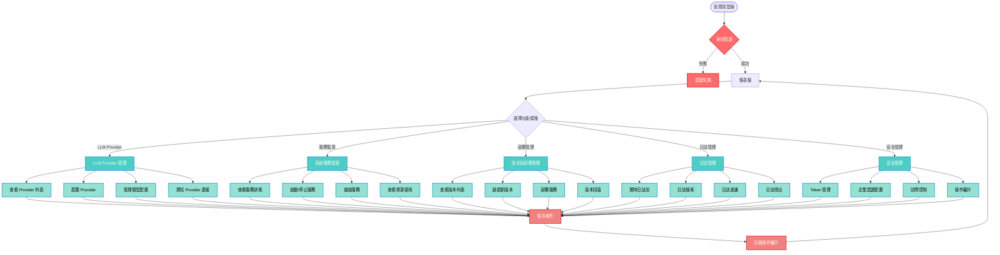
```mermaid
flowchart TD
    Start([管理員登錄]) --> Auth{身份驗證}
    Auth -->|失敗| Error1[認證失敗]
    Auth -->|成功| Dashboard[儀表盤]
    
    Dashboard --> Module{選擇功能模塊}
    
    Module -->|LLM Provider| LLMModule[LLM Provider 管理]
    Module -->|服務監管| ServiceModule[系統服務監管]
    Module -->|部署管理| DeployModule[版本與部署管理]
    Module -->|日誌管理| LogModule[日誌管理]
    Module -->|安全管理| SecurityModule[安全管理]
    
    LLMModule --> LLM1[查看 Provider 列表]
    LLMModule --> LLM2[配置 Provider]
    LLMModule --> LLM3[管理模型配置]
    LLMModule --> LLM4[測試 Provider 連接]
    
    ServiceModule --> Svc1[查看服務狀態]
    ServiceModule --> Svc2[啟動/停止服務]
    ServiceModule --> Svc3[重啟服務]
    ServiceModule --> Svc4[查看資源使用]
    
    DeployModule --> Dep1[查看版本列表]
    DeployModule --> Dep2[創建新版本]
    DeployModule --> Dep3[部署服務]
    DeployModule --> Dep4[版本回滾]
    
    LogModule --> Log1[實時日誌流]
    LogModule --> Log2[日誌搜索]
    LogModule --> Log3[日誌過濾]
    LogModule --> Log4[日誌導出]
    
    SecurityModule --> Sec1[Token 管理]
    SecurityModule --> Sec2[企業認證配置]
    SecurityModule --> Sec3[訪問控制]
    SecurityModule --> Sec4[操作審計]
    
    LLM1 --> Save[保存操作]
    LLM2 --> Save
    LLM3 --> Save
    LLM4 --> Save
    Svc1 --> Save
    Svc2 --> Save
    Svc3 --> Save
    Svc4 --> Save
    Dep1 --> Save
    Dep2 --> Save
    Dep3 --> Save
    Dep4 --> Save
    Log1 --> Save
    Log2 --> Save
    Log3 --> Save
    Log4 --> Save
    Sec1 --> Save
    Sec2 --> Save
    Sec3 --> Save
    Sec4 --> Save
    
    Save --> Audit[記錄操作審計]
    Audit --> Dashboard
    
    classDef authClass fill:#ff6b6b,stroke:#c92a2a,stroke-width:2px,color:#fff
    classDef moduleClass fill:#4ecdc4,stroke:#2d9cdb,stroke-width:2px,color:#fff
    classDef actionClass fill:#95e1d3,stroke:#2d9cdb,stroke-width:2px,color:#000
    classDef saveClass fill:#f38181,stroke:#c92a2a,stroke-width:2px,color:#fff
    
    class Auth,Error1 authClass
    class LLMModule,ServiceModule,DeployModule,LogModule,SecurityModule moduleClass
    class LLM1,LLM2,LLM3,LLM4,Svc1,Svc2,Svc3,Svc4,Dep1,Dep2,Dep3,Dep4,Log1,Log2,Log3,Log4,Sec1,Sec2,Sec3,Sec4 actionClass
    class Save,Audit saveClass
```

### 3.2 核心功能詳細流程

#### 3.2.1 LLM Provider 管理流程

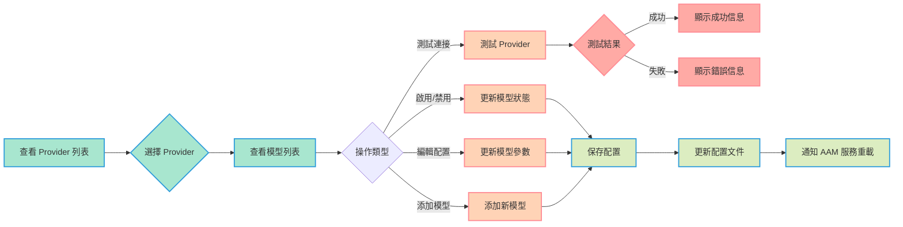
```mermaid
flowchart LR
    A[查看 Provider 列表] --> B{選擇 Provider}
    B --> C[查看模型列表]
    C --> D{操作類型}
    D -->|啟用/禁用| E[更新模型狀態]
    D -->|編輯配置| F[更新模型參數]
    D -->|測試連接| G[測試 Provider]
    D -->|添加模型| H[添加新模型]
    E --> I[保存配置]
    F --> I
    G --> J{測試結果}
    J -->|成功| K[顯示成功信息]
    J -->|失敗| L[顯示錯誤信息]
    H --> I
    I --> M[更新配置文件]
    M --> N[通知 AAM 服務重載]
    
    classDef viewClass fill:#a8e6cf,stroke:#2d9cdb,stroke-width:2px
    classDef actionClass fill:#ffd3b6,stroke:#ff8b94,stroke-width:2px
    classDef resultClass fill:#ffaaa5,stroke:#ff8b94,stroke-width:2px
    classDef saveClass fill:#dcedc1,stroke:#2d9cdb,stroke-width:2px
    
    class A,B,C viewClass
    class E,F,G,H actionClass
    class J,K,L resultClass
    class I,M,N saveClass
```

#### 3.2.2 服務監管流程

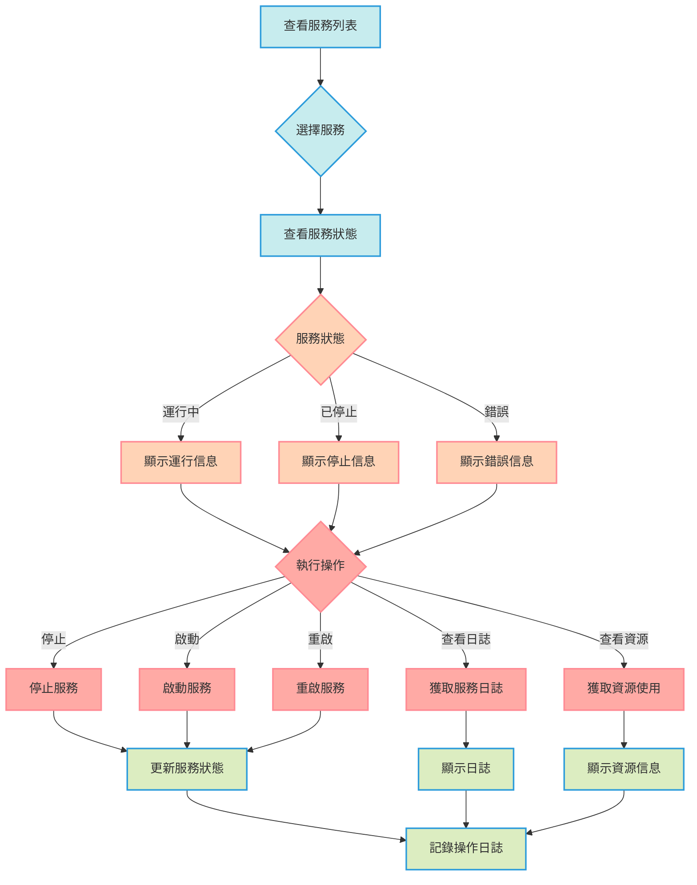
```mermaid
flowchart TD
    A[查看服務列表] --> B{選擇服務}
    B --> C[查看服務狀態]
    C --> D{服務狀態}
    D -->|運行中| E[顯示運行信息]
    D -->|已停止| F[顯示停止信息]
    D -->|錯誤| G[顯示錯誤信息]
    
    E --> H{執行操作}
    F --> H
    G --> H
    
    H -->|停止| I[停止服務]
    H -->|啟動| J[啟動服務]
    H -->|重啟| K[重啟服務]
    H -->|查看日誌| L[獲取服務日誌]
    H -->|查看資源| M[獲取資源使用]
    
    I --> N[更新服務狀態]
    J --> N
    K --> N
    L --> O[顯示日誌]
    M --> P[顯示資源信息]
    
    N --> Q[記錄操作日誌]
    O --> Q
    P --> Q
    
    classDef viewClass fill:#c7ecee,stroke:#2d9cdb,stroke-width:2px
    classDef statusClass fill:#ffd3b6,stroke:#ff8b94,stroke-width:2px
    classDef actionClass fill:#ffaaa5,stroke:#ff8b94,stroke-width:2px
    classDef resultClass fill:#dcedc1,stroke:#2d9cdb,stroke-width:2px
    
    class A,B,C viewClass
    class D,E,F,G statusClass
    class H,I,J,K,L,M actionClass
    class N,O,P,Q resultClass
```

---

## 4. 服務及組件架構

### 4.1 系統組件架構圖

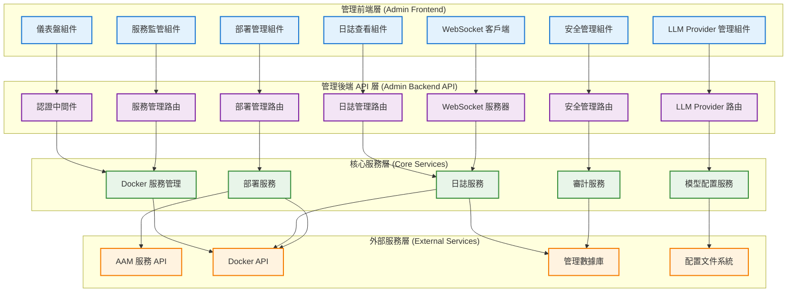
```mermaid
flowchart TB
    subgraph "管理前端層 (Admin Frontend)"
        FE1[儀表盤組件]
        FE2[LLM Provider 管理組件]
        FE3[服務監管組件]
        FE4[部署管理組件]
        FE5[日誌查看組件]
        FE6[安全管理組件]
        FE7[WebSocket 客戶端]
    end
    
    subgraph "管理後端 API 層 (Admin Backend API)"
        API1[認證中間件]
        API2[LLM Provider 路由]
        API3[服務管理路由]
        API4[部署管理路由]
        API5[日誌管理路由]
        API6[安全管理路由]
        API7[WebSocket 服務器]
    end
    
    subgraph "核心服務層 (Core Services)"
        SVC1[Docker 服務管理]
        SVC2[模型配置服務]
        SVC3[日誌服務]
        SVC4[部署服務]
        SVC5[審計服務]
    end
    
    subgraph "外部服務層 (External Services)"
        EXT1[AAM 服務 API]
        EXT2[Docker API]
        EXT3[管理數據庫]
        EXT4[配置文件系統]
    end
    
    FE1 --> API1
    FE2 --> API2
    FE3 --> API3
    FE4 --> API4
    FE5 --> API5
    FE6 --> API6
    FE7 --> API7
    
    API1 --> SVC1
    API2 --> SVC2
    API3 --> SVC1
    API4 --> SVC4
    API5 --> SVC3
    API6 --> SVC5
    API7 --> SVC3
    
    SVC1 --> EXT2
    SVC2 --> EXT4
    SVC3 --> EXT2
    SVC3 --> EXT3
    SVC4 --> EXT2
    SVC4 --> EXT1
    SVC5 --> EXT3
    
    classDef frontendClass fill:#e3f2fd,stroke:#1976d2,stroke-width:2px
    classDef apiClass fill:#f3e5f5,stroke:#7b1fa2,stroke-width:2px
    classDef serviceClass fill:#e8f5e9,stroke:#388e3c,stroke-width:2px
    classDef externalClass fill:#fff3e0,stroke:#f57c00,stroke-width:2px
    
    class FE1,FE2,FE3,FE4,FE5,FE6,FE7 frontendClass
    class API1,API2,API3,API4,API5,API6,API7 apiClass
    class SVC1,SVC2,SVC3,SVC4,SVC5 serviceClass
    class EXT1,EXT2,EXT3,EXT4 externalClass
```

### 4.2 服務交互流程

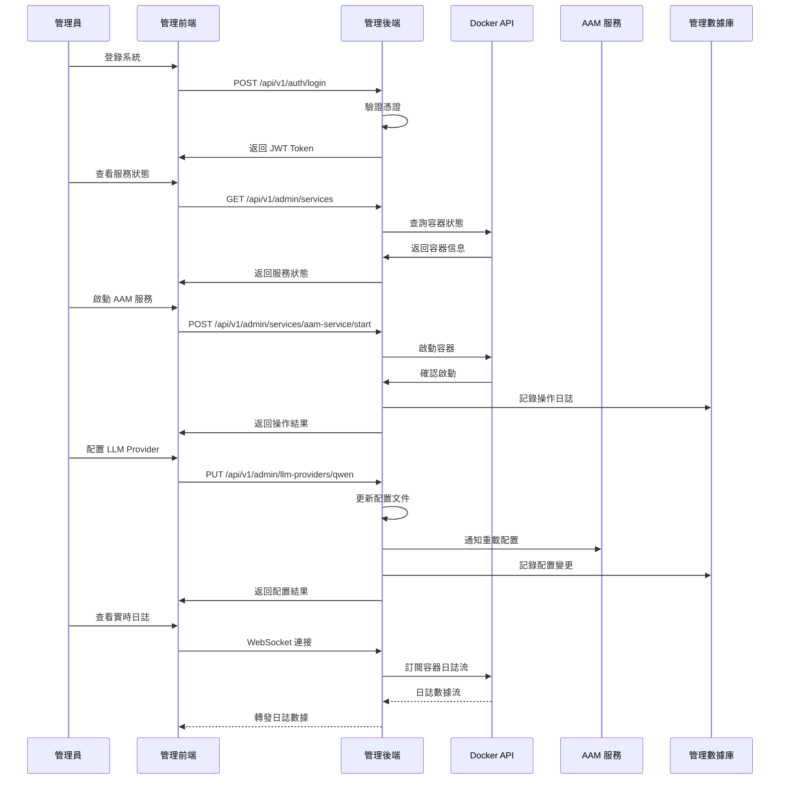
```mermaid
sequenceDiagram
    participant Admin as 管理員
    participant Frontend as 管理前端
    participant Backend as 管理後端
    participant Docker as Docker API
    participant AAM as AAM 服務
    participant DB as 管理數據庫
    
    Admin->>Frontend: 登錄系統
    Frontend->>Backend: POST /api/v1/auth/login
    Backend->>Backend: 驗證憑證
    Backend->>Frontend: 返回 JWT Token
    
    Admin->>Frontend: 查看服務狀態
    Frontend->>Backend: GET /api/v1/admin/services
    Backend->>Docker: 查詢容器狀態
    Docker->>Backend: 返回容器信息
    Backend->>Frontend: 返回服務狀態
    
    Admin->>Frontend: 啟動 AAM 服務
    Frontend->>Backend: POST /api/v1/admin/services/aam-service/start
    Backend->>Docker: 啟動容器
    Docker->>Backend: 確認啟動
    Backend->>DB: 記錄操作日誌
    Backend->>Frontend: 返回操作結果
    
    Admin->>Frontend: 配置 LLM Provider
    Frontend->>Backend: PUT /api/v1/admin/llm-providers/qwen
    Backend->>Backend: 更新配置文件
    Backend->>AAM: 通知重載配置
    Backend->>DB: 記錄配置變更
    Backend->>Frontend: 返回配置結果
    
    Admin->>Frontend: 查看實時日誌
    Frontend->>Backend: WebSocket 連接
    Backend->>Docker: 訂閱容器日誌流
    Docker-->>Backend: 日誌數據流
    Backend-->>Frontend: 轉發日誌數據
```

### 4.3 數據流架構

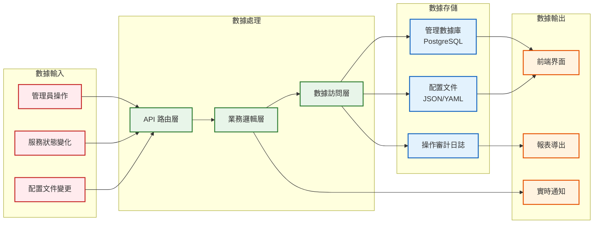
```mermaid
flowchart LR
    subgraph "數據輸入"
        A1[管理員操作]
        A2[服務狀態變化]
        A3[配置文件變更]
    end
    
    subgraph "數據處理"
        B1[API 路由層]
        B2[業務邏輯層]
        B3[數據訪問層]
    end
    
    subgraph "數據存儲"
        C1[管理數據庫<br/>PostgreSQL]
        C2[配置文件<br/>JSON/YAML]
        C3[操作審計日誌]
    end
    
    subgraph "數據輸出"
        D1[前端界面]
        D2[實時通知]
        D3[報表導出]
    end
    
    A1 --> B1
    A2 --> B1
    A3 --> B1
    
    B1 --> B2
    B2 --> B3
    
    B3 --> C1
    B3 --> C2
    B3 --> C3
    
    C1 --> D1
    C2 --> D1
    C3 --> D3
    
    B2 --> D2
    
    classDef inputClass fill:#ffebee,stroke:#c62828,stroke-width:2px
    classDef processClass fill:#e8f5e9,stroke:#2e7d32,stroke-width:2px
    classDef storageClass fill:#e3f2fd,stroke:#1565c0,stroke-width:2px
    classDef outputClass fill:#fff3e0,stroke:#e65100,stroke-width:2px
    
    class A1,A2,A3 inputClass
    class B1,B2,B3 processClass
    class C1,C2,C3 storageClass
    class D1,D2,D3 outputClass
```

---

## 5. 類圖設計

### 5.1 核心類圖

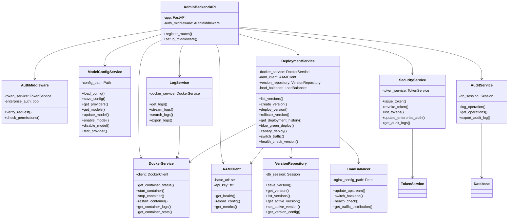
```mermaid
classDiagram
    class AdminBackendAPI {
        -app: FastAPI
        -auth_middleware: AuthMiddleware
        +register_routes()
        +setup_middleware()
    }
    
    class AuthMiddleware {
        -token_service: TokenService
        -enterprise_auth: bool
        +verify_request()
        +check_permissions()
    }
    
    class DockerService {
        -client: DockerClient
        +get_container_status()
        +start_container()
        +stop_container()
        +restart_container()
        +get_container_logs()
        +get_container_stats()
    }
    
    class ModelConfigService {
        -config_path: Path
        +load_config()
        +save_config()
        +get_providers()
        +get_models()
        +update_model()
        +enable_model()
        +disable_model()
        +test_provider()
    }
    
    class LogService {
        -docker_service: DockerService
        +get_logs()
        +stream_logs()
        +search_logs()
        +export_logs()
    }
    
    class DeploymentService {
        -docker_service: DockerService
        -aam_client: AAMClient
        -version_repository: VersionRepository
        -load_balancer: LoadBalancer
        +list_versions()
        +create_version()
        +deploy_version()
        +rollback_version()
        +get_deployment_history()
        +blue_green_deploy()
        +canary_deploy()
        +switch_traffic()
        +health_check_version()
    }
    
    class VersionRepository {
        -db_session: Session
        +save_version()
        +get_version()
        +list_versions()
        +get_active_version()
        +set_active_version()
        +get_version_config()
    }
    
    class LoadBalancer {
        -nginx_config_path: Path
        +update_upstream()
        +switch_backend()
        +health_check()
        +get_traffic_distribution()
    }
    
    class SecurityService {
        -token_service: TokenService
        +issue_token()
        +revoke_token()
        +list_tokens()
        +update_enterprise_auth()
        +get_audit_logs()
    }
    
    class AuditService {
        -db_session: Session
        +log_operation()
        +get_operations()
        +export_audit_log()
    }
    
    class AAMClient {
        -base_url: str
        -api_key: str
        +get_health()
        +reload_config()
        +get_metrics()
    }
    
    AdminBackendAPI --> AuthMiddleware
    AdminBackendAPI --> DockerService
    AdminBackendAPI --> ModelConfigService
    AdminBackendAPI --> LogService
    AdminBackendAPI --> DeploymentService
    AdminBackendAPI --> SecurityService
    AdminBackendAPI --> AuditService
    AdminBackendAPI --> AAMClient
    
    LogService --> DockerService
    DeploymentService --> DockerService
    DeploymentService --> AAMClient
    DeploymentService --> VersionRepository
    DeploymentService --> LoadBalancer
    SecurityService --> TokenService
    AuditService --> Database
```

### 5.2 數據模型類圖

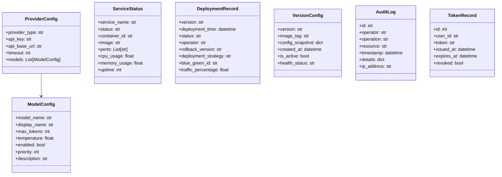
```mermaid
classDiagram
    class ProviderConfig {
        +provider_type: str
        +api_key: str
        +api_base_url: str
        +timeout: int
        +models: List[ModelConfig]
    }
    
    class ModelConfig {
        +model_name: str
        +display_name: str
        +max_tokens: int
        +temperature: float
        +enabled: bool
        +priority: int
        +description: str
    }
    
    class ServiceStatus {
        +service_name: str
        +status: str
        +container_id: str
        +image: str
        +ports: List[str]
        +cpu_usage: float
        +memory_usage: float
        +uptime: int
    }
    
    class DeploymentRecord {
        +version: str
        +deployment_time: datetime
        +status: str
        +operator: str
        +rollback_version: str
        +deployment_strategy: str
        +blue_green_id: str
        +traffic_percentage: float
    }
    
    class VersionConfig {
        +version: str
        +image_tag: str
        +config_snapshot: dict
        +created_at: datetime
        +is_active: bool
        +health_status: str
    }
    
    class AuditLog {
        +id: int
        +operator: str
        +operation: str
        +resource: str
        +timestamp: datetime
        +details: dict
        +ip_address: str
    }
    
    class TokenRecord {
        +id: int
        +user_id: str
        +token: str
        +issued_at: datetime
        +expires_at: datetime
        +revoked: bool
    }
    
    ProviderConfig --> ModelConfig
```

### 5.3 前端組件類圖

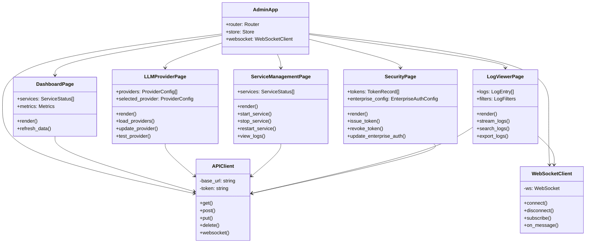
```mermaid
classDiagram
    class AdminApp {
        +router: Router
        +store: Store
        +websocket: WebSocketClient
    }
    
    class DashboardPage {
        +services: ServiceStatus[]
        +metrics: Metrics
        +render()
        +refresh_data()
    }
    
    class LLMProviderPage {
        +providers: ProviderConfig[]
        +selected_provider: ProviderConfig
        +render()
        +load_providers()
        +update_provider()
        +test_provider()
    }
    
    class ServiceManagementPage {
        +services: ServiceStatus[]
        +render()
        +start_service()
        +stop_service()
        +restart_service()
        +view_logs()
    }
    
    class LogViewerPage {
        +logs: LogEntry[]
        +filters: LogFilters
        +render()
        +stream_logs()
        +search_logs()
        +export_logs()
    }
    
    class SecurityPage {
        +tokens: TokenRecord[]
        +enterprise_config: EnterpriseAuthConfig
        +render()
        +issue_token()
        +revoke_token()
        +update_enterprise_auth()
    }
    
    class APIClient {
        -base_url: string
        -token: string
        +get()
        +post()
        +put()
        +delete()
        +websocket()
    }
    
    class WebSocketClient {
        -ws: WebSocket
        +connect()
        +disconnect()
        +subscribe()
        +on_message()
    }
    
    AdminApp --> DashboardPage
    AdminApp --> LLMProviderPage
    AdminApp --> ServiceManagementPage
    AdminApp --> LogViewerPage
    AdminApp --> SecurityPage
    AdminApp --> APIClient
    AdminApp --> WebSocketClient
    
    DashboardPage --> APIClient
    LLMProviderPage --> APIClient
    ServiceManagementPage --> APIClient
    LogViewerPage --> APIClient
    LogViewerPage --> WebSocketClient
    SecurityPage --> APIClient
```

---

## 6. 系統安全

### 6.1 安全架構

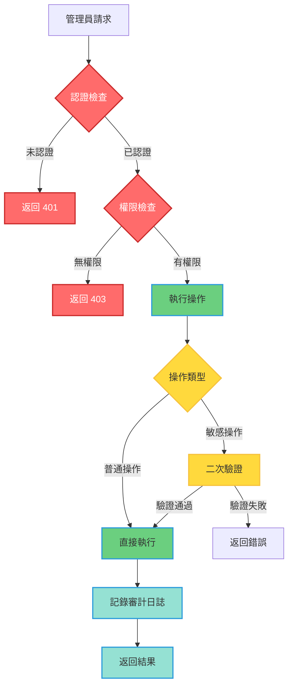
```mermaid
flowchart TD
    A[管理員請求] --> B{認證檢查}
    B -->|未認證| C[返回 401]
    B -->|已認證| D{權限檢查}
    D -->|無權限| E[返回 403]
    D -->|有權限| F[執行操作]
    F --> G{操作類型}
    G -->|敏感操作| H[二次驗證]
    G -->|普通操作| I[直接執行]
    H -->|驗證通過| I
    H -->|驗證失敗| J[返回錯誤]
    I --> K[記錄審計日誌]
    K --> L[返回結果]
    
    classDef authClass fill:#ff6b6b,stroke:#c92a2a,stroke-width:2px,color:#fff
    classDef checkClass fill:#ffd93d,stroke:#f6c23e,stroke-width:2px
    classDef actionClass fill:#6bcf7f,stroke:#2d9cdb,stroke-width:2px
    classDef auditClass fill:#95e1d3,stroke:#2d9cdb,stroke-width:2px
    
    class B,C,D,E authClass
    class G,H checkClass
    class F,I actionClass
    class K,L auditClass
```

### 6.2 認證與授權

#### 6.2.1 認證機制

1. **管理員登錄認證**
   - 使用獨立的 Admin API Key 進行認證
   - 支持 JWT Token 認證
   - Token 有效期可配置（默認 24 小時）

2. **企業級認證**
   - 復用 AAM 企業安全認證體系
   - 支持 HMAC-SHA256 簽名驗證
   - 可配置企業 Secret Key

3. **操作權限控制**
   - 超級管理員：所有權限
   - 操作員：服務管理、配置管理（無安全配置權限）
   - 只讀用戶：僅查看權限

#### 6.2.2 安全措施

1. **敏感操作保護**
   - 服務停止/重啟需要二次確認
   - 配置變更需要審批流程（可選）
   - 安全配置變更需要超級管理員權限

2. **數據保護**
   - API Key 僅顯示部分字符（前 8 位 + "***"）
   - 敏感配置加密存儲
   - 操作日誌不記錄完整敏感信息

3. **審計日誌**
   - 記錄所有管理操作
   - 記錄操作者、時間、IP 地址
   - 支持操作日誌查詢和導出

### 6.3 安全配置項

| 配置項 | 環境變量 | 說明 | 默認值 |
|--------|---------|------|--------|
| Admin API Key | `ADMIN_API_KEY` | 管理後端 API 認證密鑰 | 必填 |
| JWT Secret Key | `ADMIN_JWT_SECRET` | JWT Token 簽名密鑰 | 必填 |
| Token 有效期 | `ADMIN_TOKEN_EXPIRE_HOURS` | Token 有效期（小時） | 24 |
| 企業認證開關 | `ENABLE_ENTERPRISE_AUTH` | 是否啟用企業級認證 | false |
| 企業 Secret Key | `ENTERPRISE_SECRET_KEY` | 企業認證 Secret Key | - |
| IP 白名單 | `ADMIN_IP_WHITELIST` | 允許訪問的 IP 列表（可選） | - |
| 操作審計開關 | `ENABLE_AUDIT_LOG` | 是否啟用操作審計 | true |

---

## 7. 環境參數配置

### 7.1 管理後端環境變量

```bash
# ============================================
# 應用配置
# ============================================
APP_NAME=AAM Admin Service
APP_VERSION=1.0.0
DEBUG=false
LOG_LEVEL=INFO

# ============================================
# API 配置
# ============================================
API_HOST=0.0.0.0
API_PORT=8003
ADMIN_API_KEY=your-admin-api-key-change-this  # ⚠️ 必須修改

# ============================================
# 認證配置
# ============================================
ADMIN_JWT_SECRET=your-jwt-secret-key-change-this  # ⚠️ 必須修改
ADMIN_TOKEN_EXPIRE_HOURS=24
ENABLE_ENTERPRISE_AUTH=false
ENTERPRISE_SECRET_KEY=your-enterprise-secret-key  # 可選

# ============================================
# AAM 服務配置
# ============================================
AAM_SERVICE_URL=http://aam-service:8000
AAM_API_KEY=your-aam-api-key

# ============================================
# Docker 配置
# ============================================
DOCKER_HOST=unix:///var/run/docker.sock
DOCKER_TLS_VERIFY=false
DOCKER_CERT_PATH=

# ============================================
# 數據庫配置（管理數據庫）
# ============================================
ADMIN_DB_HOST=admin-db
ADMIN_DB_PORT=5432
ADMIN_DB_NAME=aam_admin
ADMIN_DB_USER=admin_user
ADMIN_DB_PASSWORD=your-admin-db-password  # ⚠️ 必須修改

# ============================================
# 配置文件路徑
# ============================================
MODEL_CONFIG_PATH=/app/config/models.json
AAM_SERVICE_PATH=../aam-service

# ============================================
# 審計日誌配置
# ============================================
ENABLE_AUDIT_LOG=true
AUDIT_LOG_RETENTION_DAYS=90

# ============================================
# 安全配置
# ============================================
ADMIN_IP_WHITELIST=  # 可選，逗號分隔的 IP 列表
CORS_ORIGINS=http://localhost:3000,http://localhost:3001
```

### 7.2 管理前端環境變量

```bash
# ============================================
# API 配置
# ============================================
REACT_APP_API_URL=http://localhost:8003
REACT_APP_WS_URL=ws://localhost:8003

# ============================================
# 應用配置
# ============================================
REACT_APP_NAME=AAM Admin
REACT_APP_VERSION=1.0.0
```

### 7.3 Docker Compose 配置示例

```yaml
version: '3.8'

services:
  admin-backend:
    build: ./backend
    ports:
      - "8003:8003"
    environment:
      - ADMIN_API_KEY=${ADMIN_API_KEY}
      - ADMIN_JWT_SECRET=${ADMIN_JWT_SECRET}
      - AAM_SERVICE_URL=http://aam-service:8000
      - AAM_API_KEY=${API_KEY}
      - ADMIN_DB_HOST=admin-db
      - ADMIN_DB_PASSWORD=${ADMIN_DB_PASSWORD}
    volumes:
      - ../aam-service/config:/app/config:ro
      - /var/run/docker.sock:/var/run/docker.sock:ro
    depends_on:
      - admin-db
    networks:
      - aam-network

  admin-frontend:
    build: ./frontend
    ports:
      - "3000:3000"
    environment:
      - REACT_APP_API_URL=http://localhost:8003
      - REACT_APP_WS_URL=ws://localhost:8003
    depends_on:
      - admin-backend
    networks:
      - aam-network

  admin-db:
    image: postgres:15
    environment:
      - POSTGRES_DB=aam_admin
      - POSTGRES_USER=admin_user
      - POSTGRES_PASSWORD=${ADMIN_DB_PASSWORD}
    volumes:
      - admin_db_data:/var/lib/postgresql/data
    networks:
      - aam-network

volumes:
  admin_db_data:

networks:
  aam-network:
    external: true
```

---

## 8. 部署架構

### 8.1 部署架構圖

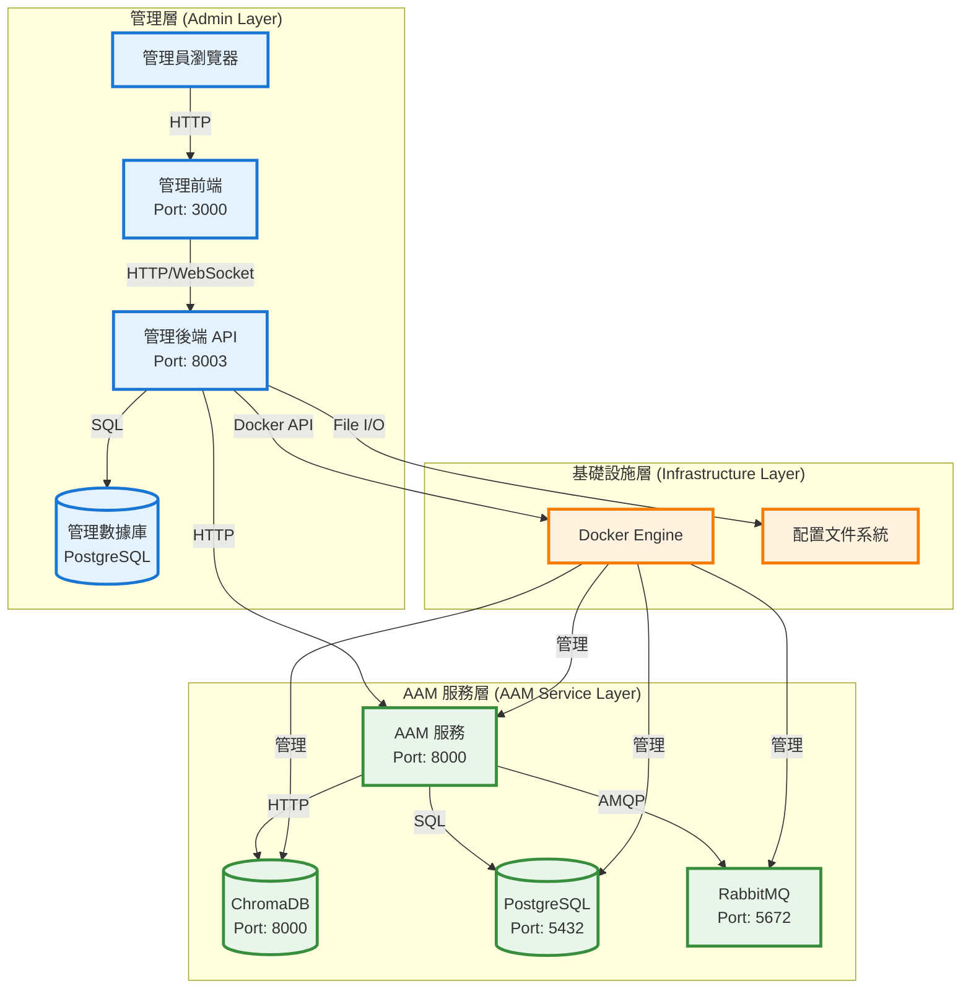
```mermaid
flowchart TB
    subgraph "管理層 (Admin Layer)"
        Admin[管理員瀏覽器]
        AdminFrontend[管理前端<br/>Port: 3000]
        AdminBackend[管理後端 API<br/>Port: 8003]
        AdminDB[(管理數據庫<br/>PostgreSQL)]
    end
    
    subgraph "AAM 服務層 (AAM Service Layer)"
        AAMService[AAM 服務<br/>Port: 8000]
        ChromaDB[(ChromaDB<br/>Port: 8000)]
        Postgres[(PostgreSQL<br/>Port: 5432)]
        RabbitMQ[RabbitMQ<br/>Port: 5672]
    end
    
    subgraph "基礎設施層 (Infrastructure Layer)"
        Docker[Docker Engine]
        ConfigFiles[配置文件系統]
    end
    
    Admin -->|HTTP| AdminFrontend
    AdminFrontend -->|HTTP/WebSocket| AdminBackend
    AdminBackend -->|SQL| AdminDB
    AdminBackend -->|HTTP| AAMService
    AdminBackend -->|Docker API| Docker
    AdminBackend -->|File I/O| ConfigFiles
    
    AAMService -->|HTTP| ChromaDB
    AAMService -->|SQL| Postgres
    AAMService -->|AMQP| RabbitMQ
    
    Docker -->|管理| AAMService
    Docker -->|管理| ChromaDB
    Docker -->|管理| Postgres
    Docker -->|管理| RabbitMQ
    
    classDef adminClass fill:#e3f2fd,stroke:#1976d2,stroke-width:3px
    classDef aamClass fill:#e8f5e9,stroke:#388e3c,stroke-width:3px
    classDef infraClass fill:#fff3e0,stroke:#f57c00,stroke-width:3px
    
    class Admin,AdminFrontend,AdminBackend,AdminDB adminClass
    class AAMService,ChromaDB,Postgres,RabbitMQ aamClass
    class Docker,ConfigFiles infraClass
```

### 8.2 網絡架構

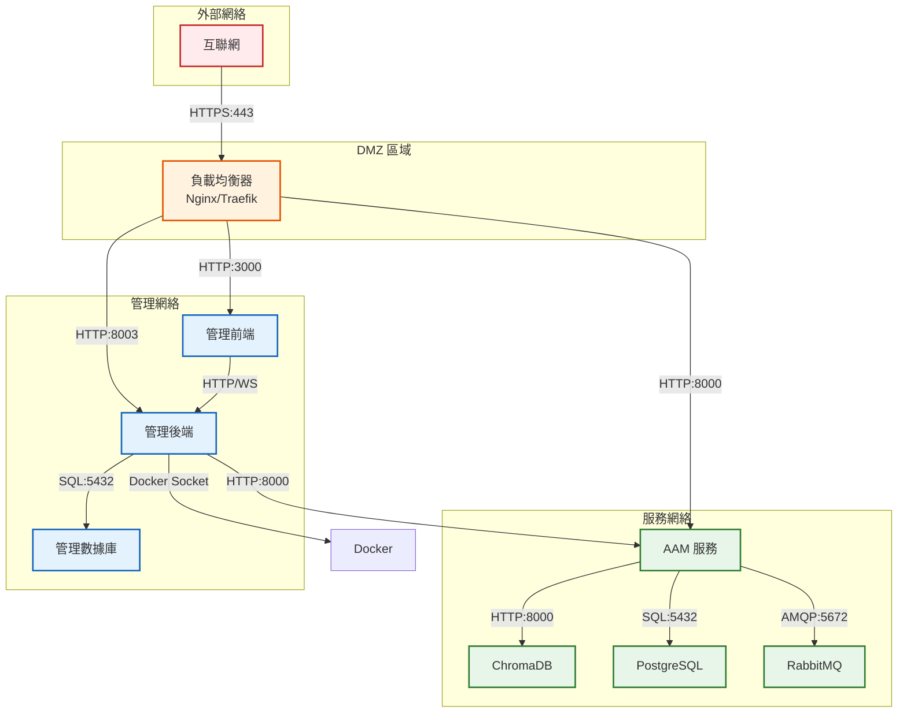
```mermaid
graph TB
    subgraph "外部網絡"
        Internet[互聯網]
    end
    
    subgraph "DMZ 區域"
        LB[負載均衡器<br/>Nginx/Traefik]
    end
    
    subgraph "管理網絡"
        AdminFrontend[管理前端]
        AdminBackend[管理後端]
    end
    
    subgraph "服務網絡"
        AAMService[AAM 服務]
        ChromaDB[ChromaDB]
        Postgres[PostgreSQL]
        RabbitMQ[RabbitMQ]
    end
    
    subgraph "管理網絡"
        AdminDB[管理數據庫]
    end
    
    Internet -->|HTTPS:443| LB
    LB -->|HTTP:3000| AdminFrontend
    LB -->|HTTP:8003| AdminBackend
    LB -->|HTTP:8000| AAMService
    
    AdminFrontend -->|HTTP/WS| AdminBackend
    AdminBackend -->|SQL:5432| AdminDB
    AdminBackend -->|HTTP:8000| AAMService
    AdminBackend -->|Docker Socket| Docker
    
    AAMService -->|HTTP:8000| ChromaDB
    AAMService -->|SQL:5432| Postgres
    AAMService -->|AMQP:5672| RabbitMQ
    
    classDef externalClass fill:#ffebee,stroke:#c62828,stroke-width:2px
    classDef dmzClass fill:#fff3e0,stroke:#e65100,stroke-width:2px
    classDef adminClass fill:#e3f2fd,stroke:#1565c0,stroke-width:2px
    classDef serviceClass fill:#e8f5e9,stroke:#2e7d32,stroke-width:2px
    
    class Internet externalClass
    class LB dmzClass
    class AdminFrontend,AdminBackend,AdminDB adminClass
    class AAMService,ChromaDB,Postgres,RabbitMQ serviceClass
```

### 8.3 數據庫 Schema

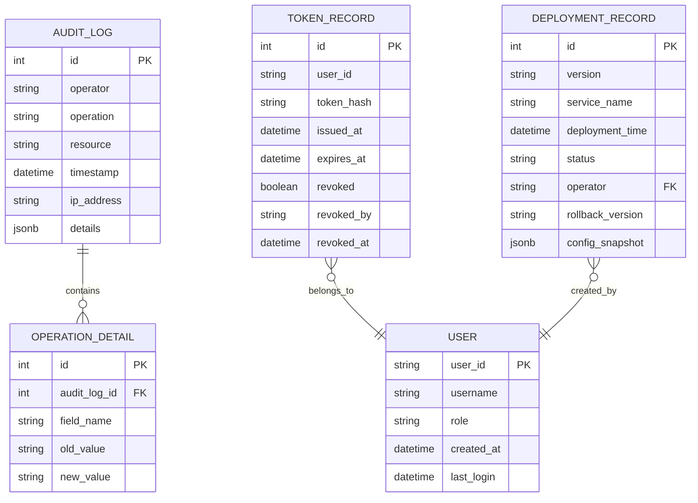
```mermaid
erDiagram
    AUDIT_LOG ||--o{ OPERATION_DETAIL : contains
    TOKEN_RECORD }o--|| USER : belongs_to
    DEPLOYMENT_RECORD }o--|| USER : created_by
    
    AUDIT_LOG {
        int id PK
        string operator
        string operation
        string resource
        datetime timestamp
        string ip_address
        jsonb details
    }
    
    TOKEN_RECORD {
        int id PK
        string user_id
        string token_hash
        datetime issued_at
        datetime expires_at
        boolean revoked
        string revoked_by
        datetime revoked_at
    }
    
    DEPLOYMENT_RECORD {
        int id PK
        string version
        string service_name
        datetime deployment_time
        string status
        string operator FK
        string rollback_version
        jsonb config_snapshot
    }
    
    USER {
        string user_id PK
        string username
        string role
        datetime created_at
        datetime last_login
    }
    
    OPERATION_DETAIL {
        int id PK
        int audit_log_id FK
        string field_name
        string old_value
        string new_value
    }
```

---

## 9. 版本管理與零中斷部署

### 9.1 版本管理架構

AAM 管理系統支持完整的版本管理功能，確保服務可以進行零中斷的版本切換。

#### 9.1.1 版本存儲結構

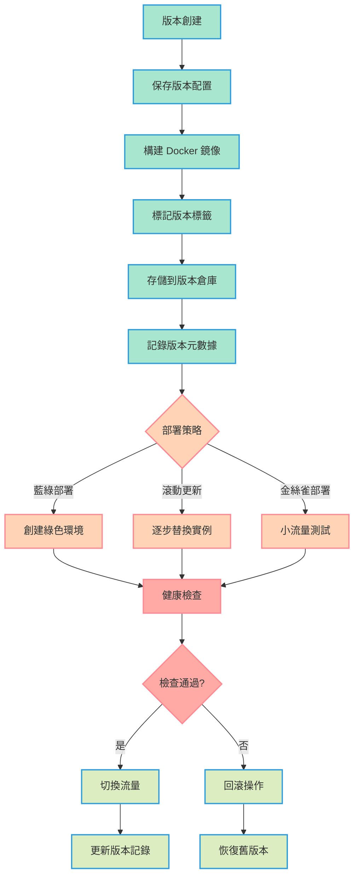
```mermaid
flowchart TD
    A[版本創建] --> B[保存版本配置]
    B --> C[構建 Docker 鏡像]
    C --> D[標記版本標籤]
    D --> E[存儲到版本倉庫]
    E --> F[記錄版本元數據]
    
    F --> G{部署策略}
    G -->|藍綠部署| H[創建綠色環境]
    G -->|滾動更新| I[逐步替換實例]
    G -->|金絲雀部署| J[小流量測試]
    
    H --> K[健康檢查]
    I --> K
    J --> K
    
    K --> L{檢查通過?}
    L -->|是| M[切換流量]
    L -->|否| N[回滾操作]
    
    M --> O[更新版本記錄]
    N --> P[恢復舊版本]
    
    classDef createClass fill:#a8e6cf,stroke:#2d9cdb,stroke-width:2px
    classDef deployClass fill:#ffd3b6,stroke:#ff8b94,stroke-width:2px
    classDef checkClass fill:#ffaaa5,stroke:#ff8b94,stroke-width:2px
    classDef resultClass fill:#dcedc1,stroke:#2d9cdb,stroke-width:2px
    
    class A,B,C,D,E,F createClass
    class G,H,I,J deployClass
    class K,L checkClass
    class M,N,O,P resultClass
```

#### 9.1.2 版本管理數據模型

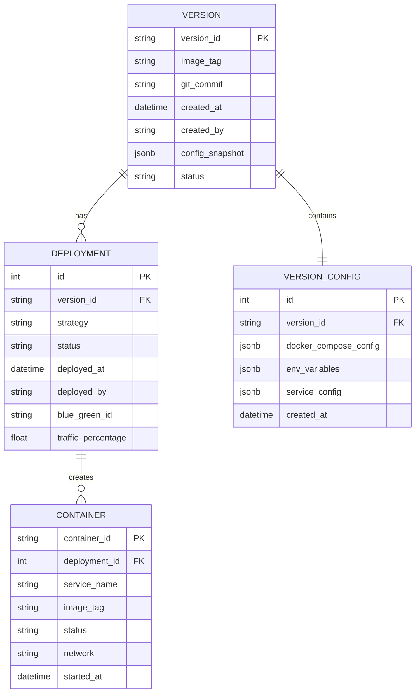
```mermaid
erDiagram
    VERSION ||--o{ DEPLOYMENT : has
    VERSION ||--|| VERSION_CONFIG : contains
    DEPLOYMENT ||--o{ CONTAINER : creates
    
    VERSION {
        string version_id PK
        string image_tag
        string git_commit
        datetime created_at
        string created_by
        jsonb config_snapshot
        string status
    }
    
    VERSION_CONFIG {
        int id PK
        string version_id FK
        jsonb docker_compose_config
        jsonb env_variables
        jsonb service_config
        datetime created_at
    }
    
    DEPLOYMENT {
        int id PK
        string version_id FK
        string strategy
        string status
        datetime deployed_at
        string deployed_by
        string blue_green_id
        float traffic_percentage
    }
    
    CONTAINER {
        string container_id PK
        int deployment_id FK
        string service_name
        string image_tag
        string status
        string network
        datetime started_at
    }
```

### 9.2 零中斷部署策略

#### 9.2.1 藍綠部署（Blue-Green Deployment）

**適用場景**: 主要版本更新、重大功能變更

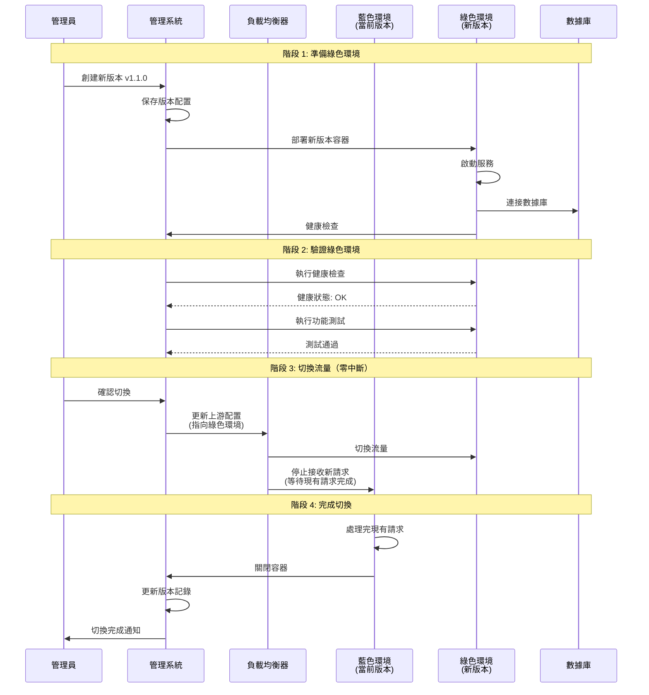
```mermaid
sequenceDiagram
    participant Admin as 管理員
    participant AdminSys as 管理系統
    participant LB as 負載均衡器
    participant Blue as 藍色環境<br/>(當前版本)
    participant Green as 綠色環境<br/>(新版本)
    participant DB as 數據庫
    
    Note over Admin,DB: 階段 1: 準備綠色環境
    Admin->>AdminSys: 創建新版本 v1.1.0
    AdminSys->>AdminSys: 保存版本配置
    AdminSys->>Green: 部署新版本容器
    Green->>Green: 啟動服務
    Green->>DB: 連接數據庫
    Green->>AdminSys: 健康檢查
    
    Note over Admin,DB: 階段 2: 驗證綠色環境
    AdminSys->>Green: 執行健康檢查
    Green-->>AdminSys: 健康狀態: OK
    AdminSys->>Green: 執行功能測試
    Green-->>AdminSys: 測試通過
    
    Note over Admin,DB: 階段 3: 切換流量（零中斷）
    Admin->>AdminSys: 確認切換
    AdminSys->>LB: 更新上游配置<br/>(指向綠色環境)
    LB->>Green: 切換流量
    LB->>Blue: 停止接收新請求<br/>(等待現有請求完成)
    
    Note over Admin,DB: 階段 4: 完成切換
    Blue->>Blue: 處理完現有請求
    Blue->>AdminSys: 關閉容器
    AdminSys->>AdminSys: 更新版本記錄
    AdminSys->>Admin: 切換完成通知
```

**藍綠部署流程圖**:

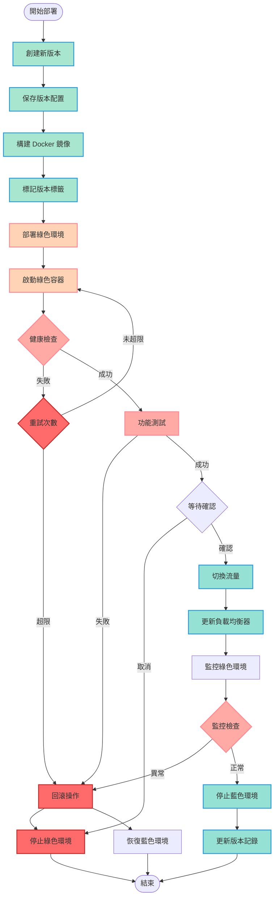
```mermaid
flowchart TD
    Start([開始部署]) --> CreateVersion[創建新版本]
    CreateVersion --> SaveConfig[保存版本配置]
    SaveConfig --> BuildImage[構建 Docker 鏡像]
    BuildImage --> TagVersion[標記版本標籤]
    
    TagVersion --> DeployGreen[部署綠色環境]
    DeployGreen --> StartGreen[啟動綠色容器]
    StartGreen --> HealthCheck{健康檢查}
    
    HealthCheck -->|失敗| Retry{重試次數}
    Retry -->|未超限| StartGreen
    Retry -->|超限| Rollback[回滾操作]
    
    HealthCheck -->|成功| FuncTest[功能測試]
    FuncTest -->|失敗| Rollback
    FuncTest -->|成功| WaitConfirm{等待確認}
    
    WaitConfirm -->|取消| StopGreen[停止綠色環境]
    StopGreen --> End([結束])
    
    WaitConfirm -->|確認| SwitchTraffic[切換流量]
    SwitchTraffic --> UpdateLB[更新負載均衡器]
    UpdateLB --> MonitorGreen[監控綠色環境]
    
    MonitorGreen --> MonitorCheck{監控檢查}
    MonitorCheck -->|異常| Rollback
    MonitorCheck -->|正常| StopBlue[停止藍色環境]
    
    StopBlue --> UpdateRecord[更新版本記錄]
    UpdateRecord --> End
    
    Rollback --> StopGreen
    Rollback --> RestoreBlue[恢復藍色環境]
    RestoreBlue --> End
    
    classDef createClass fill:#a8e6cf,stroke:#2d9cdb,stroke-width:2px
    classDef deployClass fill:#ffd3b6,stroke:#ff8b94,stroke-width:2px
    classDef checkClass fill:#ffaaa5,stroke:#ff8b94,stroke-width:2px
    classDef switchClass fill:#95e1d3,stroke:#2d9cdb,stroke-width:2px
    classDef errorClass fill:#ff6b6b,stroke:#c92a2a,stroke-width:2px
    
    class CreateVersion,SaveConfig,BuildImage,TagVersion createClass
    class DeployGreen,StartGreen deployClass
    class HealthCheck,FuncTest,MonitorCheck checkClass
    class SwitchTraffic,UpdateLB,StopBlue,UpdateRecord switchClass
    class Retry,Rollback,StopGreen errorClass
```

#### 9.2.2 滾動更新（Rolling Update）

**適用場景**: 小版本更新、配置變更、安全補丁

```mermaid
sequenceDiagram
    participant Admin as 管理員
    participant AdminSys as 管理系統
    participant Instance1 as 實例 1<br/>(舊版本)
    participant Instance2 as 實例 2<br/>(舊版本)
    participant Instance3 as 實例 3<br/>(新版本)
    participant LB as 負載均衡器
    
    Note over Admin,LB: 階段 1: 更新實例 1
    Admin->>AdminSys: 啟動滾動更新
    AdminSys->>Instance1: 停止實例 1
    Instance1->>LB: 從負載均衡移除
    LB->>Instance2: 流量轉移到實例 2
    AdminSys->>Instance1: 部署新版本
    Instance1->>Instance1: 啟動新版本
    Instance1->>AdminSys: 健康檢查通過
    Instance1->>LB: 重新加入負載均衡
    
    Note over Admin,LB: 階段 2: 更新實例 2
    AdminSys->>Instance2: 停止實例 2
    Instance2->>LB: 從負載均衡移除
    LB->>Instance1: 流量轉移到實例 1
    AdminSys->>Instance2: 部署新版本
    Instance2->>Instance2: 啟動新版本
    Instance2->>AdminSys: 健康檢查通過
    Instance2->>LB: 重新加入負載均衡
    
    Note over Admin,LB: 階段 3: 更新實例 3
    AdminSys->>Instance3: 停止實例 3
    Instance3->>LB: 從負載均衡移除
    LB->>Instance1,Instance2: 流量分散
    AdminSys->>Instance3: 部署新版本
    Instance3->>Instance3: 啟動新版本
    Instance3->>AdminSys: 健康檢查通過
    Instance3->>LB: 重新加入負載均衡
    
    Note over Admin,LB: 完成更新
    AdminSys->>Admin: 滾動更新完成
```

#### 9.2.3 金絲雀部署（Canary Deployment）

**適用場景**: 新功能測試、性能驗證、風險控制

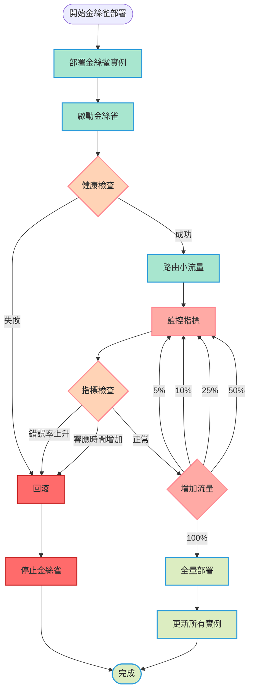
```mermaid
flowchart TD
    Start([開始金絲雀部署]) --> DeployCanary[部署金絲雀實例]
    DeployCanary --> StartCanary[啟動金絲雀]
    StartCanary --> HealthCheck{健康檢查}
    
    HealthCheck -->|失敗| Rollback[回滾]
    HealthCheck -->|成功| RouteTraffic[路由小流量]
    
    RouteTraffic --> Monitor[監控指標]
    Monitor --> CheckMetrics{指標檢查}
    
    CheckMetrics -->|錯誤率上升| Rollback
    CheckMetrics -->|響應時間增加| Rollback
    CheckMetrics -->|正常| IncreaseTraffic{增加流量}
    
    IncreaseTraffic -->|5%| Monitor
    IncreaseTraffic -->|10%| Monitor
    IncreaseTraffic -->|25%| Monitor
    IncreaseTraffic -->|50%| Monitor
    IncreaseTraffic -->|100%| FullDeploy[全量部署]
    
    FullDeploy --> UpdateAll[更新所有實例]
    UpdateAll --> End([完成])
    
    Rollback --> StopCanary[停止金絲雀]
    StopCanary --> End
    
    classDef deployClass fill:#a8e6cf,stroke:#2d9cdb,stroke-width:2px
    classDef checkClass fill:#ffd3b6,stroke:#ff8b94,stroke-width:2px
    classDef monitorClass fill:#ffaaa5,stroke:#ff8b94,stroke-width:2px
    classDef successClass fill:#dcedc1,stroke:#2d9cdb,stroke-width:2px
    classDef errorClass fill:#ff6b6b,stroke:#c92a2a,stroke-width:2px
    
    class DeployCanary,StartCanary,RouteTraffic deployClass
    class HealthCheck,CheckMetrics checkClass
    class Monitor,IncreaseTraffic monitorClass
    class FullDeploy,UpdateAll,End successClass
    class Rollback,StopCanary errorClass
```

### 9.3 版本切換機制

#### 9.3.1 負載均衡器配置

使用 Nginx 或 Traefik 作為負載均衡器，支持動態更新上游配置：

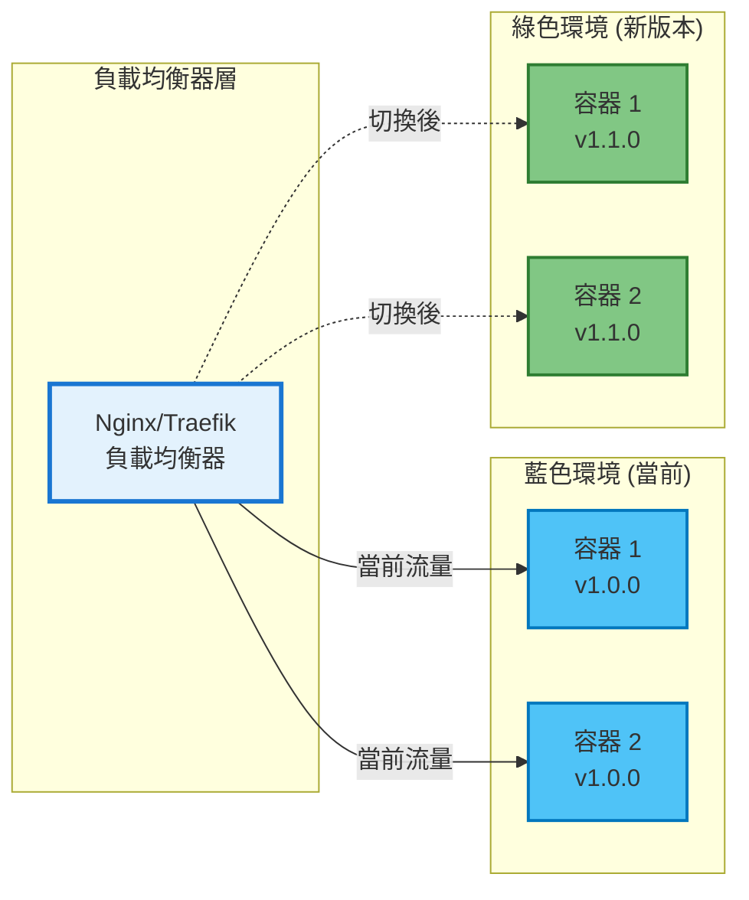
```mermaid
flowchart LR
    subgraph "負載均衡器層"
        LB[Nginx/Traefik<br/>負載均衡器]
    end
    
    subgraph "藍色環境 (當前)"
        Blue1[容器 1<br/>v1.0.0]
        Blue2[容器 2<br/>v1.0.0]
    end
    
    subgraph "綠色環境 (新版本)"
        Green1[容器 1<br/>v1.1.0]
        Green2[容器 2<br/>v1.1.0]
    end
    
    LB -->|當前流量| Blue1
    LB -->|當前流量| Blue2
    LB -.->|切換後| Green1
    LB -.->|切換後| Green2
    
    classDef lbClass fill:#e3f2fd,stroke:#1976d2,stroke-width:3px
    classDef blueClass fill:#4fc3f7,stroke:#0277bd,stroke-width:2px
    classDef greenClass fill:#81c784,stroke:#2e7d32,stroke-width:2px
    
    class LB lbClass
    class Blue1,Blue2 blueClass
    class Green1,Green2 greenClass
```

#### 9.3.2 版本切換流程

```mermaid
sequenceDiagram
    participant Admin as 管理員
    participant AdminSys as 管理系統
    participant VersionRepo as 版本倉庫
    participant LB as 負載均衡器
    participant OldVersion as 舊版本服務
    participant NewVersion as 新版本服務
    participant Monitor as 監控系統
    
    Admin->>AdminSys: 請求切換版本
    AdminSys->>VersionRepo: 獲取目標版本配置
    VersionRepo-->>AdminSys: 返回版本配置
    
    AdminSys->>NewVersion: 啟動新版本服務
    NewVersion->>NewVersion: 初始化
    NewVersion-->>AdminSys: 就緒
    
    AdminSys->>NewVersion: 執行健康檢查
    NewVersion-->>AdminSys: 健康檢查通過
    
    AdminSys->>LB: 添加新版本到上游
    LB-->>AdminSys: 配置更新成功
    
    Note over LB,OldVersion: 零中斷切換
    AdminSys->>LB: 切換流量到新版本
    LB->>NewVersion: 開始接收新請求
    LB->>OldVersion: 停止接收新請求<br/>(等待現有請求完成)
    
    OldVersion->>OldVersion: 處理完現有請求
    OldVersion-->>AdminSys: 所有請求完成
    
    AdminSys->>Monitor: 監控新版本指標
    Monitor-->>AdminSys: 指標正常
    
    AdminSys->>OldVersion: 停止舊版本
    AdminSys->>VersionRepo: 更新活動版本
    AdminSys->>Admin: 切換完成
```

### 9.4 版本管理 API

#### 9.4.1 版本管理端點

| 端點 | 方法 | 功能 | 說明 |
|------|------|------|------|
| `/api/v1/admin/versions` | GET | 獲取版本列表 | 列出所有可用版本 |
| `/api/v1/admin/versions` | POST | 創建新版本 | 從 Git 提交或配置創建版本 |
| `/api/v1/admin/versions/{version}` | GET | 獲取版本詳情 | 獲取指定版本的詳細信息 |
| `/api/v1/admin/versions/{version}/deploy` | POST | 部署版本 | 使用指定策略部署版本 |
| `/api/v1/admin/versions/{version}/rollback` | POST | 回滾版本 | 回滾到指定版本 |
| `/api/v1/admin/versions/active` | GET | 獲取活動版本 | 獲取當前活動的版本 |
| `/api/v1/admin/versions/active/switch` | POST | 切換活動版本 | 切換到指定版本（零中斷） |
| `/api/v1/admin/deployments` | GET | 獲取部署歷史 | 獲取所有部署記錄 |
| `/api/v1/admin/deployments/{id}` | GET | 獲取部署詳情 | 獲取指定部署的詳細信息 |

#### 9.4.2 部署策略參數

```json
{
  "version": "v1.1.0",
  "strategy": "blue-green",  // 或 "rolling", "canary"
  "config": {
    "blue_green": {
      "health_check_timeout": 300,
      "traffic_switch_delay": 10
    },
    "rolling": {
      "max_unavailable": 1,
      "max_surge": 1,
      "min_ready_seconds": 30
    },
    "canary": {
      "initial_traffic_percentage": 5,
      "increment_percentage": 5,
      "increment_interval": 300,
      "success_criteria": {
        "max_error_rate": 0.01,
        "max_response_time": 1000
      }
    }
  }
}
```

### 9.5 版本配置管理

#### 9.5.1 版本配置結構

每個版本包含完整的配置快照：

```yaml
version: v1.1.0
created_at: 2025-11-13T10:00:00Z
created_by: admin
git_commit: abc123def456
image_tag: aam-service:v1.1.0

docker_compose:
  services:
    aam-service:
      image: aam-service:v1.1.0
      environment:
        - APP_VERSION=v1.1.0
        - DEBUG=false
      # ... 其他配置

environment_variables:
  APP_VERSION: v1.1.0
  SECRET_KEY: "***"
  # ... 其他環境變量

service_config:
  api:
    port: 8000
    timeout: 30
  database:
    pool_size: 10
  # ... 其他服務配置
```

#### 9.5.2 版本比較功能

```mermaid
flowchart TD
    A[選擇兩個版本] --> B[載入版本配置]
    B --> C[比較配置差異]
    C --> D{有差異?}
    D -->|無差異| E[顯示無差異]
    D -->|有差異| F[生成差異報告]
    F --> G[顯示配置變更]
    G --> H[顯示環境變量變更]
    G --> I[顯示服務配置變更]
    G --> J[顯示依賴變更]
    
    classDef inputClass fill:#a8e6cf,stroke:#2d9cdb,stroke-width:2px
    classDef processClass fill:#ffd3b6,stroke:#ff8b94,stroke-width:2px
    classDef outputClass fill:#dcedc1,stroke:#2d9cdb,stroke-width:2px
    
    class A,B inputClass
    class C,D,F processClass
    class E,G,H,I,J outputClass
```

### 9.6 回滾機制

#### 9.6.1 自動回滾觸發條件

```mermaid
flowchart TD
    A[部署新版本] --> B[監控指標]
    B --> C{檢查指標}
    C -->|錯誤率 > 閾值| D[觸發自動回滾]
    C -->|響應時間 > 閾值| D
    C -->|健康檢查失敗| D
    C -->|手動觸發| D
    C -->|正常| E[繼續運行]
    
    D --> F[停止新版本]
    F --> G[恢復舊版本]
    G --> H[切換流量回舊版本]
    H --> I[記錄回滾操作]
    I --> J[通知管理員]
    
    classDef monitorClass fill:#ffd3b6,stroke:#ff8b94,stroke-width:2px
    classDef rollbackClass fill:#ff6b6b,stroke:#c92a2a,stroke-width:2px,color:#fff
    classDef successClass fill:#dcedc1,stroke:#2d9cdb,stroke-width:2px
    
    class B,C monitorClass
    class D,F,G,H rollbackClass
    class E,I,J successClass
```

#### 9.6.2 回滾配置

```json
{
  "auto_rollback": {
    "enabled": true,
    "triggers": {
      "error_rate_threshold": 0.05,
      "response_time_threshold": 2000,
      "health_check_failures": 3,
      "monitoring_duration": 300
    },
    "rollback_strategy": "immediate"  // 或 "gradual"
  }
}
```

### 9.7 版本管理數據庫 Schema

```mermaid
erDiagram
    VERSION ||--o{ VERSION_CONFIG : has
    VERSION ||--o{ DEPLOYMENT : deployed_as
    DEPLOYMENT ||--o{ CONTAINER : creates
    DEPLOYMENT ||--o{ DEPLOYMENT_METRIC : records
    
    VERSION {
        string version_id PK "v1.0.0"
        string image_tag "aam-service:v1.0.0"
        string git_commit "abc123"
        string git_branch "main"
        datetime created_at
        string created_by
        jsonb config_snapshot
        string status "active|inactive|deprecated"
    }
    
    VERSION_CONFIG {
        int id PK
        string version_id FK
        jsonb docker_compose_config
        jsonb env_variables
        jsonb service_config
        jsonb dependencies
        datetime created_at
    }
    
    DEPLOYMENT {
        int id PK
        string version_id FK
        string strategy "blue-green|rolling|canary"
        string status "pending|deploying|active|failed|rolled_back"
        datetime deployed_at
        string deployed_by
        string blue_green_id
        float traffic_percentage
        jsonb deployment_config
    }
    
    CONTAINER {
        string container_id PK
        int deployment_id FK
        string service_name "aam-service"
        string image_tag
        string status "running|stopped|failed"
        string network
        datetime started_at
        datetime stopped_at
    }
    
    DEPLOYMENT_METRIC {
        int id PK
        int deployment_id FK
        datetime timestamp
        float error_rate
        float response_time
        float cpu_usage
        float memory_usage
        int request_count
    }
```

---

## 9. 實施階段

### 9.1 階段一：基礎功能（MVP）

**目標**: 實現核心管理功能

- [ ] 管理後端 API 框架搭建
- [ ] 認證與授權系統
- [ ] 服務狀態監控
- [ ] 服務啟動/停止功能
- [ ] 基礎日誌查看
- [ ] Token 管理

**預計時間**: 2-3 週

### 9.2 階段二：完整功能

**目標**: 實現所有核心功能模塊

- [ ] LLM Provider 管理
- [ ] 模型配置管理
- [ ] 實時日誌流
- [ ] 版本管理與部署
  - [ ] 版本創建與存儲
  - [ ] 藍綠部署實現
  - [ ] 滾動更新實現
  - [ ] 版本切換機制
  - [ ] 負載均衡器集成
- [ ] 企業認證配置
- [ ] 操作審計系統

**預計時間**: 3-4 週

### 9.3 階段三：高級功能

**目標**: 增強系統功能和用戶體驗

- [ ] 性能監控與告警
- [ ] 自動化部署流程
- [ ] 多環境管理
- [ ] 操作審計報表
- [ ] 系統健康檢查
- [ ] 備份與恢復
- [ ] 金絲雀部署
- [ ] 自動回滾機制
- [ ] 版本比較與差異分析
- [ ] 部署預覽與驗證

**預計時間**: 2-3 週

---

## 10. 附錄

### 10.1 API 端點總覽

#### 認證與授權
| 端點 | 方法 | 功能 | 認證 |
|------|------|------|------|
| `/api/v1/auth/login` | POST | 管理員登錄 | - |

#### 服務管理
| 端點 | 方法 | 功能 | 認證 |
|------|------|------|------|
| `/api/v1/admin/services` | GET | 獲取服務列表 | Admin API Key |
| `/api/v1/admin/services/{name}/start` | POST | 啟動服務 | Admin API Key |
| `/api/v1/admin/services/{name}/stop` | POST | 停止服務 | Admin API Key |
| `/api/v1/admin/services/{name}/restart` | POST | 重啟服務 | Admin API Key |

#### LLM Provider 管理
| 端點 | 方法 | 功能 | 認證 |
|------|------|------|------|
| `/api/v1/admin/llm-providers` | GET | 獲取 Provider 列表 | Admin API Key |
| `/api/v1/admin/llm-providers/{type}/models` | GET | 獲取模型列表 | Admin API Key |
| `/api/v1/admin/llm-providers/{type}/models/{name}` | PUT | 更新模型配置 | Admin API Key |
| `/api/v1/admin/llm-providers/{type}/test` | POST | 測試 Provider 連接 | Admin API Key |

#### 版本管理與部署
| 端點 | 方法 | 功能 | 認證 |
|------|------|------|------|
| `/api/v1/admin/versions` | GET | 獲取版本列表 | Admin API Key |
| `/api/v1/admin/versions` | POST | 創建新版本 | Admin API Key |
| `/api/v1/admin/versions/{version}` | GET | 獲取版本詳情 | Admin API Key |
| `/api/v1/admin/versions/{version}/deploy` | POST | 部署版本 | Admin API Key |
| `/api/v1/admin/versions/{version}/rollback` | POST | 回滾版本 | Admin API Key |
| `/api/v1/admin/versions/active` | GET | 獲取活動版本 | Admin API Key |
| `/api/v1/admin/versions/active/switch` | POST | 切換活動版本（零中斷） | Admin API Key |
| `/api/v1/admin/versions/{v1}/compare/{v2}` | GET | 比較兩個版本 | Admin API Key |
| `/api/v1/admin/deployments` | GET | 獲取部署歷史 | Admin API Key |
| `/api/v1/admin/deployments/{id}` | GET | 獲取部署詳情 | Admin API Key |

#### 安全管理
| 端點 | 方法 | 功能 | 認證 |
|------|------|------|------|
| `/api/v1/admin/security/tokens` | GET | 獲取 Token 列表 | Admin API Key |
| `/api/v1/admin/security/tokens/issue` | POST | 發行 Token | Admin API Key |
| `/api/v1/admin/security/tokens/{id}/revoke` | DELETE | 撤銷 Token | Admin API Key |
| `/api/v1/admin/security/enterprise-auth` | PUT | 更新企業認證配置 | Admin API Key |

#### 日誌管理
| 端點 | 方法 | 功能 | 認證 |
|------|------|------|------|
| `/api/v1/admin/logs/stream` | WebSocket | 實時日誌流 | Admin API Key |
| `/api/v1/admin/logs/search` | POST | 搜索日誌 | Admin API Key |
| `/api/v1/admin/logs/export` | GET | 導出日誌 | Admin API Key |

### 10.2 版本管理最佳實踐

#### 10.2.1 版本命名規範

- **語義化版本**: 遵循 `MAJOR.MINOR.PATCH` 格式
  - `MAJOR`: 不兼容的 API 變更
  - `MINOR`: 向後兼容的功能新增
  - `PATCH`: 向後兼容的問題修復
- **示例**: `v1.2.3`, `v2.0.0-beta.1`

#### 10.2.2 部署策略選擇指南

| 場景 | 推薦策略 | 說明 |
|------|---------|------|
| 主要版本更新 | 藍綠部署 | 確保零中斷，易於回滾 |
| 小版本更新 | 滾動更新 | 資源利用率高，逐步替換 |
| 新功能測試 | 金絲雀部署 | 風險控制，逐步擴大流量 |
| 緊急修復 | 藍綠部署 | 快速切換，最小影響 |
| 配置變更 | 滾動更新 | 無需重啟所有實例 |

#### 10.2.3 版本切換檢查清單

**切換前檢查**:
- [ ] 新版本健康檢查通過
- [ ] 功能測試通過
- [ ] 性能測試通過
- [ ] 數據庫遷移完成（如需要）
- [ ] 配置文件驗證通過
- [ ] 依賴服務可用

**切換後監控**:
- [ ] 錯誤率監控（5 分鐘內）
- [ ] 響應時間監控
- [ ] 資源使用監控
- [ ] 業務指標監控
- [ ] 日誌異常檢查

### 10.3 相關文檔

- [AAM 企業安全認證管理手冊](./AAM企業安全認證管理手冊.md)
- [LLM Provider 配置指南](./LLM_Provider配置指南.md)
- [環境設置指南](./環境設置.md)
- [AAM Agent SD v2](./AAM%20Agent%20SD%20v2.md)

---

**最後更新**: 2025-11-13  
**維護者**:Daniel Chung

