# AAM 管理系統 - 頁面佈局設計 (UI/UX Layout Design)

**版本**: v1.0  
**創建日期**: 2025-11-13  
**最後更新**: 2025-11-13  
**作者**:Daniel Chung

---

## 📋 目錄

1. [整體佈局架構](#1-整體佈局架構)
2. [導航結構](#2-導航結構)
3. [功能模塊頁面佈局](#3-功能模塊頁面佈局)
4. [響應式設計](#4-響應式設計)
5. [組件設計規範](#5-組件設計規範)
6. [顏色與主題](#6-顏色與主題)

---

## 1. 整體佈局架構

### 1.1 主佈局結構

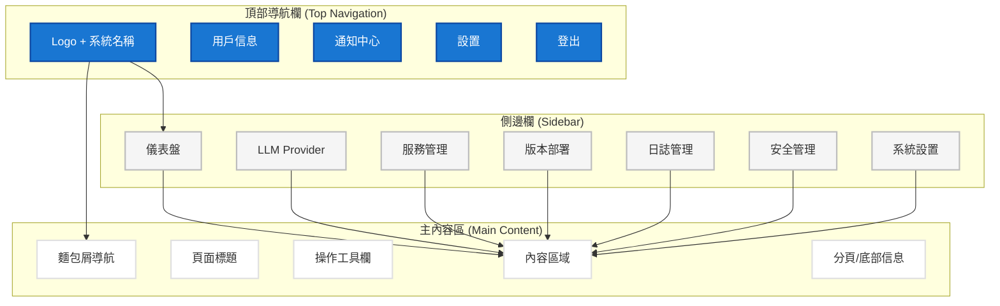

### 1.2 佈局尺寸規範

| 區域 | 寬度/高度 | 說明 |
|------|----------|------|
| 頂部導航欄 | 100% × 64px | 固定高度，全寬 |
| 側邊欄 | 240px × 100% | 固定寬度，可收起 |
| 主內容區 | 剩餘空間 | 自適應寬度 |
| 最小視窗寬度 | 1280px | 響應式斷點 |

---

## 2. 導航結構

### 2.1 導航層級結構

```mermaid
graph TD
    A[儀表盤<br/>Dashboard] 
    B[LLM Provider 管理]
    C[系統服務監管]
    D[版本與部署]
    E[日誌管理]
    F[安全管理]
    G[系統設置]
    
    B --> B1[Provider 列表]
    B --> B2[模型配置]
    B --> B3[Provider 測試]
    
    C --> C1[服務列表]
    C --> C2[服務控制]
    C --> C3[資源監控]
    
    D --> D1[版本列表]
    D --> D2[部署歷史]
    D --> D3[版本比較]
    
    E --> E1[實時日誌]
    E --> E2[日誌搜索]
    E --> E3[日誌導出]
    
    F --> F1[Token 管理]
    F --> F2[企業認證]
    F --> F3[訪問控制]
    F --> F4[操作審計]
    
    G --> G1[環境配置]
    G --> G2[通知設置]
    G --> G3[備份設置]
    
    classDef mainNav fill:#2196f3,stroke:#1976d2,stroke-width:2px,color:#fff
    classDef subNav fill:#e3f2fd,stroke:#90caf9,stroke-width:2px
    
    class A,B,C,D,E,F,G mainNav
    class B1,B2,B3,C1,C2,C3,D1,D2,D3,E1,E2,E3,F1,F2,F3,F4,G1,G2,G3 subNav
```

### 2.2 導航菜單設計

**一級菜單**（側邊欄）:
- 📊 儀表盤
- 🤖 LLM Provider
- 🖥️ 服務管理
- 🚀 版本部署
- 📝 日誌管理
- 🔒 安全管理
- ⚙️ 系統設置

**二級菜單**（展開顯示）:
- 在對應一級菜單下顯示子菜單項
- 支持摺疊/展開
- 當前頁面高亮顯示

---

## 3. 功能模塊頁面佈局

### 3.1 儀表盤 (Dashboard)

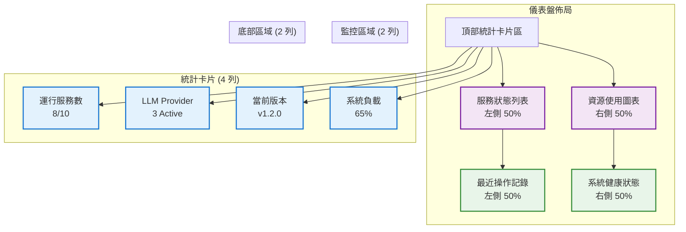

**佈局說明**:
- **頂部**: 4 個統計卡片（響應式：桌面 4 列，平板 2 列，手機 1 列）
- **中部**: 服務狀態監控 + 資源使用圖表（並排顯示）
- **底部**: 最近操作記錄 + 系統健康狀態（並排顯示）

### 3.2 LLM Provider 管理頁面

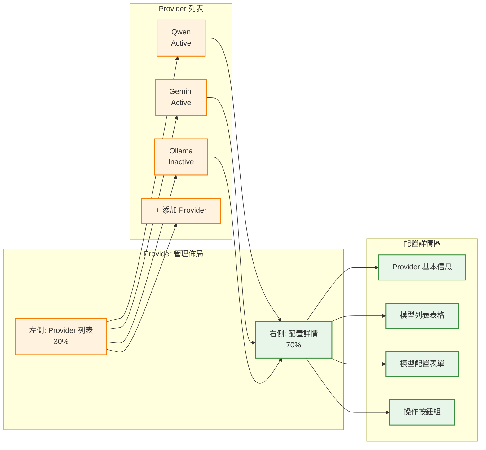

**佈局說明**:
- **左側面板**: Provider 列表（可摺疊）
  - 顯示所有 Provider
  - 顯示狀態指示器（Active/Inactive）
  - 支持添加新 Provider
- **右側面板**: 選中 Provider 的詳細配置
  - Provider 基本信息
  - 模型列表（表格）
  - 模型配置表單（可編輯）
  - 操作按鈕（保存、測試、啟用/禁用）

### 3.3 服務管理頁面

```mermaid
flowchart TB
    subgraph "服務管理佈局"
        A[服務列表表格]
        B[服務詳情面板]
        C[操作工具欄]
    end
    
    subgraph "服務列表 (表格)"
        A1[服務名稱 | 狀態 | 版本 | CPU | 內存 | 操作]
        A2[AAM Service | 🟢 Running | v1.2.0 | 45% | 512MB | 啟動/停止]
        A3[ChromaDB | 🟢 Running | latest | 12% | 256MB | 重啟]
        A4[PostgreSQL | 🟢 Running | 15 | 8% | 128MB | 查看日誌]
    end
    
    subgraph "詳情面板 (抽屜/側邊欄)"
        B1[服務基本信息]
        B2[資源使用圖表]
        B3[實時日誌預覽]
        B4[操作歷史]
    end
    
    A --> A1
    A --> A2
    A --> A3
    A --> A4
    
    A2 --> B
    A3 --> B
    A4 --> B
    
    B --> B1
    B --> B2
    B --> B3
    B --> B4
    
    classDef tableClass fill:#ffffff,stroke:#e0e0e0,stroke-width:2px
    classDef detailClass fill:#f5f5f5,stroke:#bdbdbd,stroke-width:2px
    
    class A,A1,A2,A3,A4 tableClass
    class B,B1,B2,B3,B4 detailClass
```

**佈局說明**:
- **主區域**: 服務列表表格
  - 顯示所有服務的狀態、版本、資源使用
  - 每行有操作按鈕（啟動/停止/重啟/查看日誌）
- **詳情面板**: 點擊服務後從右側滑出
  - 服務基本信息
  - 資源使用實時圖表
  - 實時日誌預覽
  - 操作歷史記錄

### 3.4 版本部署頁面

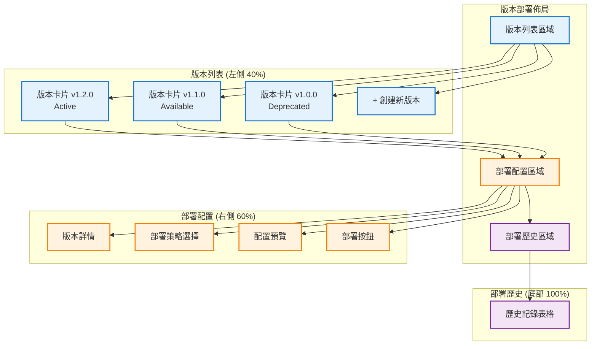

**佈局說明**:
- **左側**: 版本列表（卡片式）
  - 顯示版本號、狀態、創建時間
  - 當前活動版本高亮
  - 支持創建新版本
- **右側**: 部署配置區域
  - 選中版本的詳細信息
  - 部署策略選擇（藍綠/滾動/金絲雀）
  - 配置預覽
  - 部署操作按鈕
- **底部**: 部署歷史表格
  - 顯示所有部署記錄
  - 支持篩選和搜索

### 3.5 日誌管理頁面

```mermaid
flowchart TB
    subgraph "日誌管理佈局"
        A[日誌查看器]
        B[過濾器面板]
        C[日誌操作欄]
    end
    
    subgraph "過濾器 (頂部)"
        B1[服務選擇]
        B2[日誌級別]
        B3[時間範圍]
        B4[關鍵詞搜索]
        B5[搜索按鈕]
    end
    
    subgraph "日誌查看器 (主區域)"
        A1[實時日誌流<br/>可滾動]
        A2[日誌行<br/>時間戳 | 級別 | 服務 | 消息]
    end
    
    subgraph "操作欄 (底部)"
        C1[暫停/繼續]
        C2[清空日誌]
        C3[導出日誌]
        C4[下載日誌]
    end
    
    B --> B1
    B --> B2
    B --> B3
    B --> B4
    B --> B5
    
    B --> A
    A --> A1
    A1 --> A2
    
    A --> C
    C --> C1
    C --> C2
    C --> C3
    C --> C4
    
    classDef filterClass fill:#fff3e0,stroke:#f57c00,stroke-width:2px
    classDef logClass fill:#263238,stroke:#37474f,stroke-width:2px,color:#fff
    classDef actionClass fill:#e8f5e9,stroke:#388e3c,stroke-width:2px
    
    class B,B1,B2,B3,B4,B5 filterClass
    class A,A1,A2 logClass
    class C,C1,C2,C3,C4 actionClass
```

**佈局說明**:
- **頂部**: 過濾器工具欄
  - 服務選擇下拉框
  - 日誌級別選擇（DEBUG/INFO/WARNING/ERROR）
  - 時間範圍選擇器
  - 關鍵詞搜索框
- **主區域**: 日誌查看器（深色背景）
  - 實時日誌流（WebSocket）
  - 支持自動滾動
  - 不同級別使用不同顏色
  - 支持複製日誌行
- **底部**: 操作按鈕欄
  - 暫停/繼續實時日誌
  - 清空顯示
  - 導出/下載日誌

### 3.6 安全管理頁面

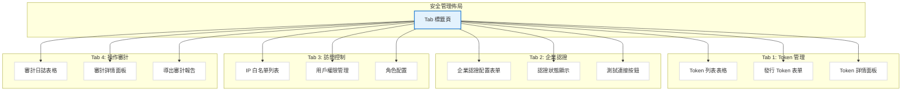

**佈局說明**:
- **Tab 標籤頁結構**:
  1. **Token 管理**: Token 列表 + 發行表單
  2. **企業認證**: 配置表單 + 狀態顯示
  3. **訪問控制**: IP 白名單 + 權限管理
  4. **操作審計**: 審計日誌表格 + 詳情面板

---

## 4. 響應式設計

### 4.1 響應式斷點

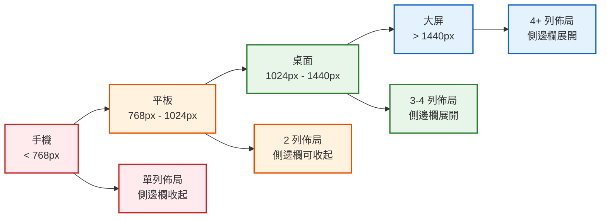

### 4.2 響應式佈局規則

| 設備類型 | 寬度範圍 | 側邊欄 | 主內容區 | 列數 |
|---------|---------|--------|---------|------|
| 手機 | < 768px | 隱藏（抽屜式） | 100% | 1 列 |
| 平板 | 768px - 1024px | 可收起 | 剩餘空間 | 2 列 |
| 桌面 | 1024px - 1440px | 展開 | 剩餘空間 | 3-4 列 |
| 大屏 | > 1440px | 展開 | 剩餘空間 | 4+ 列 |

### 4.3 移動端適配

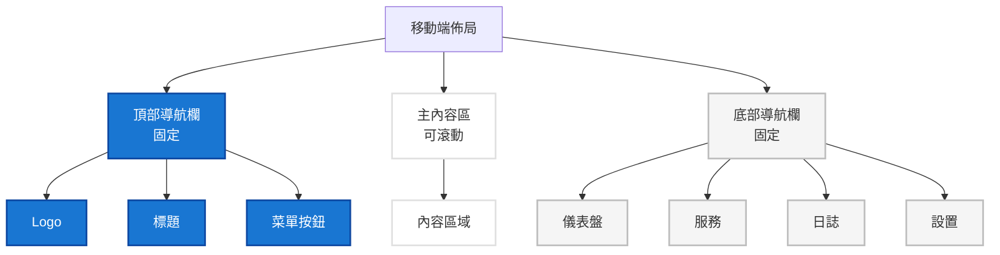

---

## 5. 組件設計規範

### 5.1 通用組件

#### 5.1.1 卡片組件 (Card)

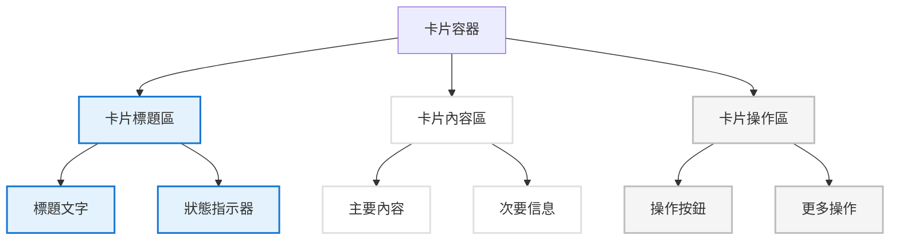

#### 5.1.2 表格組件 (Table)

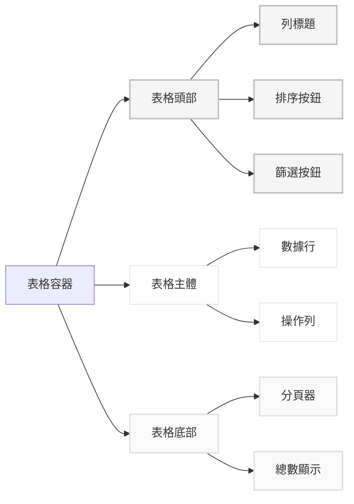

#### 5.1.3 表單組件 (Form)

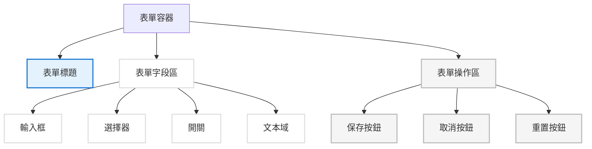

### 5.2 狀態指示器

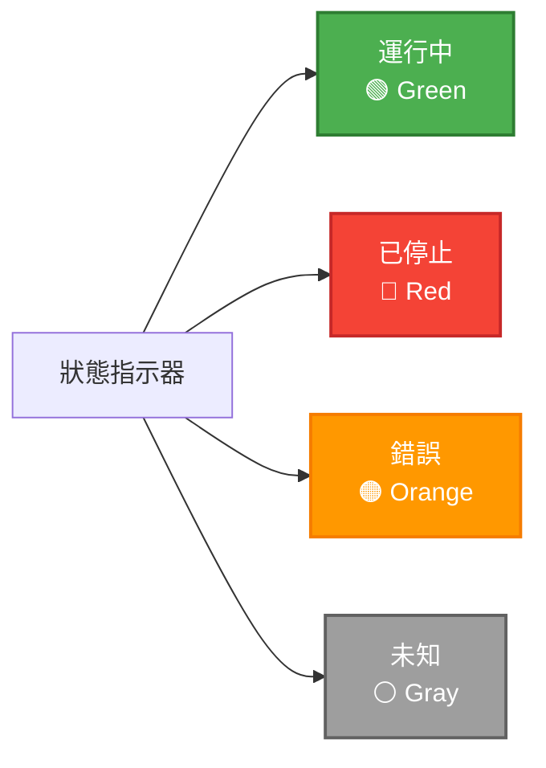

---

## 6. 顏色與主題

### 6.1 主色調方案

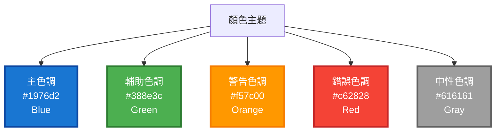

### 6.2 顏色使用規範

| 顏色 | 用途 | 示例 |
|------|------|------|
| **主色調 (Blue #1976d2)** | 主要操作按鈕、鏈接、選中狀態 | 保存、提交、主要 CTA |
| **成功色 (Green #4caf50)** | 成功狀態、完成操作 | 服務運行中、操作成功 |
| **警告色 (Orange #ff9800)** | 警告信息、需要注意的狀態 | 資源使用率高、即將過期 |
| **錯誤色 (Red #f44336)** | 錯誤狀態、危險操作 | 服務停止、操作失敗 |
| **中性色 (Gray #616161)** | 次要信息、禁用狀態 | 輔助文字、禁用按鈕 |

### 6.3 深色模式支持

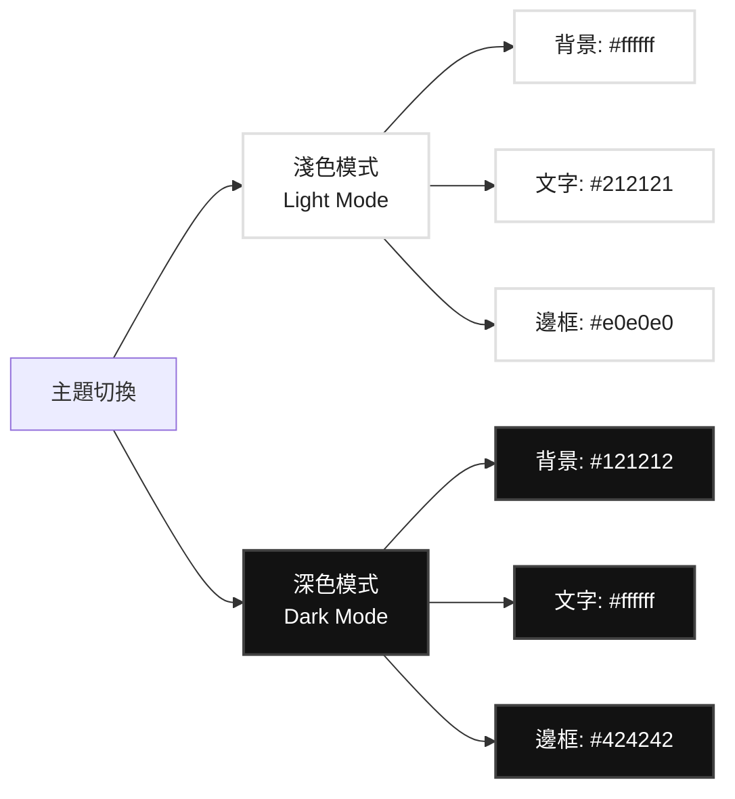

---

## 7. 頁面佈局詳細設計

### 7.1 儀表盤詳細佈局

```
┌─────────────────────────────────────────────────────────────┐
│  Top Navigation Bar (64px)                                  │
├──────────┬──────────────────────────────────────────────────┤
│          │  Breadcrumb: 首頁 > 儀表盤                        │
│          │  ┌──────┐ ┌──────┐ ┌──────┐ ┌──────┐            │
│ Sidebar  │  │ 運行 │ │ LLM  │ │ 當前 │ │ 系統 │            │
│ (240px)  │  │ 服務 │ │ Prov │ │ 版本 │ │ 負載 │            │
│          │  │  8/10│ │  3   │ │v1.2.0│ │ 65%  │            │
│ 📊 儀表盤│  └──────┘ └──────┘ └──────┘ └──────┘            │
│ 🤖 LLM   │                                                    │
│ 🖥️ 服務  │  ┌──────────────────┐ ┌──────────────────┐    │
│ 🚀 版本  │  │  服務狀態監控    │ │  資源使用圖表    │    │
│ 📝 日誌  │  │                  │ │                  │    │
│ 🔒 安全  │  │  [服務列表]      │ │  [CPU/內存圖表]  │    │
│ ⚙️ 設置  │  └──────────────────┘ └──────────────────┘    │
│          │                                                    │
│          │  ┌──────────────────┐ ┌──────────────────┐    │
│          │  │  最近操作記錄    │ │  系統健康狀態    │    │
│          │  │                  │ │                  │    │
│          │  │  [操作日誌列表]  │ │  [健康指標]      │    │
│          │  └──────────────────┘ └──────────────────┘    │
└──────────┴──────────────────────────────────────────────────┘
```

### 7.2 LLM Provider 管理詳細佈局

```
┌─────────────────────────────────────────────────────────────┐
│  Top Navigation Bar                                          │
├──────────┬──────────────────────────────────────────────────┤
│          │  Breadcrumb: LLM Provider > Qwen                 │
│          │                                                    │
│ Sidebar  │  ┌──────────┐ ┌──────────────────────────────┐ │
│          │  │ Provider │ │  配置詳情                      │ │
│          │  │ 列表     │ │                                │ │
│          │  │          │ │  Provider: Qwen                │ │
│          │  │ [Qwen]   │ │  Status: Active               │ │
│          │  │  Active  │ │                                │ │
│          │  │          │ │  ┌──────────────────────────┐ │ │
│          │  │ [Gemini] │ │  │ 模型列表                  │ │ │
│          │  │  Active  │ │  │                          │ │ │
│          │  │          │ │  │  [表格: 模型配置]         │ │ │
│          │  │ [Ollama] │ │  └──────────────────────────┘ │ │
│          │  │ Inactive │ │                                │ │
│          │  │          │ │  ┌──────────────────────────┐ │ │
│          │  │ [+ 添加] │ │  │ 模型配置表單             │ │ │
│          │  └──────────┘ │  │                          │ │ │
│          │                │  │  [表單字段]              │ │ │
│          │                │  └──────────────────────────┘ │ │
│          │                │                                │ │
│          │                │  [保存] [測試] [啟用/禁用]    │ │
└──────────┴──────────────────────────────────────────────────┘
```

### 7.3 服務管理詳細佈局

```
┌─────────────────────────────────────────────────────────────┐
│  Top Navigation Bar                                          │
├──────────┬──────────────────────────────────────────────────┤
│          │  Breadcrumb: 服務管理                             │
│          │  [刷新] [批量操作]                                │
│ Sidebar  │                                                    │
│          │  ┌──────────────────────────────────────────────┐ │
│          │  │ 服務名稱 │ 狀態 │ 版本 │ CPU │ 內存 │ 操作 │ │
│          │  ├──────────┼──────┼──────┼─────┼──────┼──────┤ │
│          │  │ AAM      │ 🟢   │ v1.2 │ 45% │ 512M │ [操作]│ │
│          │  │ Service  │      │      │     │      │      │ │
│          │  ├──────────┼──────┼──────┼─────┼──────┼──────┤ │
│          │  │ ChromaDB │ 🟢   │ latest│ 12% │ 256M │ [操作]│ │
│          │  ├──────────┼──────┼──────┼─────┼──────┼──────┤ │
│          │  │ PostgreSQL│ 🟢 │ 15   │ 8%  │ 128M │ [操作]│ │
│          │  └──────────────────────────────────────────────┘ │
│          │                                                    │
│          │  [分頁器]                                          │
│          │                                                    │
│          │  ┌──────────────────────────────────────────────┐ │
│          │  │ 服務詳情面板 (抽屜，從右側滑出)              │ │
│          │  │                                                │ │
│          │  │  基本信息 | 資源監控 | 實時日誌 | 操作歷史    │ │
│          │  └──────────────────────────────────────────────┘ │
└──────────┴──────────────────────────────────────────────────┘
```

### 7.4 版本部署詳細佈局

```
┌─────────────────────────────────────────────────────────────┐
│  Top Navigation Bar                                          │
├──────────┬──────────────────────────────────────────────────┤
│          │  Breadcrumb: 版本部署                             │
│          │                                                    │
│ Sidebar  │  ┌──────────┐ ┌──────────────────────────────┐ │
│          │  │ 版本列表 │ │  部署配置                      │ │
│          │  │          │ │                              │ │
│          │  │ ┌──────┐ │ │  版本: v1.2.0                │ │
│          │  │ │v1.2.0│ │ │  狀態: Active                │ │
│          │  │ │Active│ │ │  創建時間: 2025-11-13        │ │
│          │  │ └──────┘ │ │                              │ │
│          │  │          │ │  部署策略:                    │ │
│          │  │ ┌──────┐ │ │  ○ 藍綠部署                   │ │
│          │  │ │v1.1.0│ │ │  ○ 滾動更新                   │ │
│          │  │ │Avail │ │ │  ○ 金絲雀部署                 │ │
│          │  │ └──────┘ │ │                              │ │
│          │  │          │ │  [配置預覽]                    │ │
│          │  │ ┌──────┐ │ │                              │ │
│          │  │ │v1.0.0│ │ │  [部署] [取消]               │ │
│          │  │ │Deprec│ │ │                              │ │
│          │  │ └──────┘ │ └──────────────────────────────┘ │
│          │  │          │                                    │
│          │  │ [+ 創建] │  ┌──────────────────────────────┐ │
│          │  └──────────┘  │  部署歷史                      │ │
│          │                │                              │ │
│          │                │  [歷史記錄表格]              │ │
│          │                └──────────────────────────────┘ │
└──────────┴──────────────────────────────────────────────────┘
```

### 7.5 日誌管理詳細佈局

```
┌─────────────────────────────────────────────────────────────┐
│  Top Navigation Bar                                          │
├──────────┬──────────────────────────────────────────────────┤
│          │  Breadcrumb: 日誌管理                             │
│          │                                                    │
│ Sidebar  │  ┌──────────────────────────────────────────────┐ │
│          │  │ 過濾器工具欄                                  │ │
│          │  │ [服務▼] [級別▼] [時間範圍] [搜索] [搜索按鈕]│ │
│          │  └──────────────────────────────────────────────┘ │
│          │                                                    │
│          │  ┌──────────────────────────────────────────────┐ │
│          │  │ 日誌查看器 (深色背景)                         │ │
│          │  │                                                │ │
│          │  │  2025-11-13 10:00:00 [INFO] AAM Service: ...  │ │
│          │  │  2025-11-13 10:00:01 [DEBUG] Memory: ...     │ │
│          │  │  2025-11-13 10:00:02 [WARN] Connection: ...  │ │
│          │  │  2025-11-13 10:00:03 [ERROR] Database: ...   │ │
│          │  │  ... (實時滾動)                               │ │
│          │  └──────────────────────────────────────────────┘ │
│          │                                                    │
│          │  ┌──────────────────────────────────────────────┐ │
│          │  │ 操作欄                                         │ │
│          │  │ [暫停] [清空] [導出] [下載]                   │ │
│          │  └──────────────────────────────────────────────┘ │
└──────────┴──────────────────────────────────────────────────┘
```

---

## 8. UI 組件庫建議

### 8.1 推薦的 UI 框架

#### 選項 1: Ant Design (推薦)
- **優點**: 
  - 組件豐富，文檔完善
  - 企業級設計規範
  - 支持深色模式
  - TypeScript 支持良好
- **適用場景**: 企業管理後台、數據密集型應用

#### 選項 2: Material-UI (MUI)
- **優點**:
  - Material Design 設計語言
  - 組件豐富，主題定制靈活
  - 響應式設計優秀
- **適用場景**: 現代化 Web 應用

#### 選項 3: Element Plus (Vue)
- **優點**:
  - 如果使用 Vue 3
  - 組件豐富，中文文檔
  - 企業級應用支持
- **適用場景**: Vue 技術棧項目

### 8.2 圖表庫建議

- **ECharts**: 功能強大，適合複雜圖表
- **Recharts**: React 友好，組件化設計
- **Chart.js**: 輕量級，易於使用

---

## 9. 交互設計規範

### 9.1 操作反饋

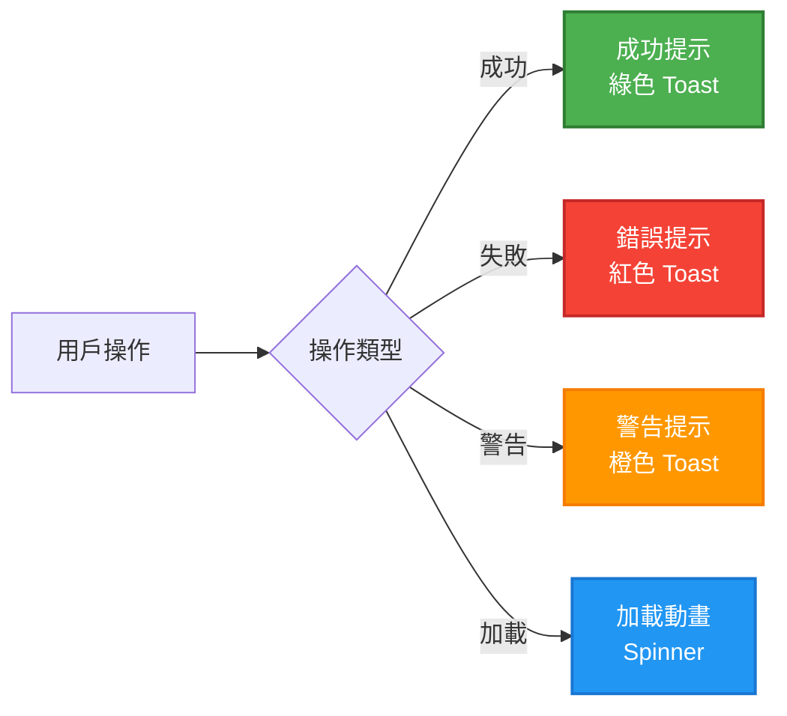

### 9.2 確認對話框

對於危險操作（如停止服務、刪除版本），必須顯示確認對話框：

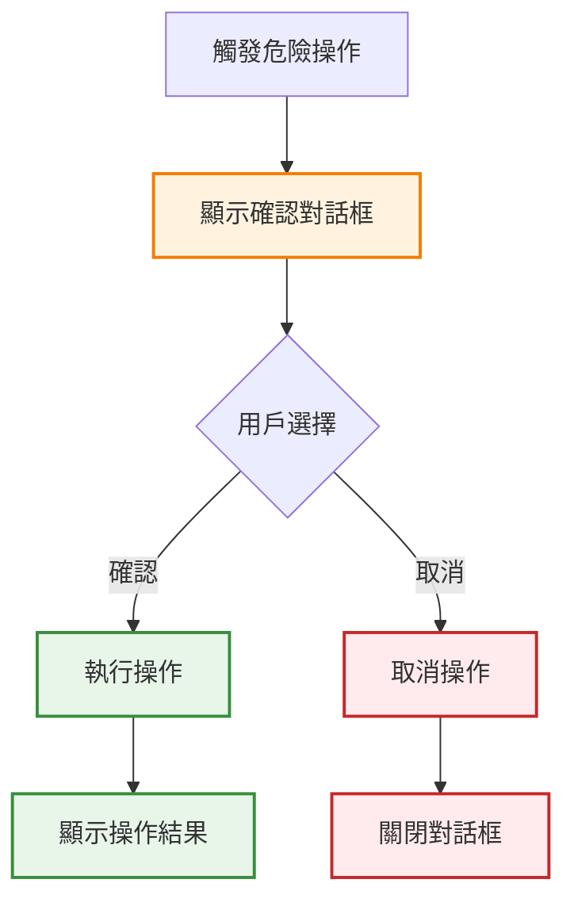

---

## 10. 實施建議

### 10.1 技術棧推薦

**前端框架**:
- React 18+ + TypeScript
- Ant Design 5.x
- React Router 6.x
- Zustand (狀態管理)
- Axios (HTTP 客戶端)
- ECharts (圖表)

**構建工具**:
- Vite (推薦) 或 Create React App
- ESLint + Prettier (代碼規範)

### 10.2 開發階段

**階段一**: 基礎佈局
- [ ] 主佈局框架（頂部導航 + 側邊欄 + 主內容區）
- [ ] 路由配置
- [ ] 響應式適配

**階段二**: 核心頁面
- [ ] 儀表盤頁面
- [ ] 服務管理頁面
- [ ] 日誌查看頁面

**階段三**: 完整功能
- [ ] LLM Provider 管理頁面
- [ ] 版本部署頁面
- [ ] 安全管理頁面

**階段四**: 優化與增強
- [ ] 深色模式
- [ ] 動畫效果
- [ ] 性能優化

---

## 11. 頁面佈局示例代碼結構

### 11.1 主佈局組件結構

```typescript
// src/layouts/MainLayout.tsx
interface MainLayoutProps {
  children: React.ReactNode;
}

export const MainLayout: React.FC<MainLayoutProps> = ({ children }) => {
  return (
    <Layout style={{ minHeight: '100vh' }}>
      <TopNavigation />
      <Layout>
        <Sidebar />
        <Layout.Content>
          <Breadcrumb />
          <PageHeader />
          <Toolbar />
          <ContentArea>{children}</ContentArea>
        </Layout.Content>
      </Layout>
    </Layout>
  );
};
```

### 11.2 路由配置示例

```typescript
// src/routes/index.tsx
const routes = [
  {
    path: '/',
    element: <MainLayout />,
    children: [
      { path: 'dashboard', element: <DashboardPage /> },
      { path: 'llm-providers', element: <LLMProviderPage /> },
      { path: 'services', element: <ServiceManagementPage /> },
      { path: 'deployments', element: <DeploymentPage /> },
      { path: 'logs', element: <LogViewerPage /> },
      { path: 'security', element: <SecurityPage /> },
    ],
  },
];
```

---

**最後更新**: 2025-11-13  
**維護者**:Daniel Chung

