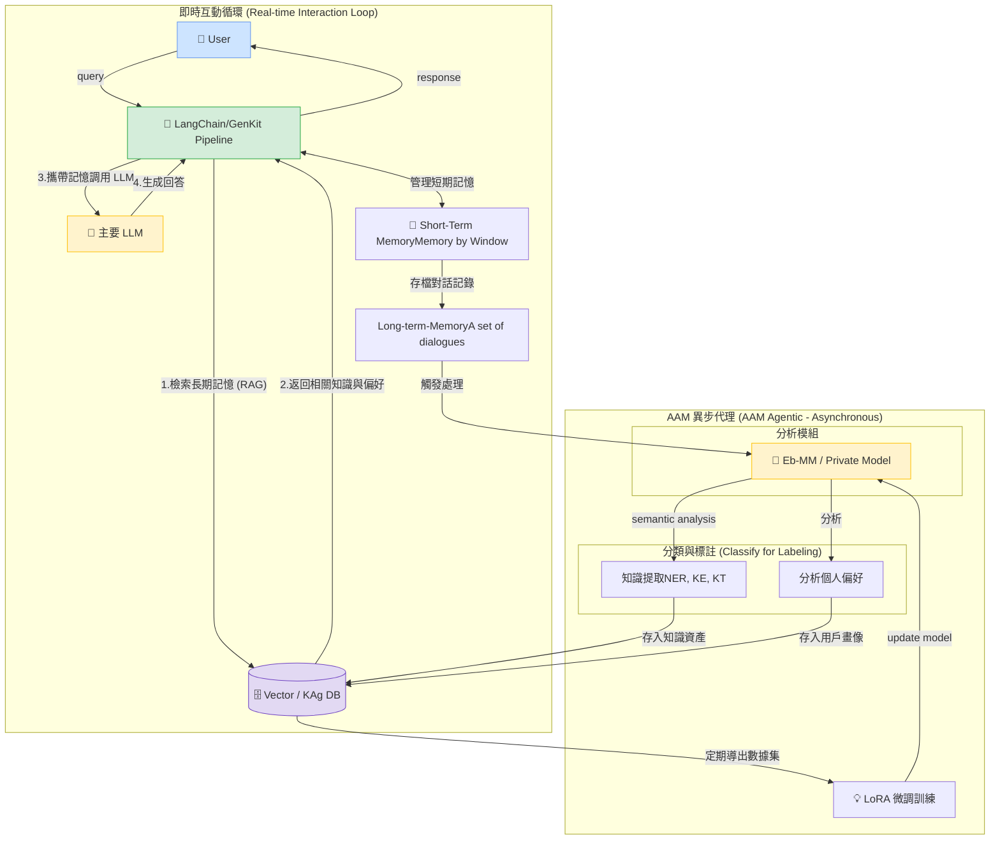
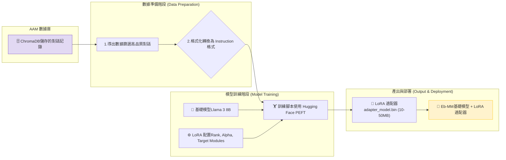
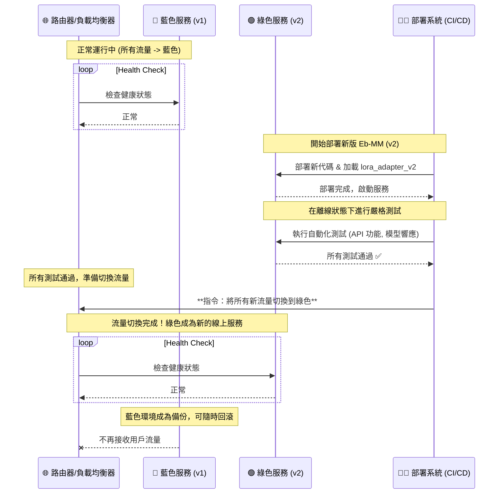
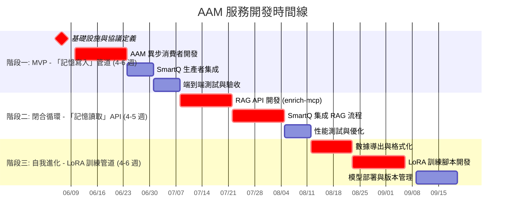

# AAM (AI-Augmented Memory)

Created time: 2025年11月10日 下午12:44
Parent doc: 企業AI 規劃白皮書 (https://www.notion.so/AI-2a410eba142a800e9381e93acc275593?pvs=21)
Status: Not started

## 一、 核心理念 (Core Philosophy)

我們要打造的系統，其核心是模擬並增強人類的記憶與溝通模式。它包含三大支柱：

1. **短期工作記憶 (Short-term Working Memory)**: 由大型語言模型 (LLM) 的**上下文視窗 (Context Window)** 提供，負責處理當前對話的即時流動性。
2. **長期情景記憶 (Long-term Episodic Memory)**: 由 **AAM 模組**提供，通過向量資料庫儲存過去的對話、知識和互動細節，讓 AI 能夠回憶過去。
3. **個性化模型 (Personalization Model)**: 由 **Eb-MM (Ebot Mini-Model)** 提供，通過分析用戶的語言習慣和情感，讓 AI 不僅「記得」事實，更「懂得」用戶，實現真正的個人化互動。

這三者協同工作，形成一個能夠持續學習和適應的閉環生態系統。

---

## 二、 系統架構 (System Architecture)

### **1. 總覽與設計哲學 (Architectural Vision)**

本架構旨在構建一個高性能、可擴展且能自我進化的 AI 增強記憶系統。其核心設計哲學是**關注點分離 (Separation of Concerns)**，我們將系統解耦為兩個獨立但協同工作的核心子系統：

1. **即時互動子系統 (Real-time Interaction Subsystem)**: 負責處理與用戶之間的同步、低延遲的對話交互。
2. **AAM 異步代理子系統 (AAM Agentic Subsystem)**: 作為系統的「認知後台」，負責異步地、深度地處理對話信息，進行學習、記憶歸檔與模型進化。

這種設計確保了用戶交互的流暢性不受後台複雜 AI 任務的影響，同時為系統的長期演進提供了堅實的基礎。

---

### **2. 核心組件與職責 (Component Breakdown)**

**2.1. 即時互動子系統 (Synchronous Core)**

這是面向用戶的前線，所有設計都以**低延遲**和**高效率**為首要目標。

- **LangChain / GenKit Pipeline**:
    - **職責**: 這是整個即時交互的中樞協調器 (Orchestrator)。它負責管理對話流程的每一步：接收用戶查詢、管理短期記憶、發起 MCP 調用以豐富上下文、將最終的 Prompt 提交給 LLM，並將結果返回給用戶。
- **Short-Term Memory (Memory by Window)**:
    - **職責**: 提供對話的即時上下文。我們將其精確定義為**基於窗口的記憶 (Memory by Window)**，利用主要 LLM 的原生上下文視窗來維持對話的連貫性。這是一種高效且無狀態的短期記憶實現方式。
- **Gen AI Internal Records**:
    - **職責**: 對話的原始日誌記錄。在一次成功的交互後，短期記憶中的對話內容會被格式化為包含 `id/user/timestamp` 的標準記錄，作為觸發長期記憶歸檔的數據源。

**2.2. AAM 異步代理子系統 (Asynchronous Core)**

這是系統的「大腦」和「長期記憶」，所有設計都以**深度分析**和**可持續學習**為目標。

- **localization Private Model (Eb-MM)**:
    - **職責**: 專門的分析模型，是 AAM 的核心處理單元。它負責接收來自 Pipeline 的對話記錄，並執行兩項關鍵的並行任務：
        1. **語義分析 (Semantic Analysis)**: 進行深度的知識提取，包括命名實體識別 (NER)、知識抽取 (KE) 和知識三元組 (KT)。
        2. **用戶洞察 (User Profiling)**: 分析用戶的語言習慣、情感和偏好，構建用戶畫像。
- **分離式數據存儲 (Decoupled Data Stores)**:
    - **職責**: 這是本架構的一個關鍵設計決策。我們將長期記憶分離為兩個獨立的資料庫：
        1. **個人偏好庫**: 一個專門的資料庫，用於存儲高度敏感和個人化的用戶畫像數據。
        2. **Vector / KAg DB**: 我們的核心知識資產圖譜，使用向量和知識圖譜結合的方式，存儲從對話中提取的結構化知識。
- **LoRA (動態微調引擎)**:
    - **職責**: 實現系統的「神經可塑性」，即自我進化能力。它定期從 KAg DB 中提取數據，對 Private Model 進行微調，使其在知識提取和用戶理解方面變得越來越精準。

---

### **3. 核心優勢分析 (Key Architectural Advantages)**

本架構的設計提供了以下四個核心優勢：

1. **協議驅動的通信 (Protocol-Driven Communication via MCP)**
    - **優勢**: 我們沒有讓 `Pipeline` 和 `AAM` 進行隨意的數據交換，而是定義了 **MCP (Model Context Protocol) Call**。這意味著所有跨子系統的通信都有一個標準化、版本化的數據結構。這極大地提升了系統的**健壯性**和**可維護性**。開發團隊可以圍繞同一個協議進行協作，未來增加新的上下文信息也只需擴展協議即可，無需重構整個系統。
2. **解耦與可擴展性 (Decoupling & Scalability)**
    - **優勢**: 即時交互與異步學習的徹底分離，意味著兩者可以**獨立擴展**。如果用戶請求量激增，我們只需擴展前端的 `Pipeline` 實例。如果後台的 AI 分析任務變得繁重，我們只需增加 `AAM` 的消費者實例。這種設計避免了性能瓶頸，確保系統在任何負載下都能保持高效。
3. **專業化與安全的數據存儲 (Specialized & Secure Data Stores)**
    - **優勢**: 將個人偏好數據與通用知識數據分開存儲，帶來了巨大的好處。在**安全與合規**方面，我們可以對敏感的個人數據庫實施更嚴格的訪問控制和加密策略。在**性能**方面，兩種資料庫可以根據其不同的查詢模式（用戶畫像檢索 vs. 知識圖譜遍歷）進行獨立的優化。
4. **自動化的自我完善閉環 (Automated Self-Improvement Loop)**
    - **優勢**: LoRA 微調管道的設計，使本系統不僅僅是一個靜態的知識庫，而是一個**活的、能夠學習的有機體**。隨著與用戶互動的增多，KAg DB 中的數據會越來越豐富，LoRA 將利用這些數據持續提升 Private Model 的性能，從而讓 AAM 的分析能力越來越強。這創造了一個正向的飛輪效應，讓系統的價值隨時間指數級增長。

### **4. 缺失環節的補全：RAG 檢索流程**

需要明確的是，本架構圖完整展示了**記憶的寫入與學習（Write & Learn）**。為了構成一個完整的 RAG 系統，`LangChain Pipeline` 在調用 LLM 之前，必須增加一個**檢索（Retrieval）**步驟：

1. **MCP 豐富化**: `Pipeline` 會向 `AAM Agentic` 的 API 端點發起一次**同步的 MCP 檢索調用**。
2. **數據檢索**: `AAM` 會從「個人偏好庫」和「KAg DB」中檢索與當前對話最相關的上下文。
3. **返回上下文**: `AAM` 將檢索到的信息返回給 `Pipeline`。
4. **最終執行**: `Pipeline` 將這些豐富的上下文信息與用戶的原始查詢組裝成最終的 Prompt，再提交給 LLM。

### 5.系統主要由以下幾個關鍵組件構成：

- **前端 (Frontend)**: 用戶與 AI 助理互動的介面 (例如網頁、App、企業聊天工具)。
- **後端應用伺服器 (Backend Server)**: 整個系統的中樞，負責處理業務邏輯、協調各個 AI 模組。
- **主要 LLM (Main LLM - The Brain)**: 系統的「大腦」，如 GPT-4、Claude 3 等，負責最終的理解、推理和生成回應。
- **AAM 模組 (The Memory)**: 負責長期記憶的儲存與檢索。
    - **對話處理管道 (Processing Pipeline)**: 對話結束後，進行知識提取和個性化分析。
    - **向量資料庫 (Vector DB - ChromaDB)**: 儲存處理過的對話向量和元數據。
- **Eb-MM (Localization )**: 您的特化小模型，負責高效率的預處理任務，如意圖識別、專有實體識別等。
- **離線訓練管道 (Offline Training Pipeline)**: 定期利用 AAM 中儲存的數據，使用 LoRA 對 Eb-MM 進行微調。

/image.png)

---

## 三、 核心流程圖 (System Flowchart - Mermaid)

這張圖展示了從用戶輸入到 AI 回應，再到記憶存檔和模型進化的完整循環。



### 流程詳解 (Detailed Process Breakdown)

### A. 即時對話流程 (Real-time Conversation Flow)

這是用戶每次互動時觸發的流程，對應圖中的 **步驟 1 到 8**。

1. **發送問題 (Send Query)**: 用戶在前端輸入問題，連同 `user_id`、`session_id` 一起發送到後端。
2. **預處理 (Pre-processing - Optional)**: 後端可選擇先調用 **Eb-MM**，對用戶問題進行快速的意圖分類或專有實體提取。這能幫助後續的記憶檢索更精準，同時節省成本。
3. **返回預處理結果**: Eb-MM 將分析結果（如意圖：`查詢庫存`，實體：`產品A`）返回給應用程式。
4. **檢索記憶 (Retrieve Memory)**: 應用程式拿著用戶問題和預處理結果，向 **AAM 模組 (ChromaDB)** 發起一個混合搜索請求：
    - **向量搜索**: 尋找語義上最相似的歷史對話。
    - **元數據過濾**: 篩選出屬於該用戶 (`user_id`)、且可能包含相關實體 (`產品A`) 的記憶。同時，也檢索該用戶的長期個性化標籤。
5. **返回相關記憶 (Return Relevant Context)**: ChromaDB 返回最相關的幾條記憶片段，包括**事實知識**（如上次的庫存數量）和**個性化檔案**（如用戶偏好直接的回答、目前情緒可能不佳）。
6. **建構動態 Prompt (Construct Dynamic Prompt)**: 這是系統的魔法核心。後端將所有信息組裝成一個發給**主要 LLM** 的超級 Prompt，包含：
    - **系統指令**: AI 角色設定。
    - **個性化策略**: 基於檢索到的用戶檔案，指示 AI 如何溝通。
    - **相關記憶**: 從 AAM 檢索到的事實知識。
    - **短期記憶**: 當前對話的歷史。
    - **用戶最新問題**。
7. **生成個人化回應 (Generate Personalized Response)**: 主要 LLM 基於這個極度豐富的上下文，生成一個既準確又符合用戶溝通習慣的回應。
8. **返回回應 (Return Response)**: 後端將生成的回應發送回前端，呈現給用戶。

### B. 異步記憶與訓練流程 (Asynchronous Memory & Training Flow)

這個流程在後台發生，確保系統能持續學習，對應圖中的 **步驟 9 到 12**。

1. **對話存檔 (Archive Conversation)**: 對話結束後，應用程式將剛剛發生的對話輪次（問題+回答）**異步地**發送到 **AAM 的處理管道**。異步確保不會阻塞即時回應。
2. **處理與儲存 (Process & Store)**: 處理管道執行我們設計的分析任務：
    - **知識提取**: NER, KE, KT。
    - **個性化分析**: 情感、情緒、語言風格。
    - 將文本向量化，連同包含所有分析結果的豐富元數據，一同存入 **ChromaDB**。
3. **導出數據集 (Export Dataset)**: 定期地（例如每週），系統會從 ChromaDB 中導出過去一段時間內的高品質、已標註的對話數據。
4. **微調模型 (Fine-tune Model)**: 這些數據被送入**離線訓練管道**，使用 LoRA 技術對 **Eb-MM** 進行微調。這會讓 Eb-MM 在識別公司特有術語或用戶意圖方面變得越來越強大，從而使整個系統的效率和準確性在未來不斷提升。

---

## 四、動態訓練小模型Eb-MM

### LoRA 是什麼？(核心概念與類比)

### 1. 傳統微調的困境 (The Problem)

想像一下，一個大型語言模型（比如 Llama 3 8B）就像一位**經驗豐富、博學多聞的大廚**。他懂得上千種菜系的烹飪原理（基礎知識），模型大小有 16GB。

現在，您想讓他學會做一道您公司的「秘製配方菜」（例如，識別您公司內部的專案代號）。

- **傳統方法 (Full Fine-tuning)**: 您會把大廚叫過來，讓他把所有學過的烹飪知識重新複習一遍，同時把您的秘製配方也練熟。訓練結束後，您得到了一位**全新的、同樣 16GB 大小**、只是稍微調整過的大廚。
- **問題**:
    - **成本高**: 每次訓練都像重新培養一位大廚，非常耗費計算資源和時間。
    - **存儲災難**: 如果您有 10 個不同的秘製配方，就需要存儲 10 位 16GB 的大廚，佔用 160GB 空間，管理起來非常麻煩。

### LoRA 的聰明解法 (The Solution)

LoRA (Low-Rank Adaptation) 提出了一個絕妙的想法：**我們不要去改變大廚本人，而是給他一本小小的「秘籍筆記」。**

- **LoRA 的方法**:
    1. **鎖定大廚 (Freeze the Model)**: 我們命令大廚把他所有學過的東西（模型的 16GB 原始權重）全部**鎖定，不准改動**。
    2. **給他筆記 (Inject Adapters)**: 我們在大廚的關鍵工作站（模型的特定層，如注意力層）旁邊，放上兩張非常小的空白紙（這就是 LoRA 的 A 和 B 矩陣）。
    3. **只訓練筆記 (Train Only the Adapters)**: 在訓練過程中，大廚的所有原有技藝都不會變。我們只教他如何在這兩張小紙上記錄關於「秘製配方」的**核心要點和調整技巧**。
    4. **訓練完成**: 訓練結束後，大廚還是原來那位 16GB 的大廚，但他手上多了一本可能**只有 10MB 大小的秘籍筆記**（這就是 LoRA 適配器 `adapter_model.bin`）。
- **優勢**:
    - **效率極高**: 訓練過程只更新這本小筆記，速度快，資源消耗少。
    - **存儲輕便**: 您只需要保存那本 10MB 的筆記，而不是整個 16GB 的模型。
    - **高度模組化**: 如果您有 10 個任務，只需訓練 10本不同的小筆記。您可以讓大廚在做任務A時看筆記A，做任務B時看筆記B，實現了模型的**動態“換膚”**。

這就是 LoRA 的精髓：**通過訓練一個極小的「補丁」，來高效地引導一個巨大的預訓練模型，使其適應新任務。**

---

### Eb-MM 的 LoRA 訓練流程

這裡是將 LoRA 應用於訓練您的 Eb-MM (Ebot Mini-Model) 的具體步驟。這個流程對應我們架構圖中的**「離線訓練」**部分。



### **步驟 1: 數據準備 (從 AAM 提取養料)**

1. **導出數據**: 定期（例如每週）從您的 ChromaDB 中導出一批標註好的對話數據。您需要根據訓練目標來篩選。
    - **訓練目標範例**: 讓 Eb-MM 學會**意圖分類**。
    - **篩選**: 導出所有用戶的提問，以及人工或由 GPT-4 標註好的意圖標籤。
2. **格式化**: 將數據轉換為模型能理解的「指令微調 (Instruction Fine-tuning)」格式。這通常是一個 JSON 文件，每一條記錄都包含清晰的指令。
    
    **JSON 數據範例 (用於意圖分類)**:
    
    ```json
    [
      {
        "instruction": "請將以下用戶的提問分類到最合適的意圖。",
        "input": "我想知道訂單 #12345 現在到哪了？",
        "output": "查詢訂單狀態"
      },
      {
        "instruction": "請將以下用戶的提問分類到最合適的意圖。",
        "input": "我的密碼好像不對，登不進去",
        "output": "重設密碼"
      }
    ]
    
    ```
    

### **步驟 2: 選擇基礎模型與配置 LoRA**

1. **選擇基礎模型 (Base Model)**: 選擇一个性能優秀的開源模型作為您的 Eb-MM 的「大廚」。
    - **推薦**: Llama 3 8B, Mistral 7B, 或 Qwen 1.5 7B。它們的性能強大，且社區支持良好。
2. **配置 LoRA 參數**: 這是訓練的核心配置。您需要在訓練腳本中設定：
    - `r` (Rank): LoRA 矩陣的「秩」，可以理解為**筆記的厚度**。數值越大，可學習的參數越多，但模型也越大。通常設為 `8`, `16`, `32` 或 `64`。
    - `lora_alpha`: 一個縮放因子，通常設為 `r` 的兩倍。
    - `target_modules`: 指定要在大廚的哪些「工作站」放上筆記。通常是模型的注意力層，如 `["q_proj", "v_proj"]`。

### **步驟 3: 執行訓練**

1. **使用 PEFT 庫**: 使用 Hugging Face 的 `PEFT` (Parameter-Efficient Fine-Tuning) 庫，它極大地簡化了 LoRA 的訓練過程。
2. **啟動訓練**: 運行您的訓練腳本。腳本會：
    - 加載基礎模型。
    - 根據您的配置，將 LoRA 適配器注入到模型中。
    - 凍結基礎模型的權重。
    - 使用您準備好的 JSON 數據集，開始訓練，**此時只有 LoRA 適配器的權重會被更新**。

### **步驟 4: 保存與部署**

1. **保存適配器**: 訓練完成後，您得到的不是一個巨大的新模型，而是一個非常小的文件夾，里面包含了 `adapter_model.bin` 和一個配置文件。這就是您訓練好的「秘籍筆記」。
2. **部署 Eb-MM**: 在您的後端應用中，部署 Eb-MM 的方式是：
    
    ```python
    # 偽代碼
    from transformers import AutoModelForCausalLM
    from peft import PeftModel
    
    # 1. 加載基礎模型 (大廚)
    base_model = AutoModelForCausalLM.from_pretrained("meta-llama/Llama-3-8B")
    
    # 2. 加載 LoRA 適配器 (給大廚配上筆記)
    eb_mm = PeftModel.from_pretrained(base_model, "./path/to/your/lora_adapter")
    
    # 現在 eb_mm 就是一個具備新能力的、完整的模型了
    #可以用它來進行推理
    
    ```
    

### **藍綠部署？**

藍綠部署的核心思想是**同時維護兩個完全相同但相互獨立的生產環境**：

- **🔵 藍色環境 (Blue)**: 代表**當前正在線上提供服務**的穩定版本。所有用戶的流量都指向這裡。
- **🟢 綠色環境 (Green)**: 代表一個**與藍色環境完全一樣的閒置環境**。它是我們部署和測試下一個版本的地方。

部署新版本的過程，不是去修改正在運行的藍色環境，而是在離線的綠色環境上進行。部署和測試完成後，只需**將流量從藍色切換到綠色**，綠色環境便成為新的線上服務。

### 藍綠部署流程

「服務」可以是一個 Docker 容器、一台虛擬機或一個 Kubernetes Pod。



### 流程詳解：

1. **階段一：正常運行**
    - 您的路由器（例如 Nginx, AWS Load Balancer, Cloudflare）將 100% 的用戶流量指向**藍色環境**。
    - 藍色環境正在運行加載了 `lora_adapter_v1` 的後端服務。
    - **綠色環境**此時處於閒置狀態，或者運行著和藍色一樣的舊版本。
2. **階段二：部署到綠色環境（離線進行）**
    - 當您的 CI/CD 管道觸發新版 Eb-MM 的部署時，**所有操作都在綠色環境中進行**。
    - 部署系統將新的後端代碼部署到綠色伺服器。
    - 綠色服務在啟動時，會加載**新版**的 `lora_adapter_v2`。
    - **關鍵**: 在此期間，所有用戶流量仍在藍色環境，您的服務完全不受影響。
3. **階段三：在綠色環境進行驗證**
    - 部署完成後，綠色環境雖然沒有接收外部用戶流量，但可以通過內部網絡或特定主機名進行訪問。
    - 您的 CI/CD 管道或測試團隊可以對綠色環境進行全面的測試：
        - **冒煙測試 (Smoke Testing)**: 確保服務能正常啟動和響應。
        - **整合測試 (Integration Testing)**: 測試 API 端點是否按預期工作。
        - **模型驗收測試 (Model Acceptance Testing)**: 發送一些測試用的 Prompt，驗證新版 Eb-MM 的響應是否符合預期。
4. **階段四：切換流量（The Flip）**
    - 一旦您對綠色環境的穩定性感到滿意，就執行最關鍵的一步：**在路由器或負載均衡器層面，將流量指向從藍色環境切換到綠色環境**。
    - 這個切換通常是**瞬間完成**的。對於用戶來說，他們只是下一個請求被發送到了一個新的、性能更好的服務上，體驗是完全無縫的。
    - 此時，綠色環境正式成為新的線上生產環境。
5. **階段五：舊環境處理**
    - 原來的藍色環境不再接收任何流量，但它**並未被銷毀**。它變成了**熱備份 (Hot Standby)**。
    - **即時回滾**: 如果上線後發現新版本（綠色環境）有任何嚴重問題，您只需在路由器上做一次反向操作，將流量切回藍色環境，就能在幾秒鐘內完成回滾，最大限度地減少故障影響。
    - **最終處理**: 在新版本（綠色）穩定運行一段時間後（例如一天），您就可以放心地將舊的藍色環境銷毀或更新為最新版本，使其成為下一次部署的「新綠色環境」。

### 優勢

並行部署方案，通過「藍綠部署」這個最佳實踐來落地，將為您的 AI 服務帶來巨大好處：

- **零停機時間 (Zero Downtime)**: 更新過程對用戶完全透明。
- **降低風險 (Reduced Risk)**: 在一個與生產完全一致的環境中進行充分測試，而不是在正在運行的服務上動手。
- **即時回滾 (Instant Rollback)**: 這是藍綠部署最大的安全保障。
- **簡化部署流程**: 整個過程非常清晰，避免了在生產環境中進行複雜操作。

---

## 五、開發規劃

### 前提與假設

- **團隊配置**: 至少包含一位熟悉後端與 AI/ML 的工程師和一位熟悉基礎設施 (DevOps) 的工程師。
- **技術棧**: 團隊對 Python, Docker, FastAPI 和消息隊列有基本了解。
- **目標**: 每個階段結束時，都有一個可以內部演示 (Demo) 的功能性產品。
- **聲明**: 這是一個積極但務實的估計，實際開發中可能會遇到意料之外的挑戰。

---

### 開發時間線概覽 (Gantt Chart)



### 階段一：MVP - 建立「記憶寫入」的異步管道 (預計: 4-6 週)

**目標：實現數據的異步捕獲、處理與存儲，為後續所有功能打下數據基礎。**

- **第 1 週：基礎設施搭建與協議定義**
    - **任務**:
        1. 使用 Docker Compose 編寫 `docker-compose.yml`，統一管理 AAM 服務、RabbitMQ 和 ChromaDB。
        2. 完成服務間的網絡配置，確保容器可以相互通信。
        3. **[關鍵]** 團隊共同確定 **MCP v1.0** 的核心數據結構，並在 AAM 服務中使用 Pydantic 進行模型定義。
        4. 確定 RabbitMQ 的交換機 (Exchange) 和隊列 (Queue) 名稱。
    - **交付成果**: 一個可以一鍵啟動的本地開發環境。一份標準化的 MCP 協議文檔。
- **第 2-3 週：AAM 異步消費者核心邏輯開發**
    - **任務**:
        1. 編寫 AAM 服務的啟動腳本，使其能夠連接 RabbitMQ 並監聽指定隊列。
        2. 實現核心處理管道：接收消息 -> 調用 Eb-MM 進行分析 (NER, KT, 個性化) -> 文本向量化 -> 存入 ChromaDB。
        3. 編寫單元測試，確保每個處理步驟都符合預期。
    - **交付成果**: AAM 服務可以獨立接收消息並將處理結果存入資料庫。
- **第 4 週：SmartQ 生產者集成**
    - **任務**:
        1. 在 SmartQ 應用中，開發一個模塊，負責在對話結束後將上下文組裝成約定的 MCP 格式。
        2. 集成 RabbitMQ 客戶端，將組裝好的消息發送到隊列中。
        3. 增加錯誤處理機制（例如，如果消息隊列無法連接，應如何處理）。
    - **交付成果**: SmartQ 具備了向 AAM 服務「投遞」記憶的能力。
- **第 5 週：端到端測試、Bug 修復與內部演示**
    - **任務**:
        1. 在 SmartQ 中進行一次完整對話，然後去 ChromaDB 驗證數據是否被正確地分析和存儲。
        2. 修復數據在傳輸和處理過程中可能出現的任何問題。
        3. 準備一個內部 Demo，展示數據流動的完整過程。
    - **交付成果**: 一個經過驗證的、可靠的記憶歸檔管道。**階段一完成！**

---

### 階段二：閉合循環 - 提供「記憶讀取」的 RAG API (預計: 4-5 週)

**目標：讓 SmartQ 能夠利用已存儲的記憶，生成個人化、有上下文的回答。**

- **第 6-7 週：RAG API (`enrich-mcp`) 開發**
    - **任務**:
        1. 在 AAM 服務中，使用 FastAPI 框架，建立 `POST /enrich-mcp` 端點。
        2. 定義 API 的請求和響應模型 (使用 Pydantic)。
        3. 實現核心 RAG 邏輯：接收部分 MCP -> 根據 `user_id` 和 `query` 在 ChromaDB 中執行混合搜索 -> 填充 MCP 的 `retrieved_knowledge` 等欄位。
    - **交付成果**: 一個可以通過 cURL 或 Postman 調試的功能性 RAG API。
- **第 8-9 週：SmartQ 集成 RAG 流程**
    - **任務**:
        1. **[關鍵]** 重構 SmartQ 的核心對話邏輯。現在，在調用 LLM 之前，必須先調用 `/enrich-mcp` API。
        2. 開發「MCP-to-Prompt」的格式化模塊，將 AAM 返回的豐富化 MCP 轉換為高质量的 Prompt。
        3. 進行大量測試，對比集成前後 AI 回答質量的顯著提升。
    - **交付成果**: SmartQ 的 AI 變得「有記憶」，能夠回答關於歷史對話的問題。
- **第 10 週：性能測試、優化與內部演示**
    - **任務**:
        1. 對 `/enrich-mcp` API 進行壓力測試，確保其響應時間在可接受範圍內（例如 < 500ms）。
        2. 優化 ChromaDB 的查詢索引或 API 的異步處理，以提升性能。
        3. 準備一個驚艷的內部 Demo，展示 AI 如何記住用戶偏好和歷史信息。
    - **交付成果**: 一個具備核心商業價值的、可上線的 AAM 系統。**階段二完成！**

---

### 階段三：自我進化 - 建立 LoRA 離線訓練管道 (預計: 4-6 週)

**目標：建立一套自動化流程，讓 AAM 的核心分析模型 (Eb-MM) 能夠持續從新數據中學習和進化。**

- **第 11-12 週：數據導出與訓練集格式化**
    - **任務**:
        1. 編寫一個獨立的、可定時運行的腳本，用於從 KAg DB 導出數據。
        2. 實現數據清洗和過濾邏輯，只保留高質量的對話數據用於訓練。
        3. 將數據轉換為 LoRA 微調所需的指令格式 (Instruction JSONL)。
    - **交付成果**: 一個可以一鍵生成訓練數據集的自動化腳本。
- **第 13-14 週：LoRA 訓練腳本開發與實驗**
    - **任務**:
        1. 使用 Hugging Face `transformers` 和 `peft` 庫編寫訓練腳本。
        2. 在小規模數據集上進行多次實驗，調整 LoRA 超參數（如 `r`, `alpha`, `learning_rate`），找到最佳配置。
        3. 評估微調後的模型在特定任務上的性能提升。
    - **交付成果**: 一個可重複運行的訓練流程，以及第一個微調後的 Eb-MM 適配器。
- **第 15 週：模型部署與版本管理**
    - **任務**:
        1. 建立一個模型倉庫（如 S3 Bucket）來存儲和版本化訓練好的 LoRA 適配器。
        2. 修改 AAM 服務的啟動邏輯，使其能夠加載指定版本的適配器。
        3. 實現一個簡單的模型更新策略（初期可以是手動的冷部署）。
    - **交付成果**: 完整的模型訓練-部署閉環。**階段三完成！**