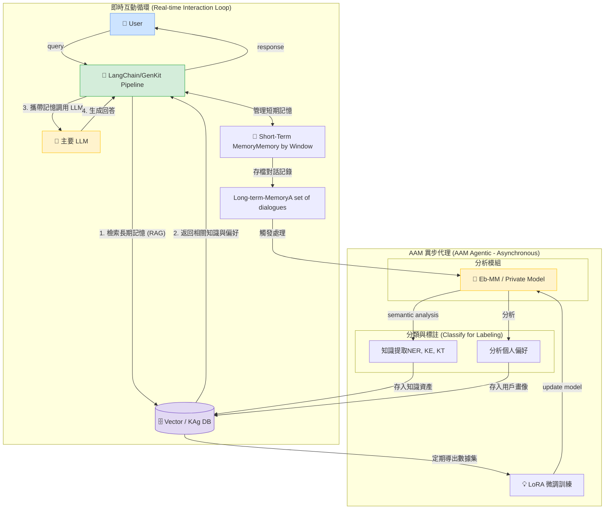
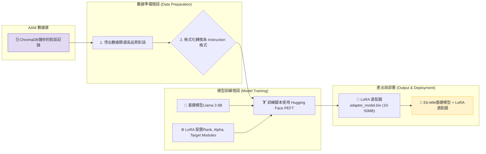
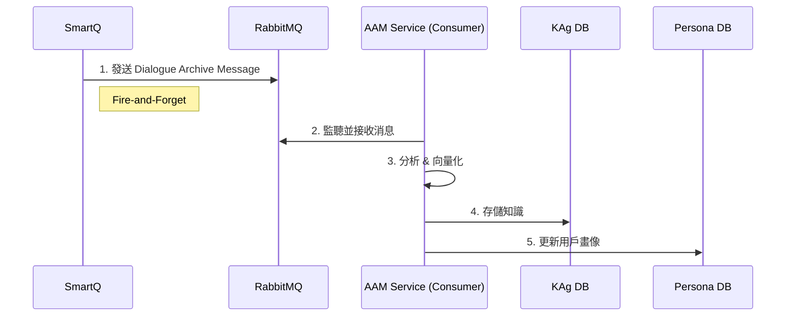
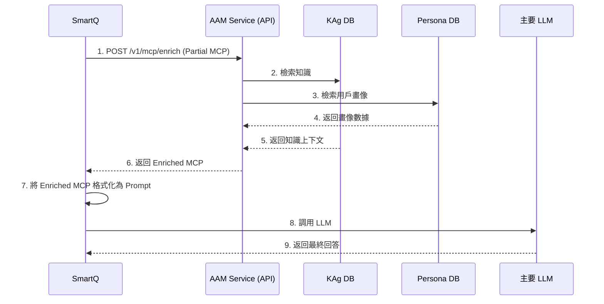
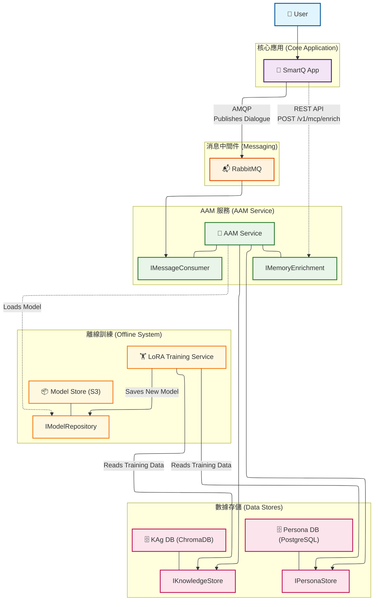
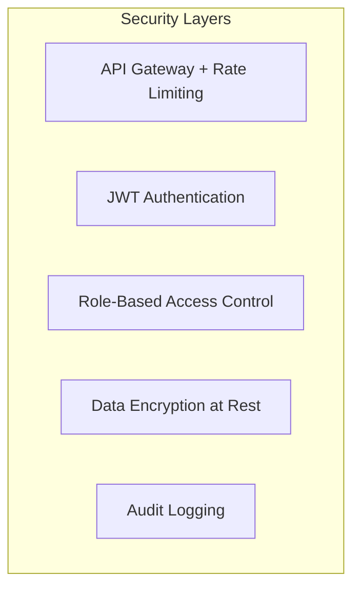

# AAM Agent SD

Created time: 2025年11月11日 下午1:16
Parent doc: 企業AI 規劃白皮書 (https://www.notion.so/AI-2a410eba142a800e9381e93acc275593?pvs=21)
Status: Not started

# **系統設計規格：AAM (AI-Augmented Memory) 服務**

**版本**: 2.0
**日期**: 2025-11-11
**最後更新**: 2025-11-12 (v2.0 - 添加抽象模型服務層設計)
**作者**: AI 架構師

---

## **1.0 系統總覽**

本文件定義 AAM 服務的設計規格。AAM 是一個獨立的微服務，旨在為任何上層應用（如 SmartQ）提供強大的長期記憶和上下文豐富化能力。系統遵循異步解耦的微服務架構，將實時交互與後台學習分離，以確保高性能、高可用性和可擴展性。

我們要打造的系統，其核心是模擬並增強人類的記憶與溝通模式。它包含三大支柱：

1. **短期工作記憶 (Short-term Working Memory)**: 由大型語言模型 (LLM) 的**上下文視窗 (Context Window)** 提供，負責處理當前對話的即時流動性。
2. **長期情景記憶 (Long-term Episodic Memory)**: 由 **AAM 模組**提供，通過向量資料庫儲存過去的對話、知識和互動細節，讓 AI 能夠回憶過去。
3. **個性化模型 (Personalization Model)**: 由 **Eb-MM (Ebot Mini-Model)** 提供，通過分析用戶的語言習慣和情感，讓 AI 不僅「記得」事實，更「懂得」用戶，實現真正的個人化互動。

這三者協同工作，形成一個能夠持續學習和適應的閉環生態系統。

---

## **2.0 架構原則**

### **1. 總覽與設計哲學 (Architectural Vision)**

本架構旨在構建一個高性能、可擴展且能自我進化的 AI 增強記憶系統。其核心設計哲學是**關注點分離 (Separation of Concerns)**，我們將系統解耦為兩個獨立但協同工作的核心子系統：

1. **即時互動子系統 (Real-time Interaction Subsystem)**: 負責處理與用戶之間的同步、低延遲的對話交互。
2. **AAM 異步代理子系統 (AAM Agentic Subsystem)**: 作為系統的「認知後台」，負責異步地、深度地處理對話信息，進行學習、記憶歸檔與模型進化。

這種設計確保了用戶交互的流暢性不受後台複雜 AI 任務的影響，同時為系統的長期演進提供了堅實的基礎。

---

### **2. 核心組件與職責 (Component Breakdown)**

**2.1. 即時互動子系統 (Synchronous Core)**

這是面向用戶的前線，所有設計都以**低延遲**和**高效率**為首要目標。

- **LangChain / GenKit Pipeline**:
    - **職責**: 這是整個即時交互的中樞協調器 (Orchestrator)。它負責管理對話流程的每一步：接收用戶查詢、管理短期記憶、發起 MCP 調用以豐富上下文、將最終的 Prompt 提交給 LLM，並將結果返回給用戶。
- **Short-Term Memory (Memory by Window)**:
    - **職責**: 提供對話的即時上下文。我們將其精確定義為**基於窗口的記憶 (Memory by Window)**，利用主要 LLM 的原生上下文視窗來維持對話的連貫性。這是一種高效且無狀態的短期記憶實現方式。
- **Gen AI Internal Records**:
    - **職責**: 對話的原始日誌記錄。在一次成功的交互後，短期記憶中的對話內容會被格式化為包含 `id/user/timestamp` 的標準記錄，作為觸發長期記憶歸檔的數據源。

**2.2. AAM 異步代理子系統 (Asynchronous Core)**

這是系統的「大腦」和「長期記憶」，所有設計都以**深度分析**和**可持續學習**為目標。

- **localization Private Model (EB-mM)**:
    - **職責**: 專門的分析模型，是 AAM 的核心處理單元。它負責接收來自 Pipeline 的對話記錄，並執行兩項關鍵的並行任務：
        1. **語義分析 (Semantic Analysis)**: 進行深度的知識提取，包括命名實體識別 (NER)、知識抽取 (KE) 和知識三元組 (KT)。
        2. **用戶洞察 (User Profiling)**: 分析用戶的語言習慣、情感和偏好，構建用戶畫像。
    - **模型架構**: 
        - **基礎模型**: DeepSeek-R1 8B (deepseek-r1:8b)
        - **訓練方式**: LoRA 微調
        - **部署方式**: 通過 Ollama 或 vLLM 服務掛載
        - **服務調用**: 通過統一模型服務 (`UnifiedModelService`) 調用
- **分離式數據存儲 (Decoupled Data Stores)**:
    - **職責**: 這是本架構的一個關鍵設計決策。我們將長期記憶分離為兩個獨立的資料庫：
        1. **個人偏好庫**: 一個專門的資料庫，用於存儲高度敏感和個人化的用戶畫像數據。
        2. **Vector / KAg DB**: 我們的核心知識資產圖譜，使用向量和知識圖譜結合的方式，存儲從對話中提取的結構化知識。
- **LoRA (動態微調引擎)**:
    - **職責**: 實現系統的「神經可塑性」，即自我進化能力。它定期從 KAg DB 中提取數據，對 Private Model 進行微調，使其在知識提取和用戶理解方面變得越來越精準。

---

### **3. 核心優勢分析 (Key Architectural Advantages)**

本架構的設計提供了以下四個核心優勢：

1. **協議驅動的通信 (Protocol-Driven Communication via MCP)**
    - **優勢**: 我們沒有讓 `Pipeline` 和 `AAM` 進行隨意的數據交換，而是定義了 **MCP (Model Context Protocol) Call**。這意味著所有跨子系統的通信都有一個標準化、版本化的數據結構。這極大地提升了系統的**健壯性**和**可維護性**。開發團隊可以圍繞同一個協議進行協作，未來增加新的上下文信息也只需擴展協議即可，無需重構整個系統。
2. **解耦與可擴展性 (Decoupling & Scalability)**
    - **優勢**: 即時交互與異步學習的徹底分離，意味著兩者可以**獨立擴展**。如果用戶請求量激增，我們只需擴展前端的 `Pipeline` 實例。如果後台的 AI 分析任務變得繁重，我們只需增加 `AAM` 的消費者實例。這種設計避免了性能瓶頸，確保系統在任何負載下都能保持高效。
3. **專業化與安全的數據存儲 (Specialized & Secure Data Stores)**
    - **優勢**: 將個人偏好數據與通用知識數據分開存儲，帶來了巨大的好處。在**安全與合規**方面，我們可以對敏感的個人數據庫實施更嚴格的訪問控制和加密策略。在**性能**方面，兩種資料庫可以根據其不同的查詢模式（用戶畫像檢索 vs. 知識圖譜遍歷）進行獨立的優化。
4. **自動化的自我完善閉環 (Automated Self-Improvement Loop)**
    - **優勢**: LoRA 微調管道的設計，使本系統不僅僅是一個靜態的知識庫，而是一個**活的、能夠學習的有機體**。隨著與用戶互動的增多，KAg DB 中的數據會越來越豐富，LoRA 將利用這些數據持續提升 Private Model 的性能，從而讓 AAM 的分析能力越來越強。這創造了一個正向的飛輪效應，讓系統的價值隨時間指數級增長。

### **4. 缺失環節的補全：RAG 檢索流程**

需要明確的是，本架構圖完整展示了**記憶的寫入與學習（Write & Learn）**。為了構成一個完整的 RAG 系統，`LangChain Pipeline` 在調用 LLM 之前，必須增加一個**檢索（Retrieval）**步驟：

1. **MCP 豐富化**: `Pipeline` 會向 `AAM Agentic` 的 API 端點發起一次**同步的 MCP 檢索調用**。
2. **數據檢索**: `AAM` 會從「個人偏好庫」和「KAg DB」中檢索與當前對話最相關的上下文。
3. **返回上下文**: `AAM` 將檢索到的信息返回給 `Pipeline`。
4. **最終執行**: `Pipeline` 將這些豐富的上下文信息與用戶的原始查詢組裝成最終的 Prompt，再提交給 LLM。

### 5.系統主要由以下幾個關鍵組件構成：

- **前端 (Frontend)**: 用戶與 AI 助理互動的介面 (例如網頁、App、企業聊天工具)。
- **後端應用伺服器 (Backend Server)**: 整個系統的中樞，負責處理業務邏輯、協調各個 AI 模組。
- **主要 LLM (Main LLM - The Brain)**: 系統的「大腦」，如 GPT-4、Claude 3 等，負責最終的理解、推理和生成回應。
- **AAM 模組 (The Memory)**: 負責長期記憶的儲存與檢索。
    - **對話處理管道 (Processing Pipeline)**: 對話結束後，進行知識提取和個性化分析。
    - **向量資料庫 (Vector DB - ChromaDB)**: 儲存處理過的對話向量和元數據。
- **Eb-MM (Localization )**: 您的特化小模型，負責高效率的預處理任務，如意圖識別、專有實體識別等。
- **離線訓練管道 (Offline Training Pipeline)**: 定期利用 AAM 中儲存的數據，使用 LoRA 對 Eb-MM 進行微調。


- **異步優先 (Asynchronous-First)**: 寫入和學習操作通過消息隊列異步處理，將對主應用的性能影響降至最低。
- **協議驅動 (Protocol-Driven)**: 所有核心數據交換均基於標準化的 **MCP (Model Context Protocol)**，確保接口的穩定性和可擴展性。
- **關注點分離 (Separation of Concerns)**: 每個服務只做一件事並把它做好。AAM 專注於記憶，SmartQ 專注於業務邏輯和用戶交互。
- **進化式設計 (Evolutionary Design)**: 系統通過 LoRA 訓練管道具備自我演進能力，使模型性能隨數據積累而持續提升。



### EB-mM 的 LoRA 訓練流程

這裡是將 LoRA 應用於訓練您的 EB-mM (Enterprise Bot mini-Model) 的具體步驟。這個流程對應我們架構圖中的**「離線訓練」**部分。EB-mM 基於 DeepSeek-R1 8B 進行 LoRA 微調。



---

## **3.0 組件詳細規格**

**3.1 AAM 服務 (AAM Service)**

- **技術棧**: Python 3.10+, FastAPI, Pydantic, Pika (RabbitMQ client), ChromaDB-client, Transformers, PEFT (PyTorch), LangChain
- **容器化**: Docker (`Dockerfile` 將定義環境和依賴)
- **核心職責**: 作為 AAM 的大腦，提供異步消費和同步 API 兩種能力。
- **3.1.1 異步消費者 (Asynchronous Consumer)**
    - **觸發方式**: 監聽 RabbitMQ 的 `aam.dialogue.archive` 隊列。
    - **輸入**: 一個包含單輪對話的 JSON 消息 (詳見 4.2)。
    - **處理流程**:
        1. 從隊列中獲取消息並使用 Pydantic 進行驗證。
        2. 使用**降級策略分析模型**進行並行分析（詳見 3.1.3）：
            - **知識提取**: 提取 NER, KE, KT。
            - **個性化分析**: 提取情感、語言風格標籤。
        3. 使用 Sentence Transformer 模型對文本塊進行向量化。
        4. 將知識提取結果存入 **KAg DB** (ChromaDB)，向量與結構化元數據一同存儲。
        5. 將個性化分析結果存入 **Persona DB**。
- **3.1.3 抽象模型服務層 (Abstract Model Service Layer)**
    - **設計理念**: 實現 Provider Pattern（提供者模式），支持多種模型服務後端，通過配置切換，無需修改代碼。
    - **架構層次**:
        1. **抽象接口層 (`IModelProvider`)**
            - 定義統一的模型服務接口
            - 支持多種 Provider 類型（Ollama, vLLM, OpenAI API 等）
            - 提供統一的調用方式
        2. **Provider 實現層**
            - **Ollama Provider**: 支持本地 Ollama 服務
            - **vLLM Provider**: 支持 vLLM 服務（OpenAI 兼容 API）
            - **OpenAI Provider**: 支持 OpenAI API（可選）
            - **Custom Provider**: 支持自定義 API（可選）
        3. **統一模型服務 (`UnifiedModelService`)**
            - 封裝業務邏輯（NER, KE, KT, 個性分析）
            - 使用 Provider 進行模型調用
            - 實現錯誤處理和降級
        4. **Provider 工廠 (`ModelProviderFactory`)**
            - 根據配置創建對應的 Provider
            - 支持動態切換 Provider
    - **配置驅動**: 通過環境變量配置 Provider 類型、API 地址、API Key 等，無需修改代碼即可切換模型服務。
    - **優勢**:
        - **靈活性**: 通過配置切換 Provider，無需修改代碼
        - **可擴展性**: 新增 Provider 只需實現接口
        - **解耦**: 業務邏輯與具體 Provider 解耦
        - **測試友好**: 可 Mock Provider 進行測試
        - **未來兼容**: 支持獨立模型服務、雲服務等
- **3.1.4 降級策略分析模型 (Fallback Analysis Model)**
    - **設計理念**: 實現多層級降級策略，確保系統高可用性和成本優化。
    - **降級鏈**:
        1. **優先級 1: EB-mM (Enterprise Bot mini-Model)**
            - **基礎模型**: DeepSeek-R1 8B (deepseek-r1:8b)
            - **訓練方式**: LoRA 微調
            - **部署方式**: 通過 Ollama 或 vLLM 服務掛載
            - **模型服務**: 通過統一模型服務 (`UnifiedModelService`) 調用
            - **優勢**: 成本最低、延遲較低、領域特化後質量高
            - **適用場景**: 正常運行時的首選模型
            - **質量要求**: 質量分數 >= 0.7 (可配置)
        2. **優先級 2: LangChain Embedding Model**
            - **模型**: 使用 LangChain + Embedding Model (如 text-embedding-ada-002)
            - **實現方式**: Prompt Engineering + LCEL (LangChain Expression Language)
            - **優勢**: 成本中等、質量中等、實現快速
            - **適用場景**: EB-mM 不可用或質量不達標時的降級選項
            - **質量要求**: 質量分數 >= 0.7 (可配置)
        3. **優先級 3: LLM (大模型)**
            - **模型**: 通過統一模型服務調用（Ollama、vLLM 或外部 API）
            - **實現方式**: 使用原始 DeepSeek-R1 8B 或其他大模型
            - **優勢**: 質量較高、能力較強
            - **適用場景**: 最後保障，確保系統在任何情況下都能提供語義分析
            - **成本控制**: 實現調用次數限制、成本上限、限流機制
    - **質量評估機制**:
        - **評估維度**:
            - 實體提取質量 (0-0.5): 實體數量、類型多樣性、置信度
            - 三元組質量 (0-0.5): 三元組數量、完整性、置信度
        - **評估算法**: 綜合評分 (0.0 - 1.0)
        - **質量閾值**: 可配置 (默認 0.7)
        - **降級觸發**: 質量 < 閾值 或 模型不可用
    - **日誌與監控**:
        - 記錄使用的模型層級
        - 記錄降級原因（質量不達標 / 模型不可用）
        - 記錄質量評估分數
        - 監控各層級模型使用率
        - 監控成本趨勢
- **3.1.2 同步 API (Synchronous API)**
    - **框架**: FastAPI
    - **端點**: `POST /v1/mcp/enrich`
    - **認證**: API Key (通過 HTTP Header `X-API-KEY` 傳遞)
    - **請求體 (Request Body)**: 部分 MCP (Partial MCP)，詳見 4.1.1。
    - **響應體 (Response Body)**: 豐富化後的 MCP (Enriched MCP)，詳見 4.1.2。
    - **處理流程**:
        1. 接收並驗證請求體。
        2. 從請求中提取 `user_id` 和 `current_query`。
        3. **並行查詢**:
            - 向 **KAg DB** 發起混合搜索請求，檢索相關知識。
            - 向 **Persona DB** 發起查詢，檢索該用戶的長期畫像。
        4. 將檢索到的結果組裝成 MCP 的 `retrieved_knowledge` 和 `user_profile` 部分。
        5. 返回完整的、豐富化後的 MCP JSON。
        6. **性能目標**: P95 延遲 < 500ms。

**3.2 知識資產圖譜數據庫 (KAg DB)**

- **技術選型**: ChromaDB (v0.4+)
- **部署方式**: 作為一個獨立的 Docker 容器運行。
- **數據模型**: 詳見 4.3.1。將存儲文本塊的向量及其豐富的元數據（來源、時間戳、實體、三元組等）。

**3.3 用戶畫像數據庫 (Persona DB)**

- **技術選型**: PostgreSQL 或 MongoDB
- **部署方式**: 作為一個獨立的 Docker 容器運行。
- **數據模型**: 詳見 4.3.2。以 `user_id` 為主鍵，存儲用戶的長期偏好標籤、平均情感等結構化數據。

**3.4 LoRA 訓練服務 (Offline Service)**

- **形式**: 一個或多個可定時運行的 Docker 容器 (可由 Kubernetes CronJob 或 Airflow 觸發)。
- **職責**:
    1. **數據導出器**: 連接 KAg DB 和 Persona DB，導出過去 N 天的數據，形成訓練集。
    2. **訓練器**: 運行 `train_lora.py` 腳本，使用 PEFT 庫對 EB-mM 進行 LoRA 微調。
        - **基礎模型**: DeepSeek-R1 8B (deepseek-r1:8b)
        - **訓練方式**: LoRA 微調
        - **輸出**: LoRA 適配器（`adapter_model.bin` 和配置文件）
    3. **模型發布器**: 將訓練完成的 LoRA 適配器打包、版本化，並上傳到模型倉庫（如 AWS S3 或本地存儲）。
    4. **模型部署**: 將訓練好的 LoRA 適配器加載到 Ollama 或 vLLM 服務中，作為 EB-mM 模型掛載。

---

## **4.0 核心數據協議與 schemas**

**4.1 Model Context Protocol (MCP) v1.0**

- **4.1.1 部分 MCP (Partial MCP) - `POST /v1/mcp/enrich` 請求**
    
    ```json
    {
      "user_profile": { "user_id": "string" },
      "session_context": {
        "session_id": "string",
        "current_query": "string",
        "short_term_memory": [
          { "role": "user | assistant", "content": "string" }
        ]
      }
    }
    
    ```
    
- **4.1.2 豐富化 MCP (Enriched MCP) - `POST /v1/mcp/enrich` 響應**
    
    ```json
    {
      "metadata": { "request_id": "uuid", "aam_version": "1.0" },
      "user_profile": {
        "user_id": "string",
        "long_term_style_tags": ["string"],
        "current_sentiment": "string"
      },
      "session_context": { ... }, // 原樣返回
      "retrieved_knowledge": {
        "docs": [ { "source": "string", "content": "string", "score": "float" } ],
        "kg_triples": [ { "subject": "string", "predicate": "string", "object": "string" } ]
      }
    }
    
    ```
    

**4.2 對話歸檔消息 (Dialogue Archive Message) v1.0**

- **RabbitMQ Queue**: `aam.dialogue.archive`
- **Body (JSON)**:
    
    ```json
    {
      "dialog_id": "string",
      "user_id": "string",
      "timestamp": "iso_8601_string",
      "turn": "integer", // 對話輪次
      "user_query": "string",
      "ai_response": "string"
    }
    
    ```
    

**4.3 數據庫 Schema**

- **4.3.1 KAg DB (ChromaDB) Collection Schema**
    - **Collection Name**: `knowledge_assets`
    - **Vectorized Content**: 對話輪次或提取的知識點文本。
    - **Metadata Fields**:
        
        ```json
        {
          "user_id": "string",
          "session_id": "string",
          "timestamp": "integer (unix timestamp)",
          "source_type": "dialogue | document",
          "entities": ["string"],
          "triples_json": "stringified_json_array"
        }
        
        ```
        
- **4.3.2 Persona DB (PostgreSQL) Table Schema**
    - **Table Name**: `user_profiles`
    - **Columns**:
        - `user_id` (VARCHAR, PRIMARY KEY)
        - `style_tags` (JSONB) // e.g., {"formal": 10, "casual": 5}
        - `sentiment_history` (JSONB) // e.g., {"positive": 20, "negative": 3}
        - `last_updated` (TIMESTAMP)

---

## **5.0 核心交互流程 (Sequence Diagrams)**

**5.1 流程一：記憶寫入 (異步)**



**5.2 流程二：記憶讀取與豐富化 (同步)**



---

## **6.0 組件及類圖**

**6.1.組件圖 (Component Diagram)**

此圖描繪了整個 AAM 生態系統的宏觀架構，展示了各個微服務、數據存儲和外部系統如何協同工作。



**組件圖解讀:**

- **組件 (Components)**: 圖中的方塊代表系統中獨立的、可部署的單元（例如，一個 Docker 容器或一組 Pods）。
- **接口 (Interfaces)**: 棒棒糖符號 `()`-`()` 代表一個組件**提供 (Provides)** 的接口，而插座符號 `Rett>` 代表一個組件**需要 (Requires)** 的接口。
- **同步路徑 (紅色)**: `SmartQ` 通過 REST API (`IMemoryEnrichment` 接口) **同步**調用 `AAM Service` 來豐富 MCP。這是一個請求-響應的過程。
- **異步路徑 (藍色)**: `SmartQ` 將對話記錄**異步**地發送到 `RabbitMQ`。`AAM Service` 作為消費者，從隊列中獲取消息進行處理。這是一個解耦的、非阻塞的過程。
- **數據與模型依賴**: `AAM Service` 依賴於兩個數據庫接口 (`IKnowledgeStore`, `IPersonaStore`) 和模型倉庫接口 (`IModelRepository`)。而離線的 `LoRA Training Service` 則負責讀取數據並向模型倉庫寫入新模型。

**6.2. 類圖 (Class Diagram) - AAM 服務內部設計**

此圖深入 `AAM Service` 組件內部，展示了其主要的 Python 類的設計、職責和關係。這是將 FastAPI 應用程序代碼化的藍圖。

```mermaid
classDiagram
    title AAM 服務內部核心類圖

    class AAMService {
        +app: FastAPI
        +run()
    }

    class MCPEnrichmentController {
        - memory_service: IMemoryService
        + enrich_mcp(mcp: PartialMCP) : EnrichedMCP
    }

    class DialogueArchiveConsumer {
        - memory_service: IMemoryService
        - analysis_model: IAnalysisModel
        + start_consuming()
        - process_message(message: DialogueArchiveMessage)
    }

    class IMemoryService {
        <>
        + enrich(mcp: PartialMCP) : EnrichedMCP
        + archive(message: DialogueArchiveMessage)
    }

    class MemoryServiceImpl {
        - knowledge_store: IKnowledgeStore
        - persona_store: IPersonaStore
        + enrich(mcp: PartialMCP) : EnrichedMCP
        + archive(message: DialogueArchiveMessage)
    }

    class IKnowledgeStore {
        <>
        + save(knowledge: KnowledgeAsset)
        + search(query: str, user_id: str) : list[RetrievedDoc]
    }

    class ChromaKnowledgeStore {
        - client: ChromaDBClient
        + save(knowledge: KnowledgeAsset)
        + search(query: str, user_id: str) : list[RetrievedDoc]
    }

    class IPersonaStore {
        <>
        + save_or_update(profile: UserProfile)
        + get(user_id: str) : UserProfile
    }

    class PgPersonaStore {
        - db_connection: Connection
        + save_or_update(profile: UserProfile)
        + get(user_id: str) : UserProfile
    }

    class IAnalysisModel {
        <>
        + extract_knowledge(text: str) : KnowledgeAsset
        + analyze_personality(text: str) : PersonalityInsights
    }

    class PrivateModelAdapter {
        - model: PeftModel
        - tokenizer: AutoTokenizer
        + extract_knowledge(text: str) : KnowledgeAsset
        + analyze_personality(text: str) : PersonalityInsights
    }

    class PartialMCP {
        <>
        +user_profile: UserProfile
        +session_context: SessionContext
    }

    class EnrichedMCP {
        <>
        +metadata: Metadata
        +user_profile: UserProfile
        +session_context: SessionContext
        +retrieved_knowledge: RetrievedKnowledge
    }

    %% 關係定義
    AAMService *-- MCPEnrichmentController : hosts
    AAMService *-- DialogueArchiveConsumer : hosts

    MCPEnrichmentController ..> IMemoryService : uses
    DialogueArchiveConsumer ..> IMemoryService : uses
    DialogueArchiveConsumer ..> IAnalysisModel : uses

    MemoryServiceImpl ..|> IMemoryService : implements
    MemoryServiceImpl *-- IKnowledgeStore : uses
    MemoryServiceImpl *-- IPersonaStore : uses

    ChromaKnowledgeStore ..|> IKnowledgeStore : implements
    PgPersonaStore ..|> IPersonaStore : implements

    PrivateModelAdapter ..|> IAnalysisModel : implements

    MCPEnrichmentController -- PartialMCP
    MCPEnrichmentController -- EnrichedMCP

    note for MemoryServiceImpl "遵循依賴倒置原則 (DIP)\n業務邏輯依賴於抽象接口\n而不是具體實現"
    note for ChromaKnowledgeStore "實現 Repository Pattern\n封裝數據庫訪問細節"
```



### **類圖解讀:**

- **依賴倒置原則 (Dependency Inversion Principle)**: 核心業務邏輯 (如 `MemoryServiceImpl`) 依賴於抽象接口 (`IMemoryService`, `IKnowledgeStore` 等)，而不是具體的實現類 (`ChromaKnowledgeStore`)。這使得系統的各個部分可以被輕鬆地替換和測試。
- **職責劃分**:
    - `MCPEnrichmentController` 和 `DialogueArchiveConsumer` 是**入口層**，分別處理同步 API 請求和異步消息。
    - `MemoryServiceImpl` 是**業務邏輯層**，負責協調數據的讀寫，是系統的核心。
    - `ChromaKnowledgeStore` 和 `PgPersonaStore` 是**數據訪問層**（實現了 Repository Pattern），封裝了與具體資料庫的交互細節。
    - `PrivateModelAdapter` 是**模型適配層**，將底層的 ML 模型封裝成業務邏輯可以理解的接口。
- **數據類 (Data Classes)**: `PartialMCP` 和 `EnrichedMCP` 是 Pydantic 模型，用於定義清晰的、經過驗證的數據結構，確保了 API 和內部數據流的穩定性。

這兩份圖表從宏觀到微觀，為您的 AAM 系統提供了全面而詳細的設計藍圖，您的開發團隊可以基於此進行高效率、高質量的開發工作。

---

## **7.0 基礎設施與部署**

- **開發環境**: 使用 `docker-compose` 統一管理所有服務的本地實例。
- **生產環境**: 推薦使用 **Kubernetes (K8s)**。
    - 每個組件 (AAM Service, KAg DB, Persona DB, RabbitMQ) 作為一個獨立的 Deployment/StatefulSet。
    - AAM Service 可以根據負載進行水平擴展 (Horizontal Pod Autoscaling)。
- **模型更新**:
    - **初期**: 採用**冷部署**（重啟 Pod 以加載新模型）。
    - **成熟期**: 採用**藍綠部署**策略，實現零停機模型更新。
    
    ---
    
    ### Eb-MM 藍綠部署策略
    
    ### 一、 什麼是藍綠部署？
    
    藍綠部署的核心思想是**同時維護兩個完全相同但相互獨立的生產環境**：
    
    - **🔵 藍色環境 (Blue)**: 代表**當前正在線上提供服務**的穩定版本。所有用戶的流量都指向這裡。
    - **🟢 綠色環境 (Green)**: 代表一個**與藍色環境完全一樣的閒置環境**。它是我們部署和測試下一個版本的地方。
    
    部署新版本的過程，不是去修改正在運行的藍色環境，而是在離線的綠色環境上進行。部署和測試完成後，只需**將流量從藍色切換到綠色**，綠色環境便成為新的線上服務。
    
    ---
    
    ### 二、 適用於您 AI 模型的藍綠部署流程
    
    讓我們將這個策略應用到您的 Eb-MM 模型更新流程中。這裡的「服務」可以是一個 Docker 容器、一台虛擬機或一個 Kubernetes Pod。
    
    ```mermaid
    sequenceDiagram
        participant R as 🌐 路由器/負載均衡器
        participant S_Blue as 🔵 藍色服務 (v1)
        participant S_Green as 🟢 綠色服務 (v2)
        participant D as 👨‍💻 部署系統 (CI/CD)
    
        %% --- 1. 正常運行 ---
        note over R, S_Blue: 正常運行中 (所有流量 -> 藍色)
        loop Health Check
            R->>S_Blue: 檢查健康狀態
            S_Blue-->>R: 正常
        end
    
        %% --- 2. 部署新版本 ---
        note over D, S_Green: 開始部署新版 Eb-MM (v2)
        D->>S_Green: 部署新代碼 & 加載 lora_adapter_v2
        S_Green-->>D: 部署完成，啟動服務
    
        %% --- 3. 測試綠色環境 ---
        note over D, S_Green: 在離線狀態下進行嚴格測試
        D->>S_Green: 執行自動化測試 (API 功能, 模型響應)
        S_Green-->>D: 所有測試通過 ✅
    
        %% --- 4. 切換流量 ---
        note over R: 所有測試通過，準備切換流量
        D->>R: **指令：將所有新流量切換到綠色**
        note over R, S_Green: 流量切換完成！綠色成為新的線上服務
    
        loop Health Check
            R->>S_Green: 檢查健康狀態
            S_Green-->>R: 正常
        end
    
        %% --- 5. 監控與舊環境處理 ---
        note over S_Blue: 藍色環境成為備份，可隨時回滾
        S_Blue --x R: 不再接收用戶流量
    
    ```
    
    ### 流程詳解：
    
    1. **階段一：正常運行**
        - 您的路由器（例如 Nginx, AWS Load Balancer, Cloudflare）將 100% 的用戶流量指向**藍色環境**。
        - 藍色環境正在運行加載了 `lora_adapter_v1` 的後端服務。
        - **綠色環境**此時處於閒置狀態，或者運行著和藍色一樣的舊版本。
    2. **階段二：部署到綠色環境（離線進行）**
        - 當您的 CI/CD 管道觸發新版 Eb-MM 的部署時，**所有操作都在綠色環境中進行**。
        - 部署系統將新的後端代碼部署到綠色伺服器。
        - 綠色服務在啟動時，會加載**新版**的 `lora_adapter_v2`。
        - **關鍵**: 在此期間，所有用戶流量仍在藍色環境，您的服務完全不受影響。
    3. **階段三：在綠色環境進行驗證**
        - 部署完成後，綠色環境雖然沒有接收外部用戶流量，但可以通過內部網絡或特定主機名進行訪問。
        - 您的 CI/CD 管道或測試團隊可以對綠色環境進行全面的測試：
            - **冒煙測試 (Smoke Testing)**: 確保服務能正常啟動和響應。
            - **整合測試 (Integration Testing)**: 測試 API 端點是否按預期工作。
            - **模型驗收測試 (Model Acceptance Testing)**: 發送一些測試用的 Prompt，驗證新版 Eb-MM 的響應是否符合預期。
    4. **階段四：切換流量（The Flip）**
        - 一旦您對綠色環境的穩定性感到滿意，就執行最關鍵的一步：**在路由器或負載均衡器層面，將流量指向從藍色環境切換到綠色環境**。
        - 這個切換通常是**瞬間完成**的。對於用戶來說，他們只是下一個請求被發送到了一個新的、性能更好的服務上，體驗是完全無縫的。
        - 此時，綠色環境正式成為新的線上生產環境。
    5. **階段五：舊環境處理**
        - 原來的藍色環境不再接收任何流量，但它**並未被銷毀**。它變成了**熱備份 (Hot Standby)**。
        - **即時回滾**: 如果上線後發現新版本（綠色環境）有任何嚴重問題，您只需在路由器上做一次反向操作，將流量切回藍色環境，就能在幾秒鐘內完成回滾，最大限度地減少故障影響。
        - **最終處理**: 在新版本（綠色）穩定運行一段時間後（例如一天），您就可以放心地將舊的藍色環境銷毀或更新為最新版本，使其成為下一次部署的「新綠色環境」。
    
    ### 總結與優勢
    
    您設想的這個並行部署方案，通過「藍綠部署」這個最佳實踐來落地，將為您的 AI 服務帶來巨大好處：
    
    - **零停機時間 (Zero Downtime)**: 更新過程對用戶完全透明。
    - **降低風險 (Reduced Risk)**: 在一個與生產完全一致的環境中進行充分測試，而不是在正在運行的服務上動手。
    - **即時回滾 (Instant Rollback)**: 這是藍綠部署最大的安全保障。
    - **簡化部署流程**: 整個過程非常清晰，避免了在生產環境中進行複雜操作。
    
    這是一個能夠支撐專業級、高可靠性 AI 服務的成熟架構。您的思考方向完全正確，並且已經觸及了現代軟體交付的核心。
    

## **8.0 AI 開發規範與指引**

### **8.1 核心開發原則 (Core Development Principles)**

所有 AAM 服務的開發工作，必須嚴格遵守以下四個核心原則，它們是我們架構穩定性和可維護性的基石。

1. **協議優先 (Protocol-First)**:
    - **規範**: 嚴禁在代碼中使用未定義的字典 (dict) 或隨意的數據結構進行服務間的數據傳遞。所有核心數據對象，特別是 **MCP** 和**對話歸檔消息**，都**必須**使用 **Pydantic** 模型進行嚴格定義和驗證。
    - **理由**: 這確保了接口的穩定性和數據的完整性。任何對協議的修改都必須先更新 Pydantic 模型，從而使變更在整個系統中有跡可循。
2. **抽象驅動 (Abstraction-Driven)**:
    - **規範**: 業務邏輯層 (`MemoryServiceImpl`) **絕對禁止**直接實例化或調用具體的數據庫客戶端 (如 `ChromaDBClient`) 或模型實現。所有外部依賴都**必須**通過抽象接口（如 `IKnowledgeStore`, `IPersonaStore`, `IAnalysisModel`）進行注入（依賴注入）。
    - **理由**: 這是為了實現**高可測試性**和**低耦合度**。在進行單元測試時，我們可以輕易地用「模擬對象 (Mock Object)」替換真實的數據庫或模型，確保業務邏輯的正確性。未來更換資料庫或模型時，也只需替換實現類，而無需改動核心業務代碼。
3. **配置化 (Configuration-Driven)**:
    - **規範**: 嚴禁在代碼中硬編碼任何環境相關的變量，如 API Keys、資料庫地址、模型名稱、隊列名稱等。所有配置項都**必須**通過環境變量加載，並使用 Pydantic 的 `BaseSettings` 進行管理。
    - **理由**: 這確保了代碼在不同環境（開發、測試、生產）中的可移植性，並提高了安全性。
4. **日誌與可觀測性 (Logging & Observability)**:
    - **規範**: 所有日誌記錄都**必須**採用結構化日誌 (Structured Logging)，例如 JSON 格式。每一條日誌都應盡可能包含上下文信息，如 `request_id`, `user_id`, `session_id` 等。
    - **理由**: AI 系統的調試極其困難。結構化日誌可以讓我們在 Datadog, ELK 等平台上進行高效的篩選和分析，快速定位問題。

### **8.2 工具鏈使用規範 (Toolchain Usage Specifications)**

1. **Cursor (AI 原生 IDE)**:
    - **規範**: 充分利用 Cursor 的 AI 能力來加速開發，但所有 AI 生成的代碼都**必須**經過開發者的人工審查和重構。
    - **推薦用法**:
        - **`@Code` 生成樣板代碼**: 使用 `@Code` 快速生成 FastAPI 控制器、Pydantic 模型、數據庫 Schema 等結構清晰的代碼骨架。
        - **`@Chat` 理解代碼庫**: 對於複雜的調用鏈，使用 `@Chat` 結合 `@` 符號引用整個文件或目錄，快速理解數據流和業務邏輯。
        - **`Fix & Diff`**: 積極使用 AI 修復 Bug 和進行代碼格式化，但要仔細審查變更，確保其符合我們的架構原則。
2. **LangChain (GenAI 框架)**:
    - **規範**: **必須**使用 **LCEL (LangChain Expression Language)** 來構建和鏈接所有處理流程。嚴禁使用已被棄用的舊版 Chain 模式。
    - **理由**: LCEL 提供了無與倫比的組合性、異步支持和流式傳輸能力，並且與 LangSmith 的集成最為緊密，是現代 LangChain 開發的最佳實踐。
    - **核心代碼範例 (RAG 檢索鏈)**: 開發者在實現 `/enrich-mcp` 的核心邏輯時，應遵循以下 LCEL 結構：
    
    ```python
    from langchain_core.prompts import ChatPromptTemplate
    from langchain_core.runnables import RunnablePassthrough, RunnableParallel
    from langchain_openai import ChatOpenAI
    
    # 1. 定義檢索器 (Retriever)，它封裝了對 KAg DB 和 Persona DB 的查詢
    retriever = create_multi_store_retriever(knowledge_store, persona_store)
    
    # 2. 定義 Prompt 模板
    template = """
    根據以下上下文回答問題:
    ---
    [用戶偏好]: {persona_context}
    ---
    [相關知識]: {knowledge_context}
    ---
    問題: {question}
    """
    prompt = ChatPromptTemplate.from_template(template)
    
    # 3. 定義 LLM
    model = ChatOpenAI(model="gpt-4-turbo")
    
    # 4. 使用 LCEL 將所有組件串聯起來
    #    這是一個標準的、必須遵循的 RAG 鍊式結構
    rag_chain = (
        RunnableParallel(
            # 並行執行檢索
            persona_context=(RunnablePassthrough() | retriever["persona"]),
            knowledge_context=(RunnablePassthrough() | retriever["knowledge"]),
            question=RunnablePassthrough()
        )
        | prompt
        | model
        | StrOutputParser()
    )
    
    # 在 MCPEnrichmentController 中調用:
    # result = rag_chain.invoke({"question": current_query, "user_id": user_id})
    
    ```
    

### **8.3 組件實現指南 (Component Implementation Guide)**

1. **API 控制器 (`MCPEnrichmentController`)**:
    - **規範**: 控制器應保持「**輕薄 (thin)**」。其唯一職責是：1) 解析 HTTP 請求並驗證數據（由 FastAPI 自動完成）；2) 調用業務邏輯層 (`IMemoryService`)；3) 將結果格式化為 HTTP 響應。**嚴禁在控制器中包含任何業務邏輯**。
2. **業務邏輯層 (`MemoryServiceImpl`)**:
    - **規範**: 這是系統的核心。它應該是**框架無關的 (Framework-agnostic)**，即不應包含任何 FastAPI 或 RabbitMQ 的特定代碼。它只通過構造函數接收抽象接口的實現，並協調它們完成工作。
3. **數據訪問層 (`ChromaKnowledgeStore`, `PgPersonaStore`)**:
    - **規範**: 嚴格實現 **Repository Pattern**。每個 Store 類只負責與一個數據庫實體交互，並將所有數據庫特定的查詢邏輯（如 ChromaDB 的 `query()` API）封裝在內部。
4. **模型適配層 (`FallbackAnalysisModel`, `UnifiedModelService`, `EbMMAnalysisModel`, `LangChainEmbeddingModel`)**:
    - **規範**: 
        - **抽象模型服務層 (`IModelProvider`, `UnifiedModelService`)**: 
            - **`IModelProvider`**: 定義統一的模型服務接口，支持多種 Provider（Ollama, vLLM, OpenAI 等）
            - **`UnifiedModelService`**: 統一模型服務，封裝業務邏輯，使用 Provider 進行模型調用
            - **`ModelProviderFactory`**: Provider 工廠，根據配置創建對應的 Provider
        - **降級策略模型 (`FallbackAnalysisModel`)**: 實現多層級降級邏輯，管理模型優先級，執行質量評估和降級決策。
        - **EB-mM 模型 (`EbMMAnalysisModel`)**: 使用統一模型服務調用 EB-mM，實現 NER, KE, KT 和個性分析。EB-mM 通過 Ollama 或 vLLM 服務掛載，無需直接加載模型。
        - **LangChain Embedding 模型 (`LangChainEmbeddingModel`)**: 使用 LangChain LCEL 構建提取鏈，通過 Prompt Engineering 實現語義分析。
    - **質量評估**: 所有模型實現都應支持質量評估，返回質量分數。
    - **錯誤處理**: 所有模型實現都應有完善的錯誤處理，支持優雅降級。
    - **配置驅動**: 通過環境變量配置 Provider 類型、API 地址、API Key 等，支持動態切換模型服務。

### **8.4 測試規範 (Testing Specifications)**

1. **單元測試 (Unit Tests)**:
    - **規範**: **所有業務邏輯 (`MemoryServiceImpl`) 和控制器 (`MCPEnrichmentController`) 都必須有單元測試覆蓋**。
    - **工具**: `pytest`, `unittest.mock`。
    - **範例**: 在測試 `MemoryServiceImpl` 時，**必須**模擬 `IKnowledgeStore` 和 `IPersonaStore` 接口，以隔離測試目標，確保測試的穩定性和速度。
    
    ```python
    # tests/services/test_memory_service.py
    from unittest.mock import Mock
    
    def test_enrich_mcp_should_call_stores():
        # Arrange (設置)
        mock_knowledge_store = Mock(spec=IKnowledgeStore)
        mock_persona_store = Mock(spec=IPersonaStore)
        memory_service = MemoryServiceImpl(
            knowledge_store=mock_knowledge_store,
            persona_store=mock_persona_store
        )
        partial_mcp = ... # 創建一個測試用的 MCP 對象
    
        # Act (執行)
        memory_service.enrich(partial_mcp)
    
        # Assert (斷言)
        mock_knowledge_store.search.assert_called_once()
        mock_persona_store.get.assert_called_once()
    
    ```
    
2. **整合測試 (Integration Tests)**:
    - **規範**: 應至少為每個 API 端點編寫一個整合測試，該測試將在一個包含真實（或測試用）資料庫和消息隊列的 Docker 環境中運行。
    - **目的**: 驗證服務與其外部依賴（資料庫、消息隊列）之間的集成是否正確。

## 9.0 性能、安全、管理監控、成本因素

## 1. 性能與擴展性規格

### 1.1 性能基準線 (Performance Baselines)

```yaml
# 建議在 3.0 組件詳細規格中補充
performance_requirements:
  api_response_time:
    p50: < 200ms
    p95: < 500ms  # 已提及，但應補充完整指標
    p99: < 1000ms
  throughput:
    concurrent_users: 1000+
    requests_per_second: 100+
  memory_usage:
    max_heap_size: 2GB per instance
  storage_growth:
    vector_db: ~10GB per 100k conversations
    persona_db: ~1GB per 100k users

```

### 1.2 擴展性策略

需要詳細說明：

- AAM Service 的水平擴展策略（負載均衡、會話親和性）
- 資料庫分片策略（特別是 ChromaDB 的擴展限制）
- 熱點數據處理策略

## 2. 安全性與合規性

### 2.1 數據安全架構



### 2.2 隱私保護機制

- PII 數據識別與脫敏策略
- GDPR/CCPA 合規的數據刪除機制
- 個人畫像數據的訪問控制矩陣

## 3. 錯誤處理與容錯機制

### 3.1 故障模式分析

建議補充故障樹分析：

- ChromaDB 不可用時的降級策略
- Private Model 推理失敗的 fallback 機制
- RabbitMQ 消息丟失的重試策略

### 3.2 斷路器模式

```python
# 建議在架構中集成斷路器模式
@circuit_breaker(failure_threshold=5, timeout=30)
async def enrich_mcp_with_fallback(mcp: PartialMCP):
    try:
        return await full_enrichment(mcp)
    except ServiceUnavailable:
        return await fallback_enrichment(mcp)  # 僅使用緩存數據

```

## 4. 監控與可觀測性

### 4.1 關鍵指標 (KPIs)

```yaml
business_metrics:
  - knowledge_extraction_accuracy: >90%
  - user_profile_prediction_accuracy: >85%
  - conversation_context_relevance: >80%

technical_metrics:
  - service_availability: 99.9%
  - message_processing_lag: <30s
  - model_inference_latency: <100ms

```

### 4.2 告警策略

需要定義清晰的告警閾值和升級路徑。

## 5. 數據一致性與事務處理

### 5.1 分散式事務

目前架構缺乏對跨服務數據一致性的處理。建議補充：

- Saga 模式處理跨 KAg DB 和 Persona DB 的事務
- 冪等性設計確保消息重複處理的安全性

### 5.2 數據同步策略

```python
# 建議的數據同步機制
class DataConsistencyManager:
    async def sync_user_profile(self, user_id: str):
        # 確保 KAg DB 和 Persona DB 的數據一致性
        pass

```

## 6. 部署與運維

### 6.1 CI/CD Pipeline 詳細規格

- 自動化測試覆蓋率要求 (>80%)
- 模型驗證管道 (Model Validation Pipeline)
- A/B 測試框架集成

### 6.2 災難恢復計劃

- 資料庫備份與恢復策略
- 跨區域災備方案
- 服務降級與恢復步驟

## 7. 成本優化考量

### 7.1 資源使用優化

- Vector DB 的索引策略優化
- Private Model 的批次推理優化
- 冷熱數據分離策略

## 8. API 版本管理

### 8.1 向後兼容性

```python
# 建議的版本管理策略
@app.post("/v1/mcp/enrich")  # 當前版本
@app.post("/v2/mcp/enrich")  # 未來版本
async def enrich_mcp_v2(mcp: PartialMCPv2):
    # 新功能實現
    pass

```

## 9. 測試策略

### 9.1 AI 模型測試

- 模型性能基準測試 (Benchmark Tests)
- 對抗性測試 (Adversarial Testing)
- 模型偏見檢測

### 9.2 負載測試

- 壓力測試場景設計
- 容量規劃驗證

## 10.0 實施階段與任務

## 🏗️ **階段一：基礎架構搭建 (Foundation Setup)**

### Task 1.1: 項目結構初始化

```bash
# 使用 Cursor 創建項目骨架
aam-service/
├── src/
│   ├── core/           # 核心業務邏輯
│   ├── api/            # API 控制器
│   ├── infrastructure/ # 數據存取層
│   ├── models/         # Pydantic 模型
│   └── config/         # 配置管理
├── tests/
├── docker-compose.yml
├── Dockerfile
└── requirements.txt

```

### Task 1.2: 配置管理系統

```python
# 使用 Cursor @Code 生成
# src/config/settings.py - Pydantic BaseSettings
class AAMSettings(BaseSettings):
    # 數據庫配置
    # API 配置
    # 模型配置

```

### Task 1.3: Docker 環境搭建

```yaml
# docker-compose.yml
# - ChromaDB 容器
# - PostgreSQL 容器
# - RabbitMQ 容器
# - AAM Service 容器

```

## 🎯 **階段二：數據協議定義 (Protocol Definition)**

### Task 2.1: MCP 協議模型

```python
# 使用 Cursor @Code 生成 Pydantic 模型
# src/models/mcp.py
class PartialMCP(BaseModel):
    user_profile: UserProfile
    session_context: SessionContext

class EnrichedMCP(BaseModel):
    metadata: Metadata
    user_profile: UserProfile
    session_context: SessionContext
    retrieved_knowledge: RetrievedKnowledge

```

### Task 2.2: 對話歸檔消息模型

```python
# src/models/dialogue.py
class DialogueArchiveMessage(BaseModel):
    dialog_id: str
    user_id: str
    timestamp: datetime
    turn: int
    user_query: str
    ai_response: str

```

### Task 2.3: 數據庫 Schema 定義

```python
# src/models/database.py
# ChromaDB Collection Schema
# PostgreSQL Table Schema

```

## 🔌 **階段三：接口層實現 (Interface Layer)**

### Task 3.1: 抽象接口定義

```python
# 使用 Cursor @Code 生成接口
# src/core/interfaces/
├── i_memory_service.py
├── i_knowledge_store.py
├── i_persona_store.py
└── i_analysis_model.py

```

### Task 3.2: 業務邏輯核心

```python
# src/core/services/memory_service.py
class MemoryServiceImpl(IMemoryService):
    def __init__(self, knowledge_store: IKnowledgeStore, ...):
        pass

    async def enrich(self, mcp: PartialMCP) -> EnrichedMCP:
        # 並行查詢知識庫和用戶畫像
        pass

    async def archive(self, message: DialogueArchiveMessage):
        # 異步處理對話歸檔
        pass

```

## 🚀 **階段四：API 層實現 (API Layer)**

### Task 4.1: FastAPI 控制器

```python
# src/api/controllers/mcp_controller.py
@router.post("/v1/mcp/enrich")
async def enrich_mcp(
    mcp: PartialMCP,
    memory_service: Annotated[IMemoryService, Depends()]
) -> EnrichedMCP:
    return await memory_service.enrich(mcp)

```

### Task 4.2: 依賴注入配置

```python
# src/api/dependencies.py
# FastAPI 依賴注入設置

```

### Task 4.3: API 應用程序主體

```python
# src/main.py
app = FastAPI(title="AAM Service")
# 路由註冊
# 中間件配置
# 健康檢查端點

```

## 🗄️ **階段五：數據存取層 (Data Access Layer)**

### Task 5.1: ChromaDB 知識庫實現

```python
# src/infrastructure/chroma_knowledge_store.py
class ChromaKnowledgeStore(IKnowledgeStore):
    async def save(self, knowledge: KnowledgeAsset):
        # ChromaDB 存儲邏輯
        pass

    async def search(self, query: str, user_id: str) -> List[RetrievedDoc]:
        # 混合搜索實現
        pass

```

### Task 5.2: PostgreSQL 用戶畫像實現

```python
# src/infrastructure/pg_persona_store.py
class PgPersonaStore(IPersonaStore):
    async def save_or_update(self, profile: UserProfile):
        pass

    async def get(self, user_id: str) -> UserProfile:
        pass

```

## 🤖 **階段六：AI 模型集成 (AI Model Integration)**

### Task 6.1: 降級策略框架

```python
# src/infrastructure/ai/fallback_analysis_model.py
class FallbackAnalysisModel(IAnalysisModel):
    """
    降級策略分析模型
    按優先級嘗試：Eb-MM → LangChain Embedding → LLM
    """
    def __init__(
        self,
        eb_mm_model: Optional[EbMModel] = None,
        langchain_embedding: Optional[LangChainEmbeddingModel] = None,
        llm_model: Optional[LLMAnalysisModel] = None,
        quality_threshold: float = 0.7,
    ):
        pass
    
    async def extract_knowledge(self, text: str, user_id: str, session_id: str) -> KnowledgeAsset:
        # 實現降級邏輯
        pass

```

### Task 6.2: 質量評估機制

```python
# src/infrastructure/ai/quality_evaluator.py
class QualityEvaluator:
    """
    質量評估器
    評估知識提取的質量（實體、三元組等）
    """
    def evaluate(self, knowledge: KnowledgeAsset) -> float:
        # 返回質量分數 (0.0 - 1.0)
        pass

```

### Task 6.2.1: 抽象模型服務接口

```python
# src/core/interfaces/i_model_provider.py
from enum import Enum
from abc import ABC, abstractmethod

class ModelProviderType(str, Enum):
    """模型服務提供商類型"""
    OLLAMA = "ollama"
    VLLM = "vllm"
    OPENAI = "openai"
    ANTHROPIC = "anthropic"
    CUSTOM = "custom"

class IModelProvider(ABC):
    """模型服務提供商抽象接口"""
    
    @abstractmethod
    async def generate(
        self,
        prompt: str,
        system_prompt: Optional[str] = None,
        temperature: float = 0.7,
        max_tokens: int = 2048,
        **kwargs
    ) -> str:
        """生成文本"""
        pass
    
    @abstractmethod
    async def check_available(self) -> bool:
        """檢查服務是否可用"""
        pass
    
    @property
    @abstractmethod
    def provider_type(self) -> ModelProviderType:
        """返回提供商類型"""
        pass

```

### Task 6.2.2: 統一模型服務

```python
# src/infrastructure/ai/unified_model_service.py
class UnifiedModelService(IAnalysisModel):
    """
    統一模型服務
    通過配置路由到不同的模型服務提供商
    """
    def __init__(
        self,
        provider: IModelProvider,
        model_name: str,
    ):
        self.provider = provider
        self.model_name = model_name
        self._init_prompts()
    
    async def extract_knowledge(
        self, text: str, user_id: str, session_id: str
    ) -> KnowledgeAsset:
        """使用統一的模型服務提取知識"""
        # 實現邏輯...
        pass
    
    async def analyze_personality(self, text: str) -> PersonalityInsights:
        """使用統一的模型服務分析個性"""
        # 實現邏輯...
        pass

```

### Task 6.3: EB-mM 模型實現

```python
# src/infrastructure/ai/eb_mm_analysis_model.py
class EbMMAnalysisModel(IAnalysisModel):
    """
    EB-mM (Enterprise Bot mini-Model) 實現
    通過統一模型服務調用，支持 Ollama/vLLM 掛載
    """
    def __init__(
        self,
        unified_model_service: UnifiedModelService,
    ):
        self.model_service = unified_model_service

    async def extract_knowledge(self, text: str, user_id: str, session_id: str) -> KnowledgeAsset:
        # 使用統一模型服務進行 NER, KE, KT 提取
        pass

    async def analyze_personality(self, text: str) -> PersonalityInsights:
        # 使用統一模型服務進行用戶畫像分析
        pass

```

### Task 6.4: LangChain Embedding 模型實現

```python
# src/infrastructure/ai/langchain_embedding_model.py
class LangChainEmbeddingModel(IAnalysisModel):
    """
    使用 LangChain + Embedding Model 進行語義分析
    通過 Prompt Engineering 實現 NER, KE, KT
    """
    def __init__(self, embedding_model_name: str = "text-embedding-ada-002"):
        # 使用 LCEL 構建提取鏈
        pass
    
    async def extract_knowledge(self, text: str, user_id: str, session_id: str) -> KnowledgeAsset:
        # 使用 LangChain 鏈進行提取
        pass

```

### Task 6.5: LLM 降級層實現

```python
# src/infrastructure/ai/llm_analysis_model.py
class LLMAnalysisModel(IAnalysisModel):
    """
    使用大模型（GPT-4, Claude 等）進行語義分析
    作為最後的降級選項
    """
    def __init__(self, llm_provider: str = "openai", model_name: str = "gpt-4"):
        # 設置大模型
        pass
    
    async def extract_knowledge(self, text: str, user_id: str, session_id: str) -> KnowledgeAsset:
        # 使用大模型進行深度分析
        pass

```

### Task 6.6: 向量化服務

```python
# src/infrastructure/ai/embedding_service.py
# Sentence Transformer 封裝（已實現）

```

## 📬 **階段七：消息隊列處理 (Message Queue Processing)**

### Task 7.1: RabbitMQ 消費者

```python
# src/infrastructure/dialogue_consumer.py
class DialogueArchiveConsumer:
    async def start_consuming(self):
        # 監聽 aam.dialogue.archive 隊列
        pass

    async def process_message(self, message: DialogueArchiveMessage):
        # 調用 memory_service.archive()
        pass

```

### Task 7.2: 消息隊列配置

```python
# src/infrastructure/rabbitmq_config.py
# connection, channel, queue 管理

```

## 🧪 **階段八：測試實現 (Testing Implementation)**

### Task 8.1: 單元測試

```python
# tests/unit/
├── test_memory_service.py      # 業務邏輯測試
├── test_mcp_controller.py      # API 控制器測試
├── test_knowledge_store.py     # 數據存取測試
└── test_model_adapter.py       # 模型適配器測試

```

### Task 8.2: 整合測試

```python
# tests/integration/
├── test_api_endpoints.py       # E2E API 測試
├── test_database_integration.py # 資料庫整合測試
└── test_message_processing.py  # 消息處理測試

```

## 🔄 **階段九：LoRA 訓練管道 (LoRA Training Pipeline)**

### Task 9.1: 數據導出器

```python
# src/training/data_exporter.py
# 從 KAg DB 和 Persona DB 導出訓練數據

```

### Task 9.2: LoRA 訓練腳本

```python
# src/training/train.py
# 使用 PEFT 進行 LoRA 微調

```

### Task 9.3: 模型版本管理

```python
# src/training/model_repository.py
# S3 模型存儲和版本控制

```

## 🚢 **階段十：部署與監控 (Deployment & Monitoring)**

### Task 10.1: Kubernetes 配置

```yaml
# k8s/
├── deployment.yaml
├── service.yaml
├── configmap.yaml
└── cronjob.yaml  # LoRA 訓練任務

```

### Task 10.2: 監控與日誌

```python
# src/monitoring/
├── metrics.py      # Prometheus 指標
├── logging.py      # 結構化日誌
└── health_check.py # 健康檢查

```

## 📋 **開發建議**

### 使用 Cursor 的最佳實踐：

1. **@Code 生成骨架**：
    
    ```
    @Code 請生成符合依賴倒置原則的 MemoryServiceImpl 類，實現 IMemoryService 接口
    
    ```
    
2. **@Chat 理解架構**：
    
    ```
    @Chat 分析 src/models/mcp.py 中的數據結構，幫我理解 MCP 協議的設計理念
    
    ```