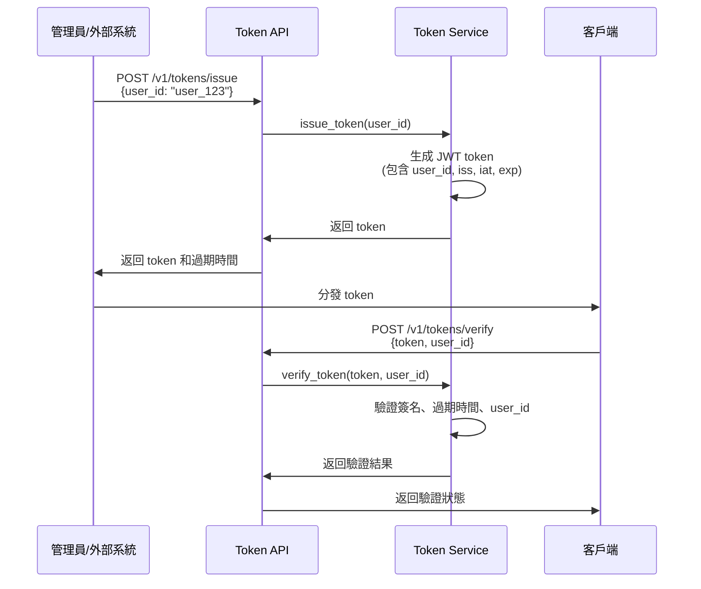
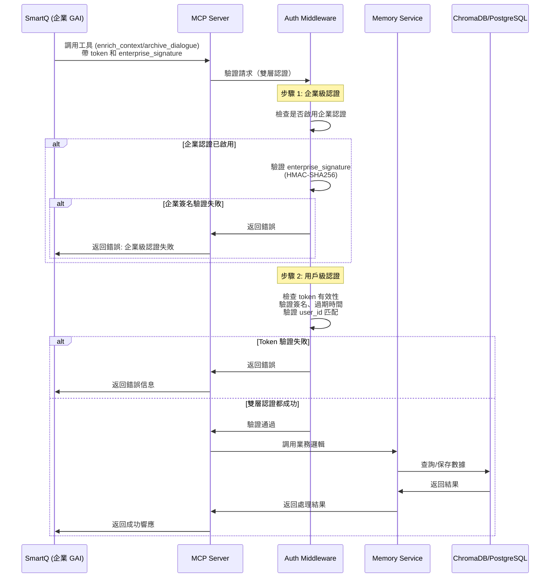
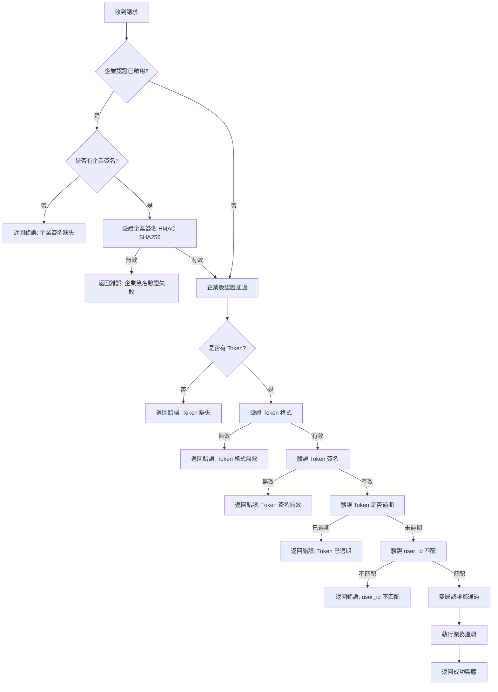
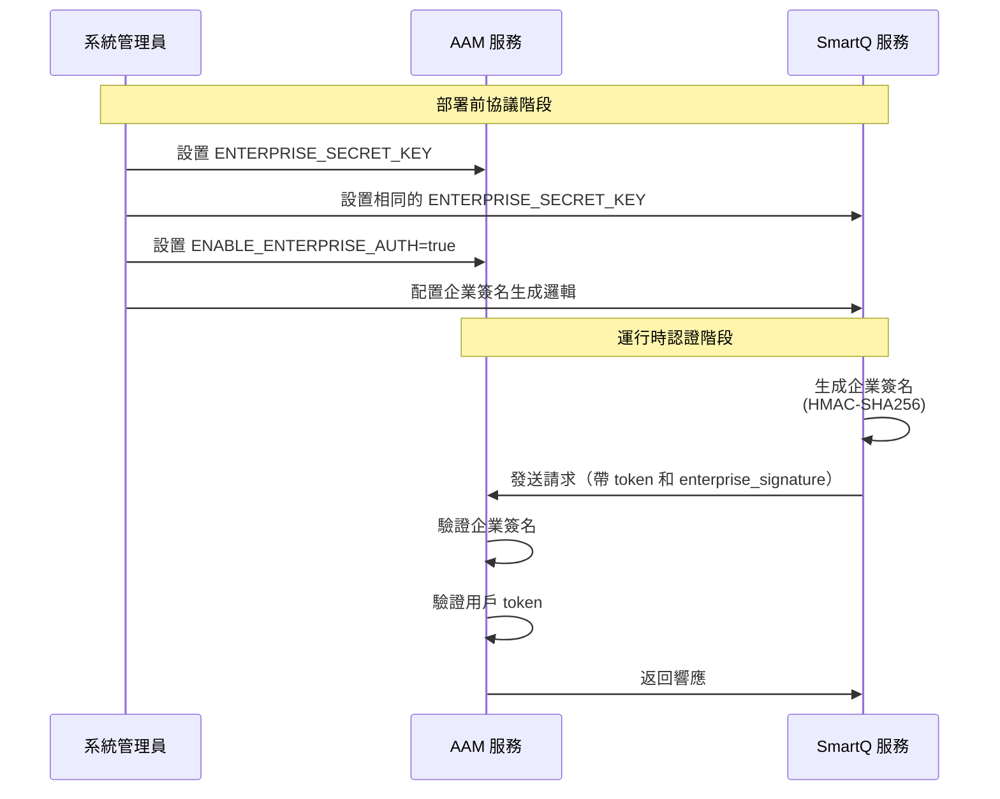
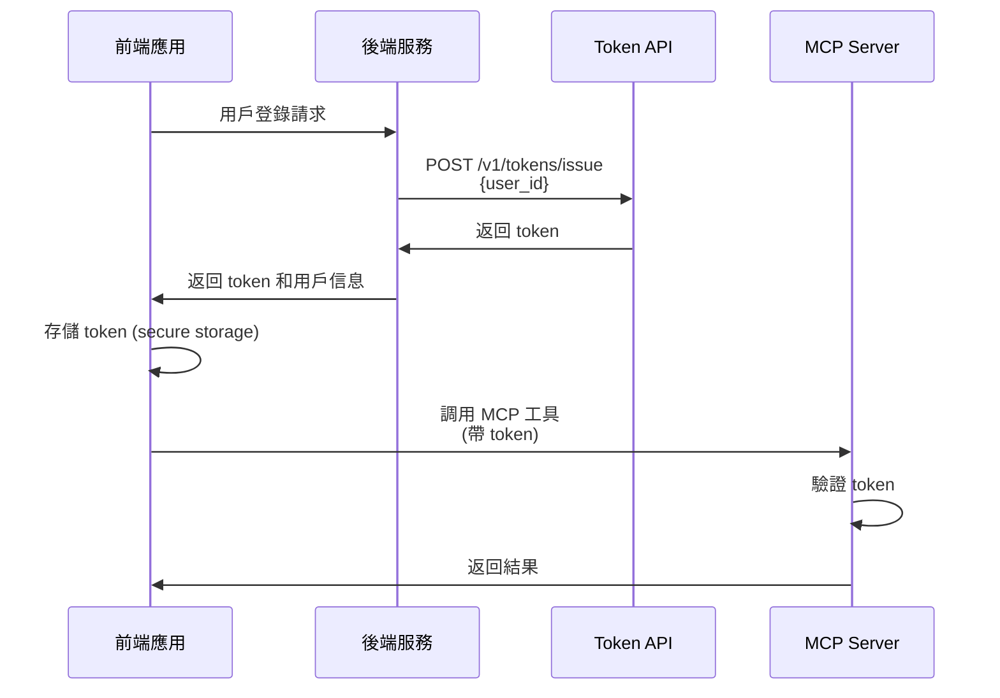
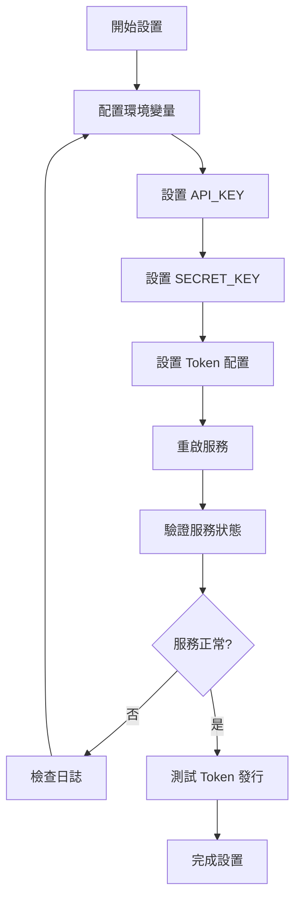
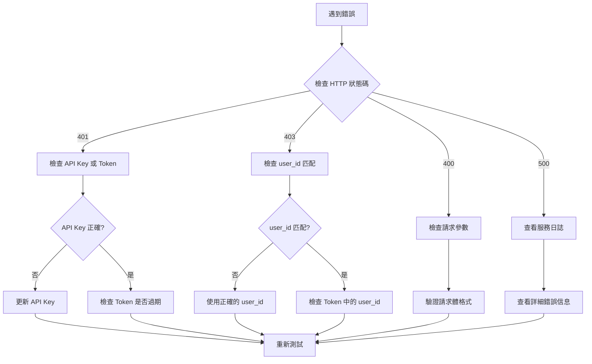

# AAM 企業安全認證管理手冊

**版本**: v1.0  
**創建日期**: 2025-11-13  
**適用對象**: 前端開發者、系統管理員

---

## 📋 目錄

1. [概述](#概述)
2. [快速開始](#快速開始)
3. [Token 管理](#token-管理)
4. [MCP Server 使用](#mcp-server-使用)
5. [安全管理](#安全管理)
6. [前端集成指南](#前端集成指南)
7. [管理員操作指南](#管理員操作指南)
8. [故障排查](#故障排查)
9. [附錄](#附錄)

---

## 概述

### 什麼是 MCP Server？

MCP (Model Context Protocol) Server 是一個標準化的協議服務器，提供以下功能：

- **enrich_context**: 檢索 ChromaDB 知識庫並豐富化上下文
- **archive_dialogue**: 歸檔對話消息到知識庫
- **issue_token**: 發行 JWT token（用於測試或管理）

### 什麼是 Token？

Token 是 JWT (JSON Web Token) 格式的安全憑證，用於：

- 驗證用戶身份
- 防止越權訪問
- 確保不同員工 user_id 的嚴格管制

### 雙層安全認證架構

AAM 服務採用**雙層安全認證架構**，確保服務器間和用戶級別的安全：

1. **企業級認證（服務器間相互認證）**
   - 用於 SmartQ 等企業 GAI 系統與 AAM 服務之間的認證
   - 使用企業 Secret Key 進行 HMAC-SHA256 簽名驗證
   - 在系統部署時由雙方協議配置
   - 防止未授權的服務器訪問

2. **用戶級認證（用戶身份驗證）**
   - 用於驗證具體用戶的身份和權限
   - 使用 JWT token 進行驗證
   - 確保 user_id 和 token 的綁定關係

### 安全設計原則

- **簡化原則**: 用戶權限管理在外部，AAM 只負責 token 驗證
- **Token 發行**: AAM 發行 JWT token，包含 user_id 信息
- **驗證邏輯**: 驗證 user_id 存在且 token 是 AAM 發行的有效 token
- **嚴格管制**: 確保 user_id 和 token 的綁定關係，防止越權訪問
- **企業級認證**: 服務器間使用企業 Secret Key 進行相互認證，確保只有授權的企業系統可以訪問

---

## 快速開始

### 前置要求

1. Docker 環境已啟動
2. AAM 服務正在運行
3. 已配置環境變量（見 [安全管理](#安全管理) 章節）

### 驗證服務狀態

```bash
# 檢查服務健康狀態
curl http://localhost:8000/health

# 預期響應
{
  "status": "healthy",
  "service": "AAM Service",
  "version": "1.0.0"
}
```

---

## Token 管理

### Token 生命週期流程



### 1. 發行 Token

**端點**: `POST /v1/tokens/issue`

**請求頭**:
```
X-API-KEY: your-api-key
Content-Type: application/json
```

**請求體**:
```json
{
  "user_id": "user_123"
}
```

**響應** (201 Created):
```json
{
  "token": "eyJhbGciOiJIUzI1NiIsInR5cCI6IkpXVCJ9...",
  "user_id": "user_123",
  "expires_in_hours": 24
}
```

**示例**:
```bash
curl -X POST http://localhost:8000/v1/tokens/issue \
  -H "Content-Type: application/json" \
  -H "X-API-KEY: your-api-key" \
  -d '{"user_id": "user_123"}'
```

### 2. 驗證 Token

**端點**: `POST /v1/tokens/verify`

**請求頭**:
```
X-API-KEY: your-api-key
Content-Type: application/json
```

**請求體**:
```json
{
  "token": "eyJhbGciOiJIUzI1NiIsInR5cCI6IkpXVCJ9...",
  "user_id": "user_123"
}
```

**響應** (200 OK):
```json
{
  "valid": true,
  "user_id": "user_123"
}
```

**示例**:
```bash
curl -X POST http://localhost:8000/v1/tokens/verify \
  -H "Content-Type: application/json" \
  -H "X-API-KEY: your-api-key" \
  -d '{
    "token": "eyJhbGciOiJIUzI1NiIsInR5cCI6IkpXVCJ9...",
    "user_id": "user_123"
  }'
```

### 3. Token 結構

Token 是 JWT 格式，包含以下信息：

```json
{
  "user_id": "user_123",
  "iss": "aam-agent",
  "iat": 1234567890,
  "exp": 1234654290
}
```

- **user_id**: 用戶 ID
- **iss**: 發行者（固定為 "aam-agent"）
- **iat**: 發行時間（Unix 時間戳）
- **exp**: 過期時間（Unix 時間戳）

---

## MCP Server 使用

### MCP Server 調用流程（雙層認證）



### 1. enrich_context 工具

**功能**: 檢索 ChromaDB 知識庫並豐富化上下文

**參數**:
```json
{
  "user_id": "user_123",
  "session_id": "session_456",
  "current_query": "What is Python?",
  "token": "eyJhbGciOiJIUzI1NiIsInR5cCI6IkpXVCJ9...",
  "enterprise_signature": "a1b2c3d4e5f6..."  // 可選，企業級簽名
}
```

**企業級簽名生成**（SmartQ 端）:
```python
import hmac
import hashlib

def generate_enterprise_signature(user_id: str, token: str, enterprise_secret_key: str) -> str:
    """生成企業級簽名"""
    message = user_id + token
    signature = hmac.new(
        enterprise_secret_key.encode('utf-8'),
        message.encode('utf-8'),
        hashlib.sha256
    ).hexdigest()
    return signature
```

**響應**:
```json
{
  "content": [
    {
      "type": "text",
      "text": "{\"metadata\": {...}, \"user_profile\": {...}, \"retrieved_knowledge\": {...}}"
    }
  ]
}
```

### 2. archive_dialogue 工具

**功能**: 歸檔對話消息到知識庫

**參數**:
```json
{
  "user_id": "user_123",
  "dialog_id": "dialog_789",
  "user_query": "What is Python?",
  "ai_response": "Python is a programming language.",
  "turn": 1,
  "token": "eyJhbGciOiJIUzI1NiIsInR5cCI6IkpXVCJ9...",
  "enterprise_signature": "a1b2c3d4e5f6..."  // 可選，企業級簽名
}
```

**響應**:
```json
{
  "content": [
    {
      "type": "text",
      "text": "對話已成功歸檔: dialog_id=dialog_789, turn=1"
    }
  ]
}
```

### 3. issue_token 工具

**功能**: 發行 JWT token（用於測試或管理）

**參數**:
```json
{
  "user_id": "user_123"
}
```

**響應**:
```json
{
  "content": [
    {
      "type": "text",
      "text": "Token issued successfully for user_id=user_123, token_prefix=eyJhbGci...\nToken: eyJhbGciOiJIUzI1NiIsInR5cCI6IkpXVCJ9..."
    }
  ]
}
```

---

## 安全管理

### 安全驗證流程（雙層認證）



### 環境變量配置

在 `.env` 文件中配置以下安全相關變量：

```bash
# API 認證密鑰（必須設置）
API_KEY=your-secret-api-key-change-this

# JWT Token 配置
SECRET_KEY=your-secret-key-change-this  # 必須設置，用於簽名
ALGORITHM=HS256                          # JWT 簽名算法
TOKEN_EXPIRE_HOURS=24                    # Token 有效期（小時）
TOKEN_ISSUER=aam-agent                   # Token 發行者標識
ENABLE_USER_ID_VALIDATION=true          # 是否啟用 user_id 驗證

# 企業級認證配置（服務器間相互認證）
ENTERPRISE_SECRET_KEY=your-enterprise-secret-key-change-this  # 企業 Secret Key（與 SmartQ 協議）
ENABLE_ENTERPRISE_AUTH=true              # 是否啟用企業級認證
```

### 企業級認證設置流程



### 安全最佳實踐

1. **Token 存儲**
   - ✅ 不在日誌中記錄完整 token，只記錄前 8 位
   - ✅ 不在客戶端代碼中硬編碼 token
   - ✅ 使用安全的存儲方式（如瀏覽器的 secure storage）

2. **Token 傳輸**
   - ✅ 使用 HTTPS（生產環境）
   - ✅ 通過 HTTP header 傳遞 token（而非 URL 參數）
   - ✅ 避免在日誌中記錄完整 token

3. **API Key 管理**
   - ✅ 使用強隨機密鑰生成器生成 API Key
   - ✅ 定期輪換 API Key
   - ✅ 不同環境使用不同的 API Key

4. **企業級認證**
   - ✅ 在部署前由雙方協議 ENTERPRISE_SECRET_KEY
   - ✅ 使用強隨機密鑰生成器生成企業 Secret Key
   - ✅ 不同企業使用不同的 Secret Key
   - ✅ 定期輪換企業 Secret Key
   - ✅ 不在日誌中記錄企業簽名
   - ✅ 使用 HMAC-SHA256 進行簽名（防止時間攻擊）

5. **錯誤處理**
   - ✅ 不洩露敏感信息（如 token 簽名密鑰、企業 Secret Key）
   - ✅ 記錄所有安全相關事件
   - ✅ 監控異常訪問嘗試
   - ✅ 區分企業級認證失敗和用戶級認證失敗的日誌

---

## 前端集成指南

### 1. Token 獲取流程



### 2. 前端代碼示例

#### React/TypeScript 示例

```typescript
// tokenService.ts
interface TokenResponse {
  token: string;
  user_id: string;
  expires_in_hours: number;
}

export class TokenService {
  private apiKey: string;
  private baseUrl: string;

  constructor(apiKey: string, baseUrl: string = 'http://localhost:8000') {
    this.apiKey = apiKey;
    this.baseUrl = baseUrl;
  }

  /**
   * 發行 Token
   */
  async issueToken(userId: string): Promise<TokenResponse> {
    const response = await fetch(`${this.baseUrl}/v1/tokens/issue`, {
      method: 'POST',
      headers: {
        'Content-Type': 'application/json',
        'X-API-KEY': this.apiKey,
      },
      body: JSON.stringify({ user_id: userId }),
    });

    if (!response.ok) {
      throw new Error(`Failed to issue token: ${response.statusText}`);
    }

    return await response.json();
  }

  /**
   * 驗證 Token
   */
  async verifyToken(token: string, userId: string): Promise<boolean> {
    const response = await fetch(`${this.baseUrl}/v1/tokens/verify`, {
      method: 'POST',
      headers: {
        'Content-Type': 'application/json',
        'X-API-KEY': this.apiKey,
      },
      body: JSON.stringify({ token, user_id: userId }),
    });

    if (!response.ok) {
      return false;
    }

    const result = await response.json();
    return result.valid;
  }

  /**
   * 存儲 Token（使用 secure storage）
   */
  saveToken(token: string): void {
    // 使用瀏覽器的 secure storage
    sessionStorage.setItem('aam_token', token);
    // 或使用 localStorage（根據安全需求）
    // localStorage.setItem('aam_token', token);
  }

  /**
   * 獲取存儲的 Token
   */
  getToken(): string | null {
    return sessionStorage.getItem('aam_token');
  }

  /**
   * 清除 Token
   */
  clearToken(): void {
    sessionStorage.removeItem('aam_token');
  }
}
```

#### MCP Client 示例（支持企業級認證）

```typescript
// mcpClient.ts
import * as crypto from 'crypto';

interface MCPToolResult {
  content: Array<{
    type: string;
    text: string;
  }>;
}

export class MCPClient {
  private token: string;
  private baseUrl: string;
  private enterpriseSecretKey?: string;

  constructor(
    token: string,
    baseUrl: string = 'http://localhost:8000',
    enterpriseSecretKey?: string
  ) {
    this.token = token;
    this.baseUrl = baseUrl;
    this.enterpriseSecretKey = enterpriseSecretKey;
  }

  /**
   * 生成企業級簽名（HMAC-SHA256）
   */
  private generateEnterpriseSignature(userId: string, token: string): string {
    if (!this.enterpriseSecretKey) {
      throw new Error('Enterprise secret key not configured');
    }

    const message = userId + token;
    const signature = crypto
      .createHmac('sha256', this.enterpriseSecretKey)
      .update(message)
      .digest('hex');

    return signature;
  }

  /**
   * 豐富化上下文（支持企業級認證）
   */
  async enrichContext(
    userId: string,
    sessionId: string,
    query: string
  ): Promise<MCPToolResult> {
    // 生成企業級簽名（如果配置了企業 Secret Key）
    let enterpriseSignature: string | undefined;
    if (this.enterpriseSecretKey) {
      enterpriseSignature = this.generateEnterpriseSignature(userId, this.token);
    }

    // 這裡需要根據實際的 MCP 客戶端實現
    // 示例：使用 HTTP 調用 MCP Server
    const response = await fetch(`${this.baseUrl}/mcp/tools/enrich_context`, {
      method: 'POST',
      headers: {
        'Content-Type': 'application/json',
        'Authorization': `Bearer ${this.token}`,
      },
      body: JSON.stringify({
        user_id: userId,
        session_id: sessionId,
        current_query: query,
        token: this.token,
        enterprise_signature: enterpriseSignature,  // 企業級簽名
      }),
    });

    if (!response.ok) {
      throw new Error(`MCP call failed: ${response.statusText}`);
    }

    return await response.json();
  }

  /**
   * 歸檔對話（支持企業級認證）
   */
  async archiveDialogue(
    userId: string,
    dialogId: string,
    userQuery: string,
    aiResponse: string,
    turn: number
  ): Promise<MCPToolResult> {
    // 生成企業級簽名（如果配置了企業 Secret Key）
    let enterpriseSignature: string | undefined;
    if (this.enterpriseSecretKey) {
      enterpriseSignature = this.generateEnterpriseSignature(userId, this.token);
    }

    const response = await fetch(`${this.baseUrl}/mcp/tools/archive_dialogue`, {
      method: 'POST',
      headers: {
        'Content-Type': 'application/json',
        'Authorization': `Bearer ${this.token}`,
      },
      body: JSON.stringify({
        user_id: userId,
        dialog_id: dialogId,
        user_query: userQuery,
        ai_response: aiResponse,
        turn: turn,
        token: this.token,
        enterprise_signature: enterpriseSignature,  // 企業級簽名
      }),
    });

    if (!response.ok) {
      throw new Error(`MCP call failed: ${response.statusText}`);
    }

    return await response.json();
  }
}
```

#### React Hook 示例

```typescript
// useMCP.ts
import { useState, useCallback } from 'react';
import { TokenService } from './tokenService';
import { MCPClient } from './mcpClient';

export function useMCP(apiKey: string) {
  const [token, setToken] = useState<string | null>(null);
  const [loading, setLoading] = useState(false);
  const [error, setError] = useState<Error | null>(null);

  const tokenService = new TokenService(apiKey);
  const mcpClient = token ? new MCPClient(token) : null;

  /**
   * 登錄並獲取 Token
   */
  const login = useCallback(async (userId: string) => {
    setLoading(true);
    setError(null);

    try {
      const tokenResponse = await tokenService.issueToken(userId);
      tokenService.saveToken(tokenResponse.token);
      setToken(tokenResponse.token);
      return tokenResponse;
    } catch (err) {
      const error = err instanceof Error ? err : new Error('Unknown error');
      setError(error);
      throw error;
    } finally {
      setLoading(false);
    }
  }, [apiKey]);

  /**
   * 登出並清除 Token
   */
  const logout = useCallback(() => {
    tokenService.clearToken();
    setToken(null);
  }, []);

  /**
   * 豐富化上下文
   */
  const enrichContext = useCallback(async (
    userId: string,
    sessionId: string,
    query: string
  ) => {
    if (!mcpClient) {
      throw new Error('Not authenticated. Please login first.');
    }

    setLoading(true);
    setError(null);

    try {
      return await mcpClient.enrichContext(userId, sessionId, query);
    } catch (err) {
      const error = err instanceof Error ? err : new Error('Unknown error');
      setError(error);
      throw error;
    } finally {
      setLoading(false);
    }
  }, [mcpClient]);

  /**
   * 歸檔對話
   */
  const archiveDialogue = useCallback(async (
    userId: string,
    dialogId: string,
    userQuery: string,
    aiResponse: string,
    turn: number
  ) => {
    if (!mcpClient) {
      throw new Error('Not authenticated. Please login first.');
    }

    setLoading(true);
    setError(null);

    try {
      return await mcpClient.archiveDialogue(
        userId,
        dialogId,
        userQuery,
        aiResponse,
        turn
      );
    } catch (err) {
      const error = err instanceof Error ? err : new Error('Unknown error');
      setError(error);
      throw error;
    } finally {
      setLoading(false);
    }
  }, [mcpClient]);

  return {
    token,
    loading,
    error,
    login,
    logout,
    enrichContext,
    archiveDialogue,
  };
}
```

---

## SmartQ 集成指南

### SmartQ 端實現示例（Python）

```python
"""
SmartQ 端企業級認證實現示例
"""
import hmac
import hashlib
import os
from typing import Optional

import httpx


class SmartQMCPClient:
    """SmartQ MCP 客戶端（支持企業級認證）"""

    def __init__(
        self,
        aam_service_url: str,
        enterprise_secret_key: str,
        user_token: Optional[str] = None,
    ):
        """
        初始化 SmartQ MCP 客戶端
        
        Args:
            aam_service_url: AAM 服務 URL
            enterprise_secret_key: 企業 Secret Key（與 AAM 協議）
            user_token: 用戶 JWT token（可選，如果沒有則需要先獲取）
        """
        self.aam_service_url = aam_service_url
        self.enterprise_secret_key = enterprise_secret_key
        self.user_token = user_token

    def generate_enterprise_signature(
        self, user_id: str, token: str
    ) -> str:
        """
        生成企業級簽名（HMAC-SHA256）
        
        Args:
            user_id: 用戶 ID
            token: JWT token
            
        Returns:
            str: HMAC-SHA256 簽名（十六進制）
        """
        message = user_id + token
        signature = hmac.new(
            self.enterprise_secret_key.encode("utf-8"),
            message.encode("utf-8"),
            hashlib.sha256,
        ).hexdigest()
        return signature

    async def enrich_context(
        self, user_id: str, session_id: str, query: str
    ) -> dict:
        """
        調用 AAM enrich_context 工具（帶企業級認證）
        
        Args:
            user_id: 用戶 ID
            session_id: 會話 ID
            query: 查詢內容
            
        Returns:
            dict: 豐富化後的上下文
        """
        if not self.user_token:
            raise ValueError("User token is required")

        # 生成企業級簽名
        enterprise_signature = self.generate_enterprise_signature(
            user_id, self.user_token
        )

        # 調用 MCP Server（這裡需要根據實際的 MCP 客戶端實現）
        # 示例：使用 HTTP 調用（實際應該使用 MCP 協議）
        async with httpx.AsyncClient() as client:
            response = await client.post(
                f"{self.aam_service_url}/mcp/tools/enrich_context",
                json={
                    "user_id": user_id,
                    "session_id": session_id,
                    "current_query": query,
                    "token": self.user_token,
                    "enterprise_signature": enterprise_signature,
                },
            )
            response.raise_for_status()
            return response.json()

    async def archive_dialogue(
        self,
        user_id: str,
        dialog_id: str,
        user_query: str,
        ai_response: str,
        turn: int,
    ) -> dict:
        """
        調用 AAM archive_dialogue 工具（帶企業級認證）
        
        Args:
            user_id: 用戶 ID
            dialog_id: 對話 ID
            user_query: 用戶查詢
            ai_response: AI 響應
            turn: 對話輪次
            
        Returns:
            dict: 歸檔結果
        """
        if not self.user_token:
            raise ValueError("User token is required")

        # 生成企業級簽名
        enterprise_signature = self.generate_enterprise_signature(
            user_id, self.user_token
        )

        # 調用 MCP Server
        async with httpx.AsyncClient() as client:
            response = await client.post(
                f"{self.aam_service_url}/mcp/tools/archive_dialogue",
                json={
                    "user_id": user_id,
                    "dialog_id": dialog_id,
                    "user_query": user_query,
                    "ai_response": ai_response,
                    "turn": turn,
                    "token": self.user_token,
                    "enterprise_signature": enterprise_signature,
                },
            )
            response.raise_for_status()
            return response.json()


# 使用示例
async def main():
    """SmartQ 使用 AAM 服務示例"""
    # 從環境變量獲取配置
    aam_service_url = os.getenv("AAM_SERVICE_URL", "http://localhost:8000")
    enterprise_secret_key = os.getenv("ENTERPRISE_SECRET_KEY")
    user_token = os.getenv("USER_TOKEN")  # 從用戶登錄獲取

    if not enterprise_secret_key:
        raise ValueError("ENTERPRISE_SECRET_KEY must be set")

    # 創建 SmartQ MCP 客戶端
    client = SmartQMCPClient(
        aam_service_url=aam_service_url,
        enterprise_secret_key=enterprise_secret_key,
        user_token=user_token,
    )

    # 豐富化上下文
    enriched_context = await client.enrich_context(
        user_id="user_123",
        session_id="session_456",
        query="What is Python?",
    )
    print("Enriched context:", enriched_context)

    # 歸檔對話
    await client.archive_dialogue(
        user_id="user_123",
        dialog_id="dialog_789",
        user_query="What is Python?",
        ai_response="Python is a programming language.",
        turn=1,
    )
    print("Dialogue archived successfully")


if __name__ == "__main__":
    import asyncio

    asyncio.run(main())
```

### SmartQ 環境變量配置

在 SmartQ 服務的 `.env` 文件中配置：

```bash
# AAM 服務配置
AAM_SERVICE_URL=http://aam-service:8000

# 企業級認證（與 AAM 協議的 Secret Key）
ENTERPRISE_SECRET_KEY=<與 AAM 協議的企業 Secret Key>

# 用戶 Token（從用戶登錄獲取，或通過 Token API 獲取）
USER_TOKEN=<用戶 JWT token>
```

---

## 管理員操作指南

### 1. 初始設置流程



### 2. 環境變量配置

#### 開發環境

```bash
# .env.development
API_KEY=dev-api-key-12345
SECRET_KEY=dev-secret-key-12345
TOKEN_EXPIRE_HOURS=24
TOKEN_ISSUER=aam-agent
ENABLE_USER_ID_VALIDATION=true

# 企業級認證（開發環境可選）
ENTERPRISE_SECRET_KEY=dev-enterprise-secret-key-12345
ENABLE_ENTERPRISE_AUTH=false  # 開發環境可關閉

DEBUG=true
LOG_LEVEL=DEBUG
```

#### 生產環境

```bash
# .env.production
API_KEY=<強隨機密鑰，至少 32 字符>
SECRET_KEY=<強隨機密鑰，至少 32 字符>
TOKEN_EXPIRE_HOURS=24
TOKEN_ISSUER=aam-agent
ENABLE_USER_ID_VALIDATION=true

# 企業級認證（生產環境必須配置）
ENTERPRISE_SECRET_KEY=<與 SmartQ 協議的企業 Secret Key，至少 32 字符>
ENABLE_ENTERPRISE_AUTH=true  # 生產環境必須啟用

DEBUG=false
LOG_LEVEL=INFO
```

### 3. 企業級認證部署協議

在部署前，AAM 服務和 SmartQ 服務的管理員需要：

1. **協議企業 Secret Key**
   ```bash
   # 雙方管理員共同生成並確認
   openssl rand -hex 32
   ```

2. **配置 AAM 服務**
   ```bash
   ENTERPRISE_SECRET_KEY=<協議的 Secret Key>
   ENABLE_ENTERPRISE_AUTH=true
   ```

3. **配置 SmartQ 服務**
   ```bash
   # SmartQ 端也需要配置相同的 Secret Key
   ENTERPRISE_SECRET_KEY=<協議的 Secret Key>
   ```

4. **驗證配置**
   - 測試企業級認證是否正常工作
   - 驗證簽名生成和驗證邏輯
   - 確認日誌記錄正確

### 3. 生成強隨機密鑰

```bash
# 使用 OpenSSL 生成強隨機密鑰
openssl rand -hex 32

# 或使用 Python
python3 -c "import secrets; print(secrets.token_hex(32))"
```

### 5. Token 管理操作

#### 發行 Token（用於測試）

```bash
# 使用 curl
curl -X POST http://localhost:8000/v1/tokens/issue \
  -H "Content-Type: application/json" \
  -H "X-API-KEY: your-api-key" \
  -d '{"user_id": "test_user_123"}'

# 使用 Python
python3 << EOF
import requests

response = requests.post(
    'http://localhost:8000/v1/tokens/issue',
    headers={
        'Content-Type': 'application/json',
        'X-API-KEY': 'your-api-key'
    },
    json={'user_id': 'test_user_123'}
)

print(response.json())
EOF
```

#### 測試企業級認證

```bash
# 在 Docker 環境中測試企業級認證
docker-compose exec aam-service python3 << EOF
from src.mcp_server.auth_middleware import AuthMiddleware
from src.core.services.token_service import TokenService
import os

# 設置企業 Secret Key（測試用）
os.environ['ENTERPRISE_SECRET_KEY'] = 'test-enterprise-secret-key-12345'
os.environ['ENABLE_ENTERPRISE_AUTH'] = 'true'

ts = TokenService()
am = AuthMiddleware(ts)

# 發行 token
user_id = "test_user_123"
token = ts.issue_token(user_id)

# 生成企業簽名
signature = am.generate_enterprise_signature(user_id, token)
print(f"Enterprise signature: {signature[:16]}...")

# 驗證請求
is_valid, error = am.verify_request(token, user_id, signature)
print(f"Verification result: {is_valid}")
if not is_valid:
    print(f"Error: {error}")
EOF
```

#### 驗證 Token

```bash
# 使用 curl
curl -X POST http://localhost:8000/v1/tokens/verify \
  -H "Content-Type: application/json" \
  -H "X-API-KEY: your-api-key" \
  -d '{
    "token": "eyJhbGciOiJIUzI1NiIsInR5cCI6IkpXVCJ9...",
    "user_id": "test_user_123"
  }'
```

### 6. 企業級認證測試腳本

創建測試腳本 `test_enterprise_auth.sh`：

```bash
#!/bin/bash
# 測試企業級認證

ENTERPRISE_SECRET_KEY="test-enterprise-secret-key-12345"
USER_ID="test_user_123"

# 獲取 token
TOKEN=$(curl -s -X POST http://localhost:8000/v1/tokens/issue \
  -H "Content-Type: application/json" \
  -H "X-API-KEY: your-api-key" \
  -d "{\"user_id\": \"$USER_ID\"}" | jq -r '.token')

echo "Token: ${TOKEN:0:20}..."

# 生成企業簽名（Python）
SIGNATURE=$(python3 << EOF
import hmac
import hashlib

enterprise_secret_key = "$ENTERPRISE_SECRET_KEY"
user_id = "$USER_ID"
token = "$TOKEN"

message = user_id + token
signature = hmac.new(
    enterprise_secret_key.encode('utf-8'),
    message.encode('utf-8'),
    hashlib.sha256
).hexdigest()

print(signature)
EOF
)

echo "Enterprise signature: ${SIGNATURE:0:20}..."

# 測試 MCP 調用（需要實際的 MCP 客戶端）
echo "Testing MCP call with enterprise authentication..."
```

### 5. 監控和日誌

#### 查看服務日誌

```bash
# Docker 環境
docker-compose logs -f aam-service

# 查看安全相關日誌
docker-compose logs aam-service | grep -E "token|auth|security"
```

#### 監控指標

- Token 發行次數
- Token 驗證失敗次數
- 越權訪問嘗試次數
- Token 過期次數

### 6. 故障排查

#### 常見問題

1. **Token 驗證失敗**
   - 檢查 token 是否過期
   - 檢查 user_id 是否匹配
   - 檢查 SECRET_KEY 是否正確

2. **API Key 驗證失敗**
   - 檢查 X-API-KEY header 是否正確
   - 檢查環境變量 API_KEY 是否設置

3. **Token 發行失敗**
   - 檢查 API Key 是否正確
   - 檢查 user_id 是否為空

---

## 故障排查

### 錯誤碼參考

| HTTP 狀態碼 | 錯誤信息 | 可能原因 | 解決方案 |
|------------|---------|---------|---------|
| 400 | Bad Request | 請求參數無效 | 檢查請求體格式 |
| 401 | Unauthorized | API Key 或 Token 無效 | 檢查認證信息 |
| 403 | Forbidden | user_id 不匹配 | 檢查 user_id 是否正確 |
| 500 | Internal Server Error | 服務器內部錯誤 | 查看服務日誌 |

### 調試步驟



---

## 附錄

### A. API 端點總覽

| 端點 | 方法 | 功能 | 認證 |
|------|------|------|------|
| `/v1/tokens/issue` | POST | 發行 Token | API Key |
| `/v1/tokens/verify` | POST | 驗證 Token | API Key |
| `/v1/mcp/enrich` | POST | 豐富化 MCP | API Key |
| `/health` | GET | 健康檢查 | 無 |

### B. Token 配置參數

| 參數 | 類型 | 默認值 | 說明 |
|------|------|--------|------|
| `TOKEN_EXPIRE_HOURS` | int | 24 | Token 有效期（小時） |
| `TOKEN_ISSUER` | string | "aam-agent" | Token 發行者標識 |
| `ENABLE_USER_ID_VALIDATION` | bool | true | 是否啟用 user_id 驗證 |
| `SECRET_KEY` | string | - | JWT 簽名密鑰（必須設置） |
| `ALGORITHM` | string | "HS256" | JWT 簽名算法 |
| `ENTERPRISE_SECRET_KEY` | string | None | 企業 Secret Key（用於服務器間相互認證） |
| `ENABLE_ENTERPRISE_AUTH` | bool | false | 是否啟用企業級認證（服務器間相互認證） |

### C. 安全檢查清單

**用戶級認證**
- [ ] API_KEY 已設置且不是默認值
- [ ] SECRET_KEY 已設置且不是默認值
- [ ] 生產環境使用 HTTPS
- [ ] Token 不在日誌中完整記錄
- [ ] 定期輪換 API Key 和 SECRET_KEY
- [ ] 監控異常訪問嘗試
- [ ] 啟用 user_id 驗證

**企業級認證**
- [ ] ENTERPRISE_SECRET_KEY 已設置且不是默認值（生產環境）
- [ ] 與 SmartQ 服務協議了相同的 ENTERPRISE_SECRET_KEY
- [ ] ENABLE_ENTERPRISE_AUTH 已正確配置
- [ ] 企業簽名不在日誌中完整記錄
- [ ] 定期輪換企業 Secret Key
- [ ] 監控企業級認證失敗次數
- [ ] 驗證 HMAC-SHA256 簽名算法正常工作

### D. 相關文檔

- [環境設置指南](./環境設置.md)
- [MCP Server 安全實現](./plan/MCP-Server-安全实现.md)
- [AI 開發指導手冊](./AiDevelopmentGuide.md)

---

**最後更新**: 2025-11-13  
**維護者**:Daniel Chung

